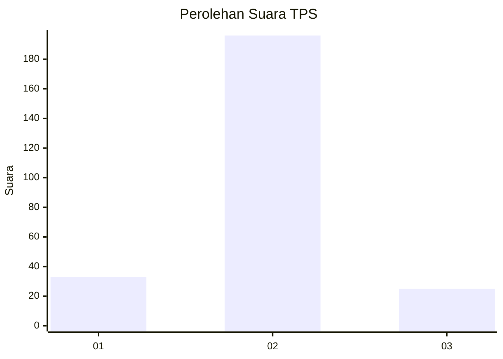
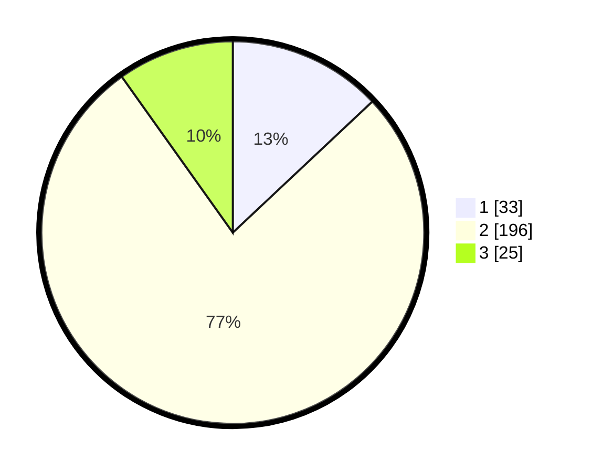

# Hasil

## Grafik

## Tabel

| No. | Nama Paslon    | Suara | Suara (raw) | Persentase |
|:--- |:-------------- | -----:| -----------:| ----------:|
| 1   | ANIES MUHAIMIN | 33    | [33][p-1]   | 12,99      |
| 2   | PRABOWO GIBRAN | 196   | [196][p-2]  | 77,17      |
| 3   | GANJAR MAHFUD  | 25    | [25][p-3]   | 9,84       |

[p-1]: https://github.com/gigit-pemilu/pemilu-2024-35-jawa-timur/blob/main/pilpres/hitung-suara/sub/35-jawa-timur/sub/15-sidoarjo/sub/05-jabon/sub/2009-jemirahan/sub/003-tps/sub/paslon-1.txt
[p-2]: https://github.com/gigit-pemilu/pemilu-2024-35-jawa-timur/blob/main/pilpres/hitung-suara/sub/35-jawa-timur/sub/15-sidoarjo/sub/05-jabon/sub/2009-jemirahan/sub/003-tps/sub/paslon-2.txt
[p-3]: https://github.com/gigit-pemilu/pemilu-2024-35-jawa-timur/blob/main/pilpres/hitung-suara/sub/35-jawa-timur/sub/15-sidoarjo/sub/05-jabon/sub/2009-jemirahan/sub/003-tps/sub/paslon-3.txt

## Foto C Plano

https://sirekap-obj-formc.kpu.go.id/69be/pemilu/ppwp/35/15/05/20/09/3515052009003-20240215-111129--43a5fa01-9b03-442c-a332-ccb3f4c72389.jpg

https://sirekap-obj-formc.kpu.go.id/69be/pemilu/ppwp/35/15/05/20/09/3515052009003-20240215-111137--371cd9d1-8522-4753-b499-11828bbf31d3.jpg

https://sirekap-obj-formc.kpu.go.id/69be/pemilu/ppwp/35/15/05/20/09/3515052009003-20240215-111140--148c38a3-84ff-4664-98df-1269676252f1.jpg

## Metadata

| Key        | Value               |
| ---------- | ------------------- |
| Time Stamp | 2024-02-21 21:00:04 |

