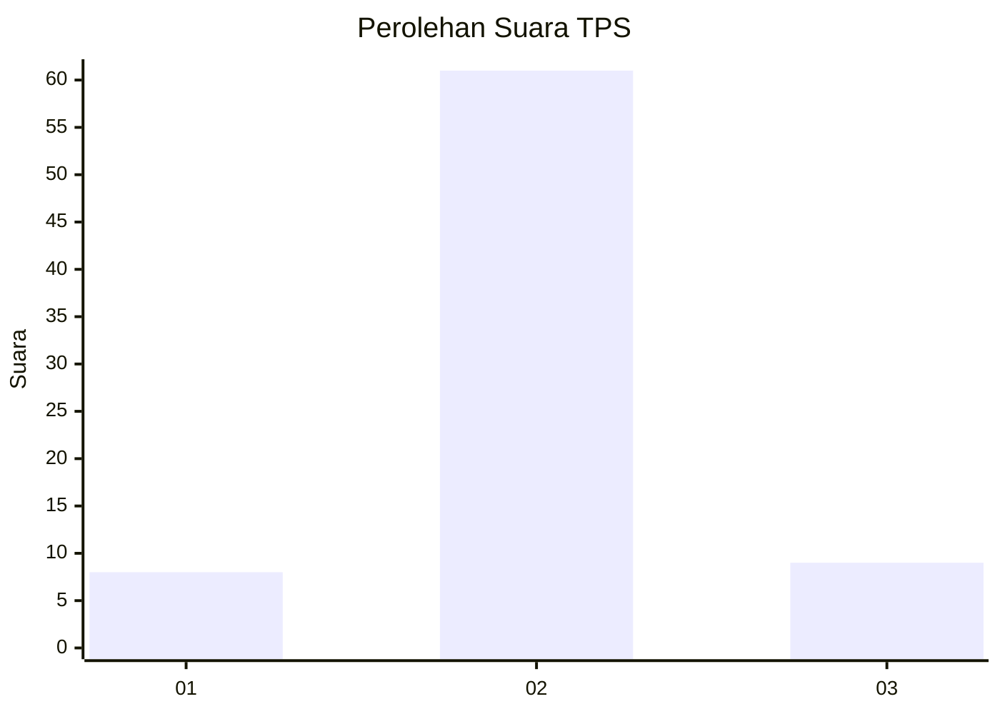
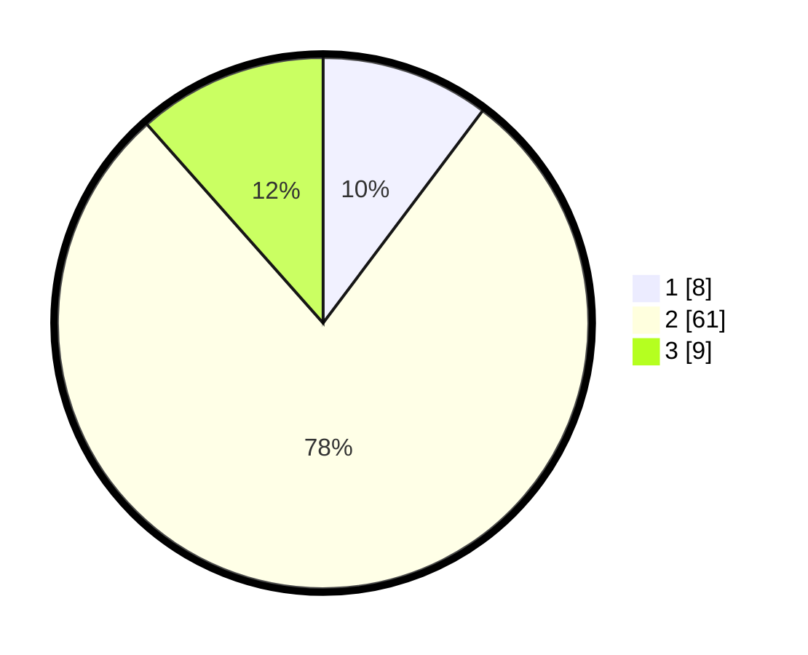

# Hasil

## Grafik

## Tabel

| No. | Nama Paslon    | Suara | Suara (raw) | Persentase |
|:--- |:-------------- | -----:| -----------:| ----------:|
| 1   | ANIES MUHAIMIN | 8     | [8][p-1]    | 10,26      |
| 2   | PRABOWO GIBRAN | 61    | [61][p-2]   | 78,21      |
| 3   | GANJAR MAHFUD  | 9     | [9][p-3]    | 11,54      |

[p-1]: https://github.com/gigit-pemilu/pemilu-2024/blob/main/pilpres/hitung-suara/sub/35-jawa-timur/sub/15-sidoarjo/sub/05-jabon/sub/2010-dukuhsari/sub/016-tps/sub/paslon-1.txt
[p-2]: https://github.com/gigit-pemilu/pemilu-2024/blob/main/pilpres/hitung-suara/sub/35-jawa-timur/sub/15-sidoarjo/sub/05-jabon/sub/2010-dukuhsari/sub/016-tps/sub/paslon-2.txt
[p-3]: https://github.com/gigit-pemilu/pemilu-2024/blob/main/pilpres/hitung-suara/sub/35-jawa-timur/sub/15-sidoarjo/sub/05-jabon/sub/2010-dukuhsari/sub/016-tps/sub/paslon-3.txt

## Foto C Plano

https://sirekap-obj-formc.kpu.go.id/da26/pemilu/ppwp/35/15/05/20/10/3515052010016-20240215-052036--e20f0b63-60bd-41b3-87cd-8a2095605b09.jpg

https://sirekap-obj-formc.kpu.go.id/da26/pemilu/ppwp/35/15/05/20/10/3515052010016-20240215-010348--018a1372-911b-4be6-93b3-b4f418c242dc.jpg

https://sirekap-obj-formc.kpu.go.id/da26/pemilu/ppwp/35/15/05/20/10/3515052010016-20240215-010615--5e7992f8-76ec-44ee-a111-a78e09baf90e.jpg

## Metadata

| Key        | Value               |
| ---------- | ------------------- |
| Time Stamp | 2024-02-15 17:30:25 |

