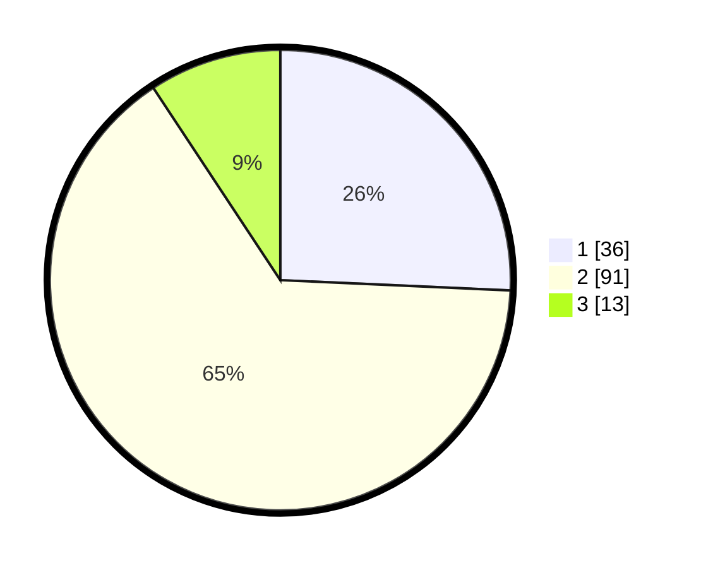

# Hasil

## Grafik

## Tabel

| No. | Nama Paslon    | Suara | Suara (raw) | Persentase |
|:--- |:-------------- | -----:| -----------:| ----------:|
| 1   | ANIES MUHAIMIN | 36    | [36][p-1]   | 25,71      |
| 2   | PRABOWO GIBRAN | 91    | [91][p-2]   | 65,00      |
| 3   | GANJAR MAHFUD  | 13    | [13][p-3]   | 9,29       |

[p-1]: https://github.com/gigit-pemilu/pemilu-2024/blob/main/pilpres/hitung-suara/sub/35-jawa-timur/sub/15-sidoarjo/sub/05-jabon/sub/2010-dukuhsari/sub/017-tps/sub/paslon-1.txt
[p-2]: https://github.com/gigit-pemilu/pemilu-2024/blob/main/pilpres/hitung-suara/sub/35-jawa-timur/sub/15-sidoarjo/sub/05-jabon/sub/2010-dukuhsari/sub/017-tps/sub/paslon-2.txt
[p-3]: https://github.com/gigit-pemilu/pemilu-2024/blob/main/pilpres/hitung-suara/sub/35-jawa-timur/sub/15-sidoarjo/sub/05-jabon/sub/2010-dukuhsari/sub/017-tps/sub/paslon-3.txt

## Foto C Plano

https://sirekap-obj-formc.kpu.go.id/fcaf/pemilu/ppwp/35/15/05/20/10/3515052010017-20240215-012447--be983e4c-7d9e-43dd-a9d4-ce7ef47e9bbe.jpg

https://sirekap-obj-formc.kpu.go.id/fcaf/pemilu/ppwp/35/15/05/20/10/3515052010017-20240215-012537--ed71f94e-62bc-4ac3-a4ec-93e5cad221b1.jpg

https://sirekap-obj-formc.kpu.go.id/fcaf/pemilu/ppwp/35/15/05/20/10/3515052010017-20240215-012622--cd64d633-54ac-43bb-9f51-390f26fcfe2f.jpg

## Metadata

| Key        | Value               |
| ---------- | ------------------- |
| Time Stamp | 2024-02-25 11:00:00 |

