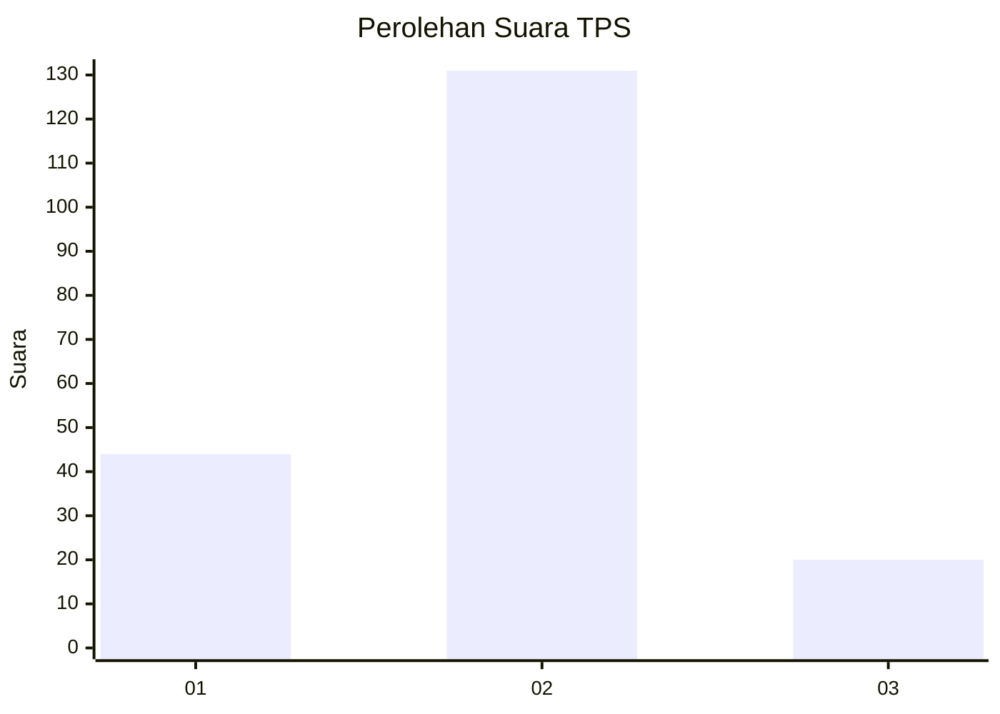

# Hasil

## Grafik

## Tabel

| No. | Nama Paslon    | Suara | Suara (raw) | Persentase |
|:--- |:-------------- | -----:| -----------:| ----------:|
| 1   | ANIES MUHAIMIN | 44    | [44][p-1]   | 22,56      |
| 2   | PRABOWO GIBRAN | 131   | [131][p-2]  | 67,18      |
| 3   | GANJAR MAHFUD  | 20    | [20][p-3]   | 10,26      |

[p-1]: https://github.com/gigit-pemilu/pemilu-2024-35-jawa-timur/blob/main/pilpres/hitung-suara/sub/35-jawa-timur/sub/15-sidoarjo/sub/06-tanggulangin/sub/2001-kalisampurno/sub/002-tps/sub/paslon-1.txt
[p-2]: https://github.com/gigit-pemilu/pemilu-2024-35-jawa-timur/blob/main/pilpres/hitung-suara/sub/35-jawa-timur/sub/15-sidoarjo/sub/06-tanggulangin/sub/2001-kalisampurno/sub/002-tps/sub/paslon-2.txt
[p-3]: https://github.com/gigit-pemilu/pemilu-2024-35-jawa-timur/blob/main/pilpres/hitung-suara/sub/35-jawa-timur/sub/15-sidoarjo/sub/06-tanggulangin/sub/2001-kalisampurno/sub/002-tps/sub/paslon-3.txt

## Foto C Plano

https://sirekap-obj-formc.kpu.go.id/9490/pemilu/ppwp/35/15/06/20/01/3515062001002-20240214-203451--f54b721b-5cd0-45b2-ae5c-61da90f4720d.jpg

https://sirekap-obj-formc.kpu.go.id/9490/pemilu/ppwp/35/15/06/20/01/3515062001002-20240214-203548--b3c23bfa-7763-4da8-bebb-3238f737e304.jpg

https://sirekap-obj-formc.kpu.go.id/9490/pemilu/ppwp/35/15/06/20/01/3515062001002-20240214-203612--c34e73ec-6730-41e4-ab31-842bfaf7bb52.jpg

## Metadata

| Key        | Value               |
| ---------- | ------------------- |
| Time Stamp | 2024-02-25 14:00:00 |

