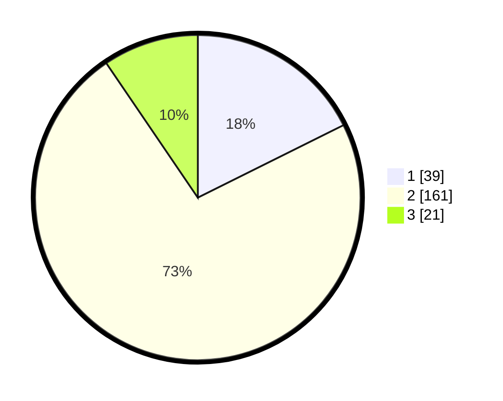

# Hasil

## Grafik

## Tabel

| No. | Nama Paslon    | Suara | Suara (raw) | Persentase |
|:--- |:-------------- | -----:| -----------:| ----------:|
| 1   | ANIES MUHAIMIN | 39    | [39][p-1]   | 17,65      |
| 2   | PRABOWO GIBRAN | 161   | [161][p-2]  | 72,85      |
| 3   | GANJAR MAHFUD  | 21    | [21][p-3]   | 9,50       |

[p-1]: https://github.com/gigit-pemilu/pemilu-2024-35-jawa-timur/blob/main/pilpres/hitung-suara/sub/35-jawa-timur/sub/15-sidoarjo/sub/06-tanggulangin/sub/2001-kalisampurno/sub/004-tps/sub/paslon-1.txt
[p-2]: https://github.com/gigit-pemilu/pemilu-2024-35-jawa-timur/blob/main/pilpres/hitung-suara/sub/35-jawa-timur/sub/15-sidoarjo/sub/06-tanggulangin/sub/2001-kalisampurno/sub/004-tps/sub/paslon-2.txt
[p-3]: https://github.com/gigit-pemilu/pemilu-2024-35-jawa-timur/blob/main/pilpres/hitung-suara/sub/35-jawa-timur/sub/15-sidoarjo/sub/06-tanggulangin/sub/2001-kalisampurno/sub/004-tps/sub/paslon-3.txt

## Foto C Plano

https://sirekap-obj-formc.kpu.go.id/3f6d/pemilu/ppwp/35/15/06/20/01/3515062001004-20240214-141303--6d21328a-a52e-41f8-bf98-01ab4f0e9960.jpg

https://sirekap-obj-formc.kpu.go.id/3f6d/pemilu/ppwp/35/15/06/20/01/3515062001004-20240214-141406--6d7fff38-4ff7-435a-92a0-56155fa213c8.jpg

https://sirekap-obj-formc.kpu.go.id/3f6d/pemilu/ppwp/35/15/06/20/01/3515062001004-20240214-141453--10933ed4-d39d-4c99-99ca-bfedf7da7ad7.jpg

## Metadata

| Key        | Value               |
| ---------- | ------------------- |
| Time Stamp | 2024-02-15 17:30:25 |

