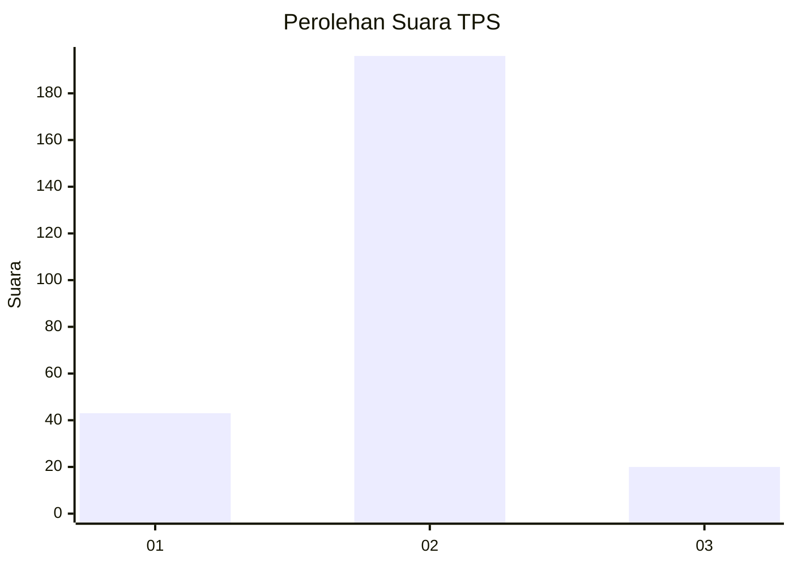
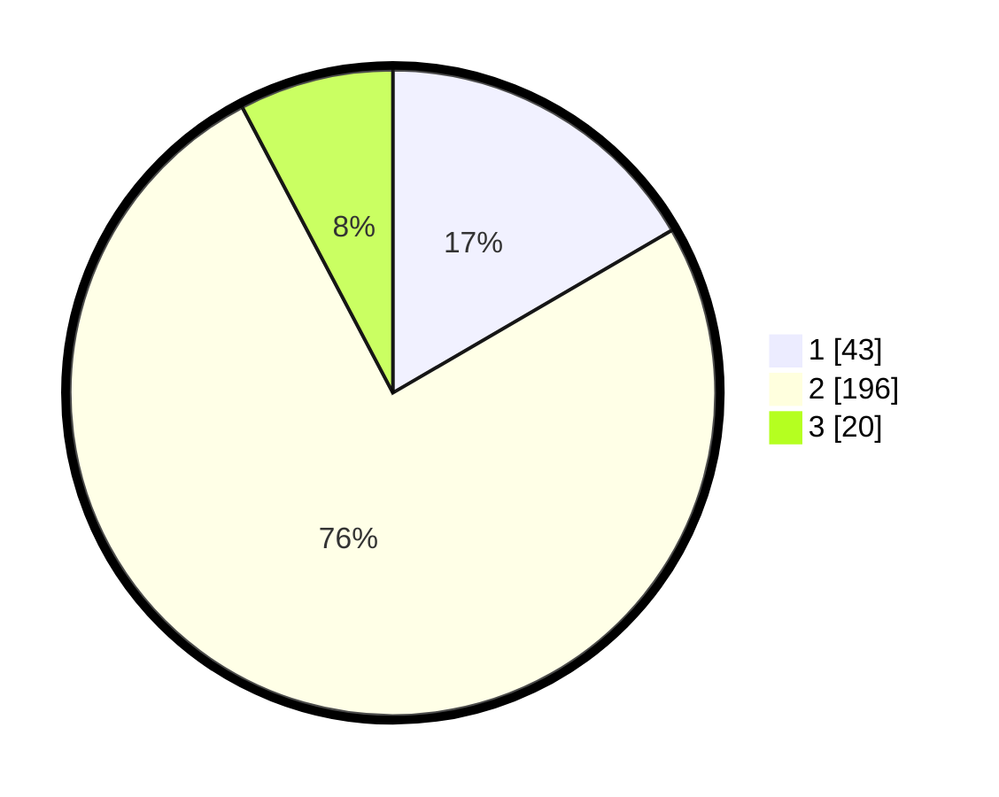

# Hasil

## Grafik

## Tabel

| No. | Nama Paslon    | Suara | Suara (raw) | Persentase |
|:--- |:-------------- | -----:| -----------:| ----------:|
| 1   | ANIES MUHAIMIN | 43    | [43][p-1]   | 16,60      |
| 2   | PRABOWO GIBRAN | 196   | [196][p-2]  | 75,68      |
| 3   | GANJAR MAHFUD  | 20    | [20][p-3]   | 7,72       |

[p-1]: https://github.com/gigit-pemilu/pemilu-2024-35-jawa-timur/blob/main/pilpres/hitung-suara/sub/35-jawa-timur/sub/15-sidoarjo/sub/06-tanggulangin/sub/2001-kalisampurno/sub/005-tps/sub/paslon-1.txt
[p-2]: https://github.com/gigit-pemilu/pemilu-2024-35-jawa-timur/blob/main/pilpres/hitung-suara/sub/35-jawa-timur/sub/15-sidoarjo/sub/06-tanggulangin/sub/2001-kalisampurno/sub/005-tps/sub/paslon-2.txt
[p-3]: https://github.com/gigit-pemilu/pemilu-2024-35-jawa-timur/blob/main/pilpres/hitung-suara/sub/35-jawa-timur/sub/15-sidoarjo/sub/06-tanggulangin/sub/2001-kalisampurno/sub/005-tps/sub/paslon-3.txt

## Foto C Plano

https://sirekap-obj-formc.kpu.go.id/5c14/pemilu/ppwp/35/15/06/20/01/3515062001005-20240214-191721--43ad8d2e-7b22-4289-8010-2ec1b8b6a2ba.jpg

https://sirekap-obj-formc.kpu.go.id/5c14/pemilu/ppwp/35/15/06/20/01/3515062001005-20240214-191731--4f1cbc09-83f8-45f1-a01d-2dbddbfe65c6.jpg

https://sirekap-obj-formc.kpu.go.id/5c14/pemilu/ppwp/35/15/06/20/01/3515062001005-20240214-194019--9f713ad0-0031-404d-bf18-abe34bbbc03f.jpg

## Metadata

| Key        | Value               |
| ---------- | ------------------- |
| Time Stamp | 2024-02-14 21:46:01 |

## DATA PEMILIH TETAP

Jumlah pemilih dalam DPT: **283**.
 * L: **142**.
 * P: **141**.

## DATA PENGGUNA HAK PILIH

Jumlah pengguna hak pilih dalam DPT: **259**.
 * L: **126**.
 * P: **133**.

Jumlah pengguna hak pilih dalam DPTb: **0**.
 * L: **0**.
 * P: **0**.

Jumlah pengguna hak pilih dalam DPK: **11**.
 * L: **6**.
 * P: **5**.

Jumlah pengguna hak pilih: **270**.
 * L: **132**.
 * P: **138**.

## JUMLAH SUARA SAH DAN TIDAK SAH

JUMLAH SELURUH SUARA SAH: **259**.

JUMLAH SUARA TIDAK SAH: **11**.

JUMLAH SELURUH SUARA SAH DAN SUARA TIDAK SAH: **270**.

