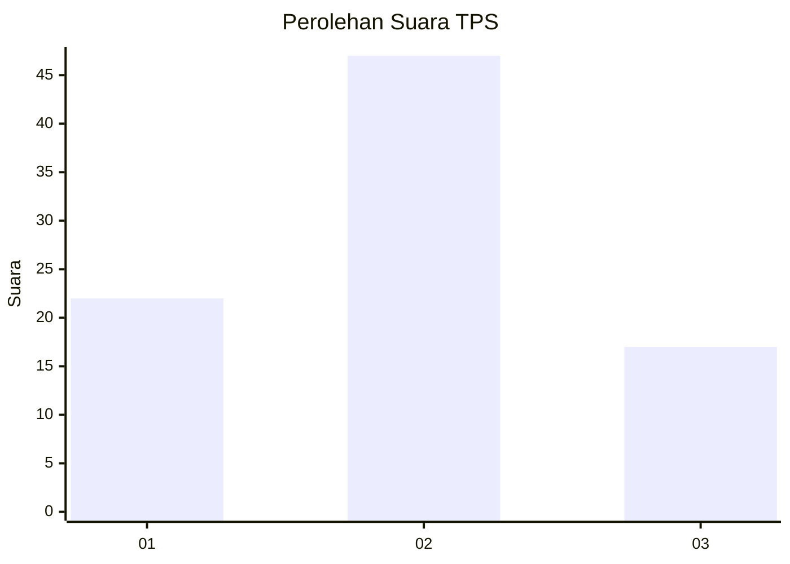
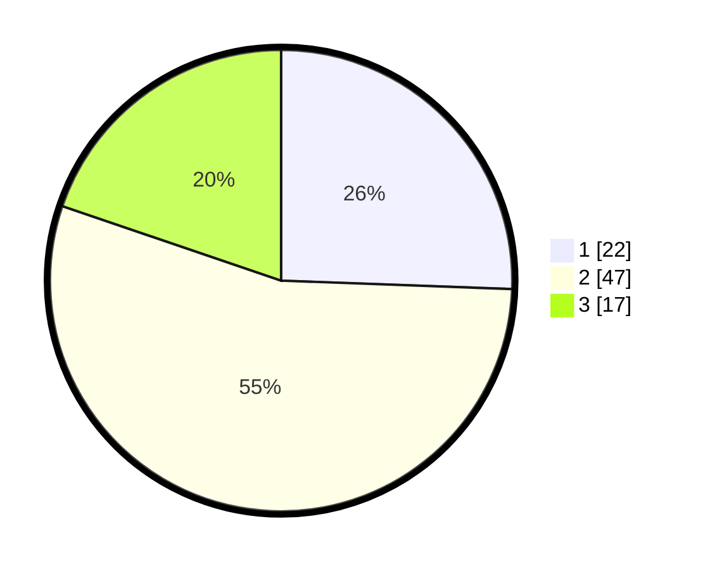

# Hasil

## Grafik

## Tabel

| No. | Nama Paslon    | Suara | Suara (raw) | Persentase |
|:--- |:-------------- | -----:| -----------:| ----------:|
| 1   | ANIES MUHAIMIN | 22    | [22][p-1]   | 25,58      |
| 2   | PRABOWO GIBRAN | 47    | [47][p-2]   | 54,65      |
| 3   | GANJAR MAHFUD  | 17    | [17][p-3]   | 19,77      |

[p-1]: https://github.com/gigit-pemilu/pemilu-2024-35-jawa-timur/blob/main/pilpres/hitung-suara/sub/35-jawa-timur/sub/15-sidoarjo/sub/06-tanggulangin/sub/2002-ketapang/sub/003-tps/sub/paslon-1.txt
[p-2]: https://github.com/gigit-pemilu/pemilu-2024-35-jawa-timur/blob/main/pilpres/hitung-suara/sub/35-jawa-timur/sub/15-sidoarjo/sub/06-tanggulangin/sub/2002-ketapang/sub/003-tps/sub/paslon-2.txt
[p-3]: https://github.com/gigit-pemilu/pemilu-2024-35-jawa-timur/blob/main/pilpres/hitung-suara/sub/35-jawa-timur/sub/15-sidoarjo/sub/06-tanggulangin/sub/2002-ketapang/sub/003-tps/sub/paslon-3.txt

## Foto C Plano

https://sirekap-obj-formc.kpu.go.id/4a9b/pemilu/ppwp/35/15/06/20/02/3515062002003-20240215-002111--e85c1b9b-dc16-4fd1-a2b4-0776949b1257.jpg

https://sirekap-obj-formc.kpu.go.id/4a9b/pemilu/ppwp/35/15/06/20/02/3515062002003-20240215-002220--b17b937f-7cee-451e-b935-cd2ef42226b8.jpg

https://sirekap-obj-formc.kpu.go.id/4a9b/pemilu/ppwp/35/15/06/20/02/3515062002003-20240215-002359--89bc3fcc-65fb-49d5-9843-32936401a9bd.jpg

## Metadata

| Key        | Value               |
| ---------- | ------------------- |
| Time Stamp | 2024-02-25 20:00:00 |

