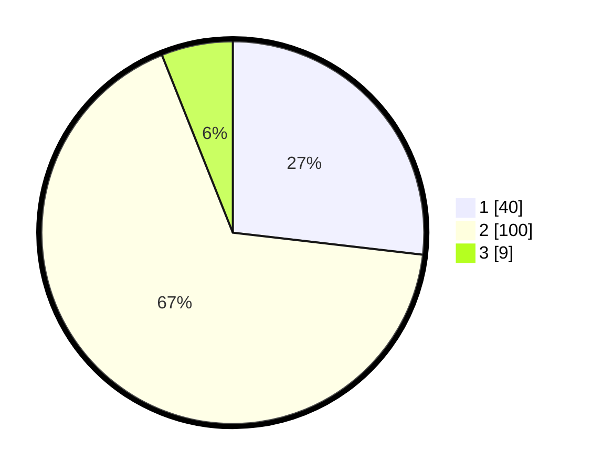

# Hasil

## Grafik

## Tabel

| No. | Nama Paslon    | Suara | Suara (raw) | Persentase |
|:--- |:-------------- | -----:| -----------:| ----------:|
| 1   | ANIES MUHAIMIN | 40    | [40][p-1]   | 26,85      |
| 2   | PRABOWO GIBRAN | 100   | [100][p-2]  | 67,11      |
| 3   | GANJAR MAHFUD  | 9     | [9][p-3]    | 6,04       |

[p-1]: https://github.com/gigit-pemilu/pemilu-2024-35-jawa-timur/blob/main/pilpres/hitung-suara/sub/35-jawa-timur/sub/15-sidoarjo/sub/06-tanggulangin/sub/2002-ketapang/sub/004-tps/sub/paslon-1.txt
[p-2]: https://github.com/gigit-pemilu/pemilu-2024-35-jawa-timur/blob/main/pilpres/hitung-suara/sub/35-jawa-timur/sub/15-sidoarjo/sub/06-tanggulangin/sub/2002-ketapang/sub/004-tps/sub/paslon-2.txt
[p-3]: https://github.com/gigit-pemilu/pemilu-2024-35-jawa-timur/blob/main/pilpres/hitung-suara/sub/35-jawa-timur/sub/15-sidoarjo/sub/06-tanggulangin/sub/2002-ketapang/sub/004-tps/sub/paslon-3.txt

## Foto C Plano

https://sirekap-obj-formc.kpu.go.id/bd00/pemilu/ppwp/35/15/06/20/02/3515062002004-20240215-042415--b009075c-a81c-4449-84b7-ac7410a1ec9e.jpg

https://sirekap-obj-formc.kpu.go.id/bd00/pemilu/ppwp/35/15/06/20/02/3515062002004-20240215-010003--533328e8-c7af-4318-839c-2cfed1c010a4.jpg

https://sirekap-obj-formc.kpu.go.id/bd00/pemilu/ppwp/35/15/06/20/02/3515062002004-20240215-010109--4ff934b2-6787-43bd-a2b1-61addb86337d.jpg

## Metadata

| Key        | Value               |
| ---------- | ------------------- |
| Time Stamp | 2024-02-25 17:00:00 |

