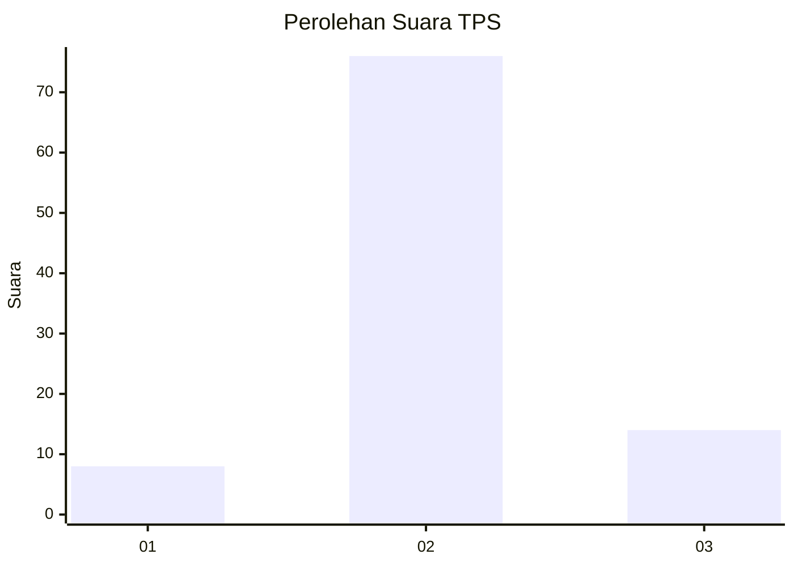
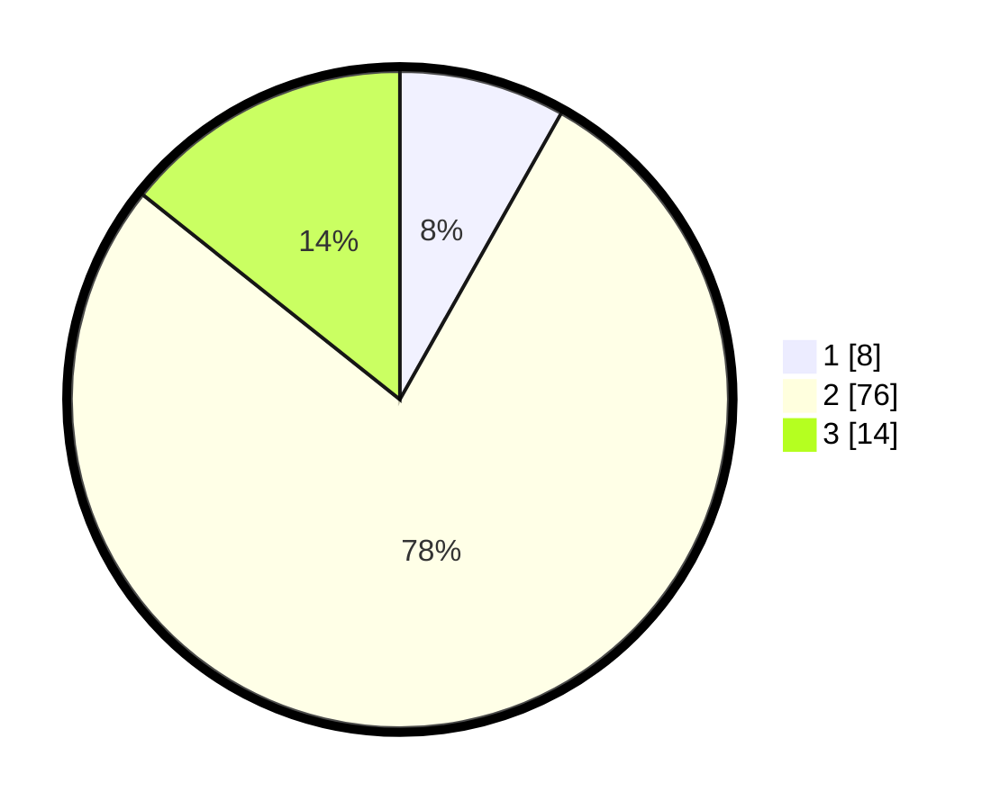

# Hasil

## Grafik

## Tabel

| No. | Nama Paslon    | Suara | Suara (raw) | Persentase |
|:--- |:-------------- | -----:| -----------:| ----------:|
| 1   | ANIES MUHAIMIN | 8     | [8][p-1]    | 8,16       |
| 2   | PRABOWO GIBRAN | 76    | [76][p-2]   | 77,55      |
| 3   | GANJAR MAHFUD  | 14    | [14][p-3]   | 14,29      |

[p-1]: https://github.com/gigit-pemilu/pemilu-2024/blob/main/pilpres/hitung-suara/sub/35-jawa-timur/sub/15-sidoarjo/sub/06-tanggulangin/sub/2002-ketapang/sub/005-tps/sub/paslon-1.txt
[p-2]: https://github.com/gigit-pemilu/pemilu-2024/blob/main/pilpres/hitung-suara/sub/35-jawa-timur/sub/15-sidoarjo/sub/06-tanggulangin/sub/2002-ketapang/sub/005-tps/sub/paslon-2.txt
[p-3]: https://github.com/gigit-pemilu/pemilu-2024/blob/main/pilpres/hitung-suara/sub/35-jawa-timur/sub/15-sidoarjo/sub/06-tanggulangin/sub/2002-ketapang/sub/005-tps/sub/paslon-3.txt

## Foto C Plano

https://sirekap-obj-formc.kpu.go.id/c5ed/pemilu/ppwp/35/15/06/20/02/3515062002005-20240214-225541--4588d474-1650-4e56-823a-34fcf83e0b72.jpg

https://sirekap-obj-formc.kpu.go.id/c5ed/pemilu/ppwp/35/15/06/20/02/3515062002005-20240214-225704--956ea844-1b78-462a-8ddf-beca29079901.jpg

https://sirekap-obj-formc.kpu.go.id/c5ed/pemilu/ppwp/35/15/06/20/02/3515062002005-20240214-225840--55ce0718-e674-4176-87ac-5b24d274fcd1.jpg

## Metadata

| Key        | Value               |
| ---------- | ------------------- |
| Time Stamp | 2024-02-25 16:00:00 |

