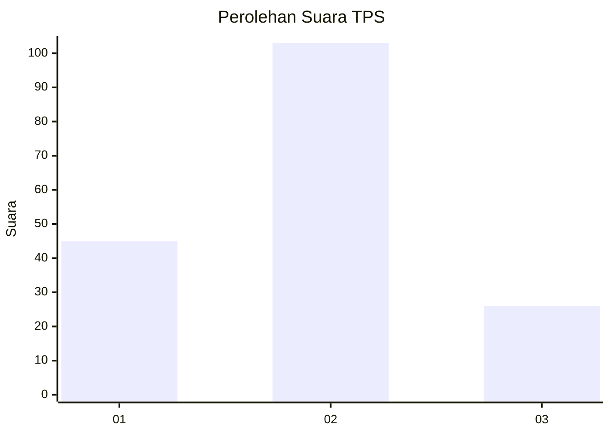

# Hasil

## Grafik

## Tabel

| No. | Nama Paslon    | Suara | Suara (raw) | Persentase |
|:--- |:-------------- | -----:| -----------:| ----------:|
| 1   | ANIES MUHAIMIN | 45    | [45][p-1]   | 25,86      |
| 2   | PRABOWO GIBRAN | 103   | [103][p-2]  | 59,20      |
| 3   | GANJAR MAHFUD  | 26    | [26][p-3]   | 14,94      |

[p-1]: https://github.com/gigit-pemilu/pemilu-2024-35-jawa-timur/blob/main/pilpres/hitung-suara/sub/35-jawa-timur/sub/15-sidoarjo/sub/06-tanggulangin/sub/2004-kalitengah/sub/027-tps/sub/paslon-1.txt
[p-2]: https://github.com/gigit-pemilu/pemilu-2024-35-jawa-timur/blob/main/pilpres/hitung-suara/sub/35-jawa-timur/sub/15-sidoarjo/sub/06-tanggulangin/sub/2004-kalitengah/sub/027-tps/sub/paslon-2.txt
[p-3]: https://github.com/gigit-pemilu/pemilu-2024-35-jawa-timur/blob/main/pilpres/hitung-suara/sub/35-jawa-timur/sub/15-sidoarjo/sub/06-tanggulangin/sub/2004-kalitengah/sub/027-tps/sub/paslon-3.txt

## Foto C Plano

https://sirekap-obj-formc.kpu.go.id/4884/pemilu/ppwp/35/15/06/20/04/3515062004027-20240214-205049--dee36fde-79c1-4ea5-bf48-40d9c958f674.jpg

https://sirekap-obj-formc.kpu.go.id/4884/pemilu/ppwp/35/15/06/20/04/3515062004027-20240214-205110--a55a288b-1abb-4f44-90e8-e4aca55195ca.jpg

https://sirekap-obj-formc.kpu.go.id/4884/pemilu/ppwp/35/15/06/20/04/3515062004027-20240214-205204--71a7b354-ab5c-4931-85fd-cce54db77ffb.jpg

## Metadata

| Key        | Value               |
| ---------- | ------------------- |
| Time Stamp | 2024-02-15 17:30:25 |

