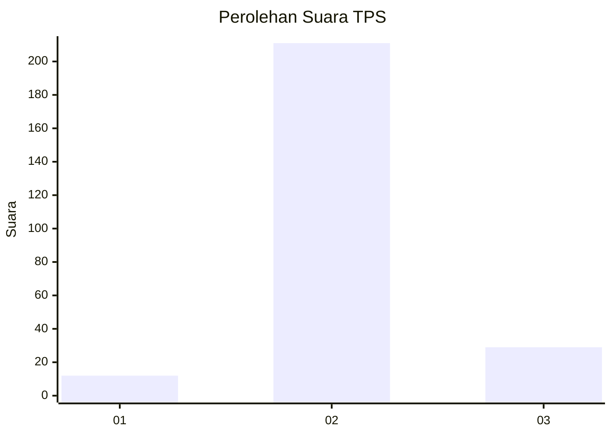
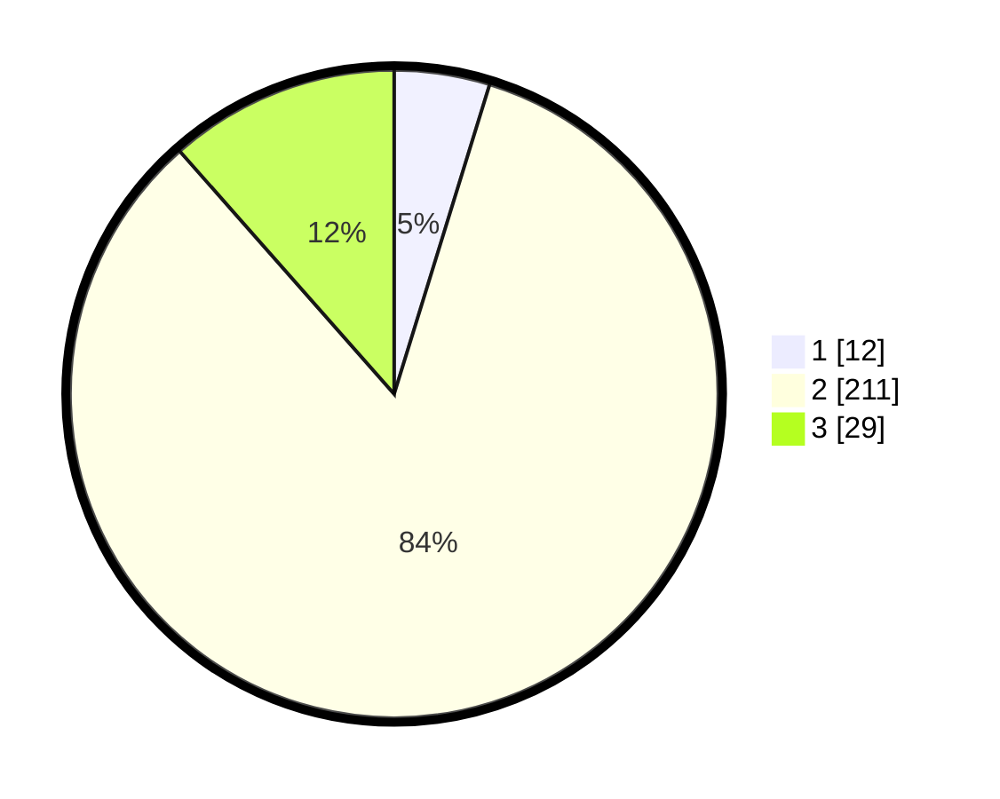

# Hasil

## Grafik

## Tabel

| No. | Nama Paslon    | Suara | Suara (raw) | Persentase |
|:--- |:-------------- | -----:| -----------:| ----------:|
| 1   | ANIES MUHAIMIN | 12    | [12][p-1]   | 4,76       |
| 2   | PRABOWO GIBRAN | 211   | [211][p-2]  | 83,73      |
| 3   | GANJAR MAHFUD  | 29    | [29][p-3]   | 11,51      |

[p-1]: https://github.com/gigit-pemilu/pemilu-2024-35-jawa-timur/blob/main/pilpres/hitung-suara/sub/35-jawa-timur/sub/15-sidoarjo/sub/06-tanggulangin/sub/2006-sentul/sub/006-tps/sub/paslon-1.txt
[p-2]: https://github.com/gigit-pemilu/pemilu-2024-35-jawa-timur/blob/main/pilpres/hitung-suara/sub/35-jawa-timur/sub/15-sidoarjo/sub/06-tanggulangin/sub/2006-sentul/sub/006-tps/sub/paslon-2.txt
[p-3]: https://github.com/gigit-pemilu/pemilu-2024-35-jawa-timur/blob/main/pilpres/hitung-suara/sub/35-jawa-timur/sub/15-sidoarjo/sub/06-tanggulangin/sub/2006-sentul/sub/006-tps/sub/paslon-3.txt

## Foto C Plano

https://sirekap-obj-formc.kpu.go.id/7fe9/pemilu/ppwp/35/15/06/20/06/3515062006006-20240217-180551--df941c89-5444-4fb3-91f4-f00837d7ad75.jpg

https://sirekap-obj-formc.kpu.go.id/7fe9/pemilu/ppwp/35/15/06/20/06/3515062006006-20240217-181416--667d528d-1615-48b7-972a-cb012f529f2d.jpg

https://sirekap-obj-formc.kpu.go.id/7fe9/pemilu/ppwp/35/15/06/20/06/3515062006006-20240214-214005--90cb595f-dfe1-4081-8ee4-868d363fc289.jpg

## Metadata

| Key        | Value               |
| ---------- | ------------------- |
| Time Stamp | 2024-02-25 12:00:00 |

