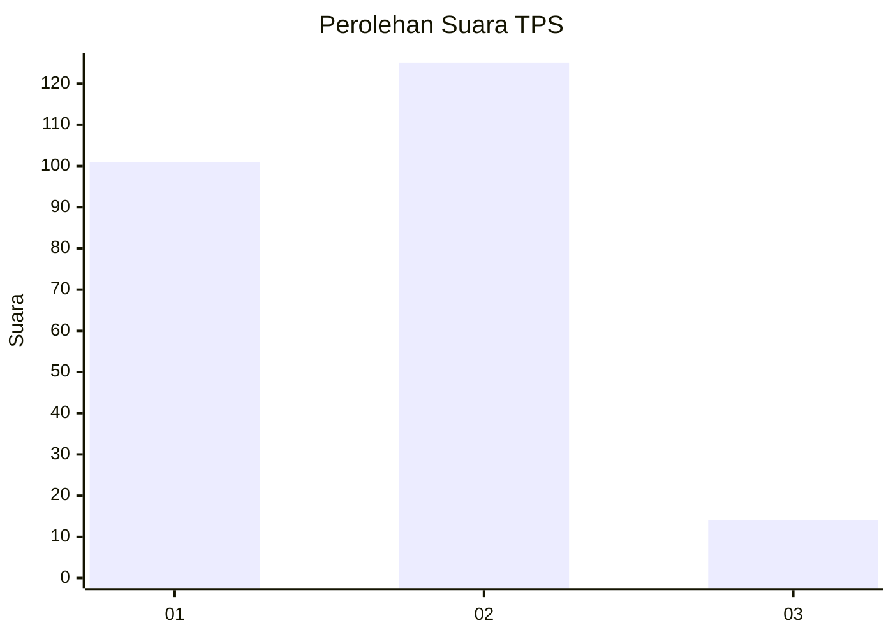
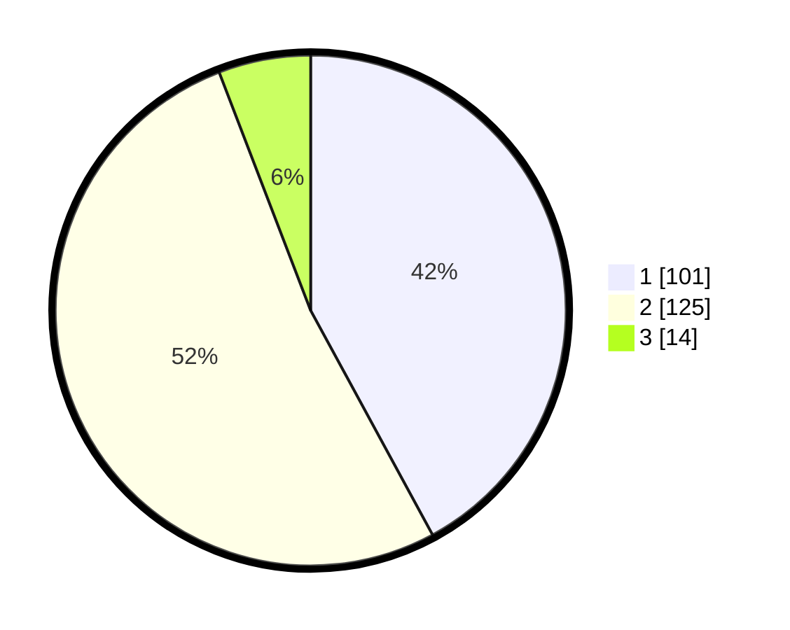

# Hasil

## Grafik

## Tabel

| No. | Nama Paslon    | Suara | Suara (raw) | Persentase |
|:--- |:-------------- | -----:| -----------:| ----------:|
| 1   | ANIES MUHAIMIN | 101   | [101][p-1]  | 42,08      |
| 2   | PRABOWO GIBRAN | 125   | [125][p-2]  | 52,08      |
| 3   | GANJAR MAHFUD  | 14    | [14][p-3]   | 5,83       |

[p-1]: https://github.com/gigit-pemilu/pemilu-2024/blob/main/pilpres/hitung-suara/sub/35-jawa-timur/sub/15-sidoarjo/sub/06-tanggulangin/sub/2007-penatarsewu/sub/003-tps/sub/paslon-1.txt
[p-2]: https://github.com/gigit-pemilu/pemilu-2024/blob/main/pilpres/hitung-suara/sub/35-jawa-timur/sub/15-sidoarjo/sub/06-tanggulangin/sub/2007-penatarsewu/sub/003-tps/sub/paslon-2.txt
[p-3]: https://github.com/gigit-pemilu/pemilu-2024/blob/main/pilpres/hitung-suara/sub/35-jawa-timur/sub/15-sidoarjo/sub/06-tanggulangin/sub/2007-penatarsewu/sub/003-tps/sub/paslon-3.txt

## Foto C Plano

https://sirekap-obj-formc.kpu.go.id/cb18/pemilu/ppwp/35/15/06/20/07/3515062007003-20240214-222705--15d7f326-771c-4ade-be9a-c2c073a407ff.jpg

https://sirekap-obj-formc.kpu.go.id/cb18/pemilu/ppwp/35/15/06/20/07/3515062007003-20240214-220029--c82c4d6b-c57f-412f-836e-d7e0d93b6f56.jpg

https://sirekap-obj-formc.kpu.go.id/cb18/pemilu/ppwp/35/15/06/20/07/3515062007003-20240214-220046--61e87052-a957-458b-9d9a-5c8f47a1d73c.jpg

## Metadata

| Key        | Value               |
| ---------- | ------------------- |
| Time Stamp | 2024-02-25 13:00:00 |

