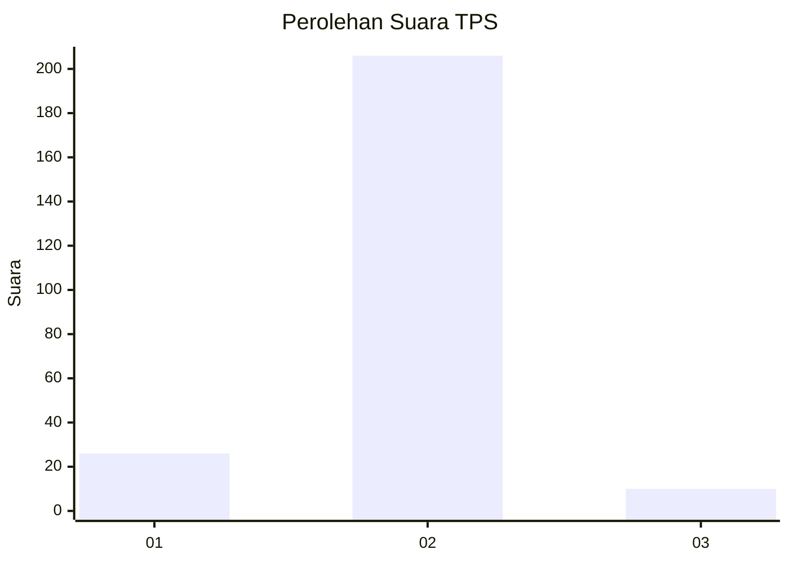
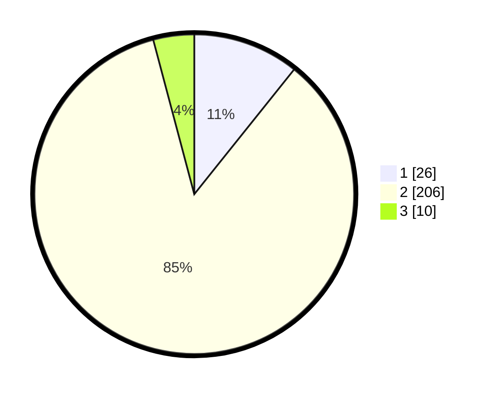

# Hasil

## Grafik

## Tabel

| No. | Nama Paslon    | Suara | Suara (raw) | Persentase |
|:--- |:-------------- | -----:| -----------:| ----------:|
| 1   | ANIES MUHAIMIN | 26    | [26][p-1]   | 10,74      |
| 2   | PRABOWO GIBRAN | 206   | [206][p-2]  | 85,12      |
| 3   | GANJAR MAHFUD  | 10    | [10][p-3]   | 4,13       |

[p-1]: https://github.com/gigit-pemilu/pemilu-2024/blob/main/pilpres/hitung-suara/sub/35-jawa-timur/sub/15-sidoarjo/sub/06-tanggulangin/sub/2008-banjarasri/sub/005-tps/sub/paslon-1.txt
[p-2]: https://github.com/gigit-pemilu/pemilu-2024/blob/main/pilpres/hitung-suara/sub/35-jawa-timur/sub/15-sidoarjo/sub/06-tanggulangin/sub/2008-banjarasri/sub/005-tps/sub/paslon-2.txt
[p-3]: https://github.com/gigit-pemilu/pemilu-2024/blob/main/pilpres/hitung-suara/sub/35-jawa-timur/sub/15-sidoarjo/sub/06-tanggulangin/sub/2008-banjarasri/sub/005-tps/sub/paslon-3.txt

## Foto C Plano

https://sirekap-obj-formc.kpu.go.id/1cbf/pemilu/ppwp/35/15/06/20/08/3515062008005-20240214-234910--c4ad34d9-c843-4e8f-94c4-04866ea22124.jpg

https://sirekap-obj-formc.kpu.go.id/1cbf/pemilu/ppwp/35/15/06/20/08/3515062008005-20240214-233308--4e96ef8b-51aa-49ef-832e-09064dd6e22d.jpg

https://sirekap-obj-formc.kpu.go.id/1cbf/pemilu/ppwp/35/15/06/20/08/3515062008005-20240214-233451--6e270b76-e06a-4c9a-8f6a-a33a1ba0cc1c.jpg

## Metadata

| Key        | Value               |
| ---------- | ------------------- |
| Time Stamp | 2024-02-15 18:00:26 |

