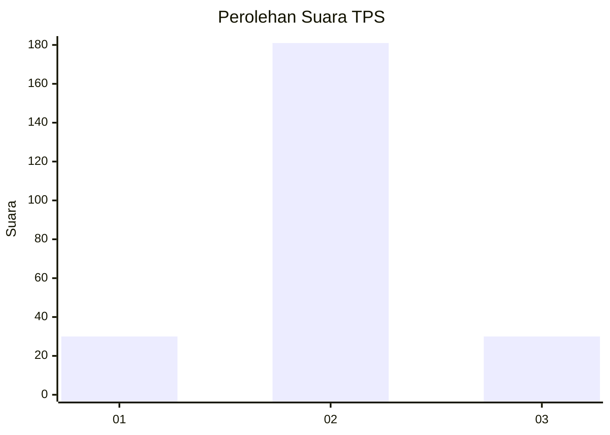
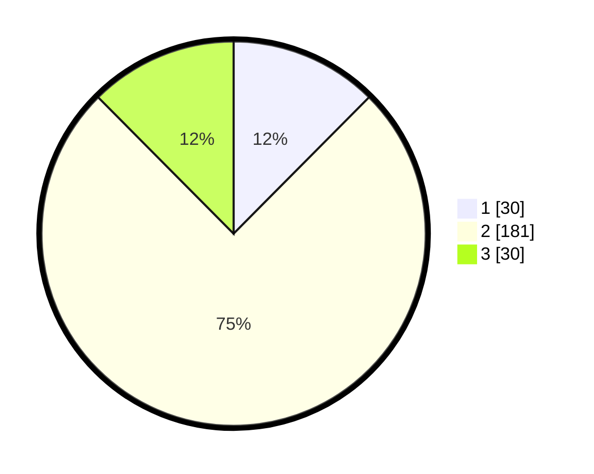

# Hasil

## Grafik

## Tabel

| No. | Nama Paslon    | Suara | Suara (raw) | Persentase |
|:--- |:-------------- | -----:| -----------:| ----------:|
| 1   | ANIES MUHAIMIN | 30    | [30][p-1]   | 12,45      |
| 2   | PRABOWO GIBRAN | 181   | [181][p-2]  | 75,10      |
| 3   | GANJAR MAHFUD  | 30    | [30][p-3]   | 12,45      |

[p-1]: https://github.com/gigit-pemilu/pemilu-2024-35-jawa-timur/blob/main/pilpres/hitung-suara/sub/35-jawa-timur/sub/15-sidoarjo/sub/06-tanggulangin/sub/2008-banjarasri/sub/007-tps/sub/paslon-1.txt
[p-2]: https://github.com/gigit-pemilu/pemilu-2024-35-jawa-timur/blob/main/pilpres/hitung-suara/sub/35-jawa-timur/sub/15-sidoarjo/sub/06-tanggulangin/sub/2008-banjarasri/sub/007-tps/sub/paslon-2.txt
[p-3]: https://github.com/gigit-pemilu/pemilu-2024-35-jawa-timur/blob/main/pilpres/hitung-suara/sub/35-jawa-timur/sub/15-sidoarjo/sub/06-tanggulangin/sub/2008-banjarasri/sub/007-tps/sub/paslon-3.txt

## Foto C Plano

https://sirekap-obj-formc.kpu.go.id/6f4d/pemilu/ppwp/35/15/06/20/08/3515062008007-20240214-231720--725e7501-e932-49d4-96b1-fa1117ac2dba.jpg

https://sirekap-obj-formc.kpu.go.id/6f4d/pemilu/ppwp/35/15/06/20/08/3515062008007-20240214-231948--0b30f62d-5e54-475a-b778-126cf5e9de4c.jpg

https://sirekap-obj-formc.kpu.go.id/6f4d/pemilu/ppwp/35/15/06/20/08/3515062008007-20240214-232052--c9a53cbd-408b-41ee-9e0d-192c95a7df79.jpg

## Metadata

| Key        | Value               |
| ---------- | ------------------- |
| Time Stamp | 2024-02-15 18:00:26 |

