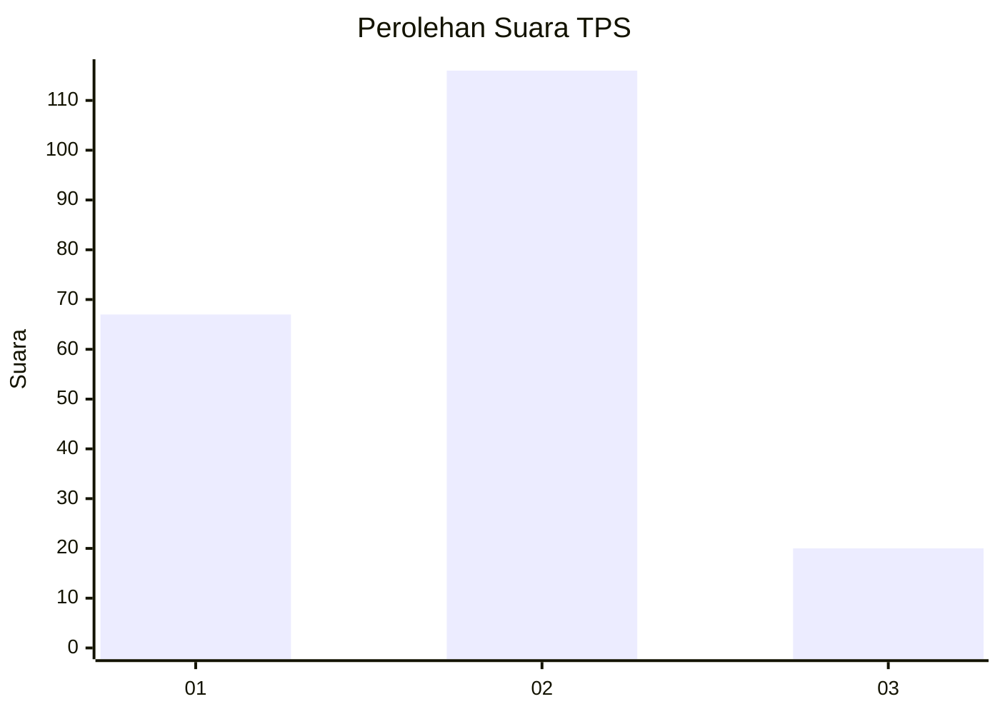
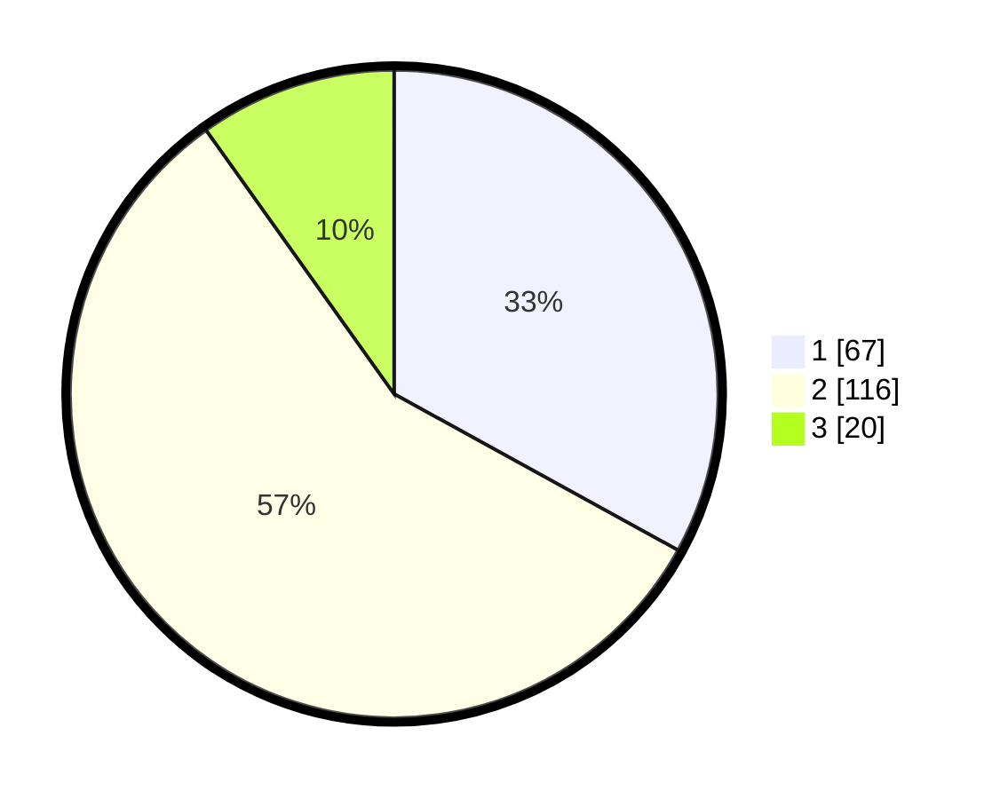

# Hasil

## Grafik

## Tabel

| No. | Nama Paslon    | Suara | Suara (raw) | Persentase |
|:--- |:-------------- | -----:| -----------:| ----------:|
| 1   | ANIES MUHAIMIN | 67    | [67][p-1]   | 33,00      |
| 2   | PRABOWO GIBRAN | 116   | [116][p-2]  | 57,14      |
| 3   | GANJAR MAHFUD  | 20    | [20][p-3]   | 9,85       |

[p-1]: https://github.com/gigit-pemilu/pemilu-2024/blob/main/pilpres/hitung-suara/sub/35-jawa-timur/sub/15-sidoarjo/sub/06-tanggulangin/sub/2010-kedungbanteng/sub/002-tps/sub/paslon-1.txt
[p-2]: https://github.com/gigit-pemilu/pemilu-2024/blob/main/pilpres/hitung-suara/sub/35-jawa-timur/sub/15-sidoarjo/sub/06-tanggulangin/sub/2010-kedungbanteng/sub/002-tps/sub/paslon-2.txt
[p-3]: https://github.com/gigit-pemilu/pemilu-2024/blob/main/pilpres/hitung-suara/sub/35-jawa-timur/sub/15-sidoarjo/sub/06-tanggulangin/sub/2010-kedungbanteng/sub/002-tps/sub/paslon-3.txt

## Foto C Plano

https://sirekap-obj-formc.kpu.go.id/43cf/pemilu/ppwp/35/15/06/20/10/3515062010002-20240214-202443--ea076b9d-42b7-4bdd-b830-c0218a326ed1.jpg

https://sirekap-obj-formc.kpu.go.id/43cf/pemilu/ppwp/35/15/06/20/10/3515062010002-20240214-202725--60b91bc6-85fb-45a8-bab2-94b9269c0fc8.jpg

https://sirekap-obj-formc.kpu.go.id/43cf/pemilu/ppwp/35/15/06/20/10/3515062010002-20240214-203546--84b6cccf-1262-47c2-9a2a-b5824db50d43.jpg

## Metadata

| Key        | Value               |
| ---------- | ------------------- |
| Time Stamp | 2024-02-15 18:00:26 |

