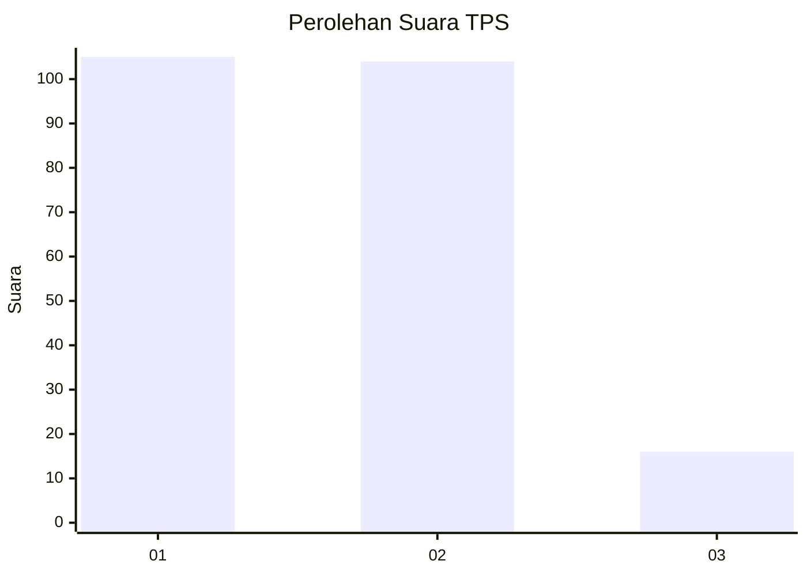
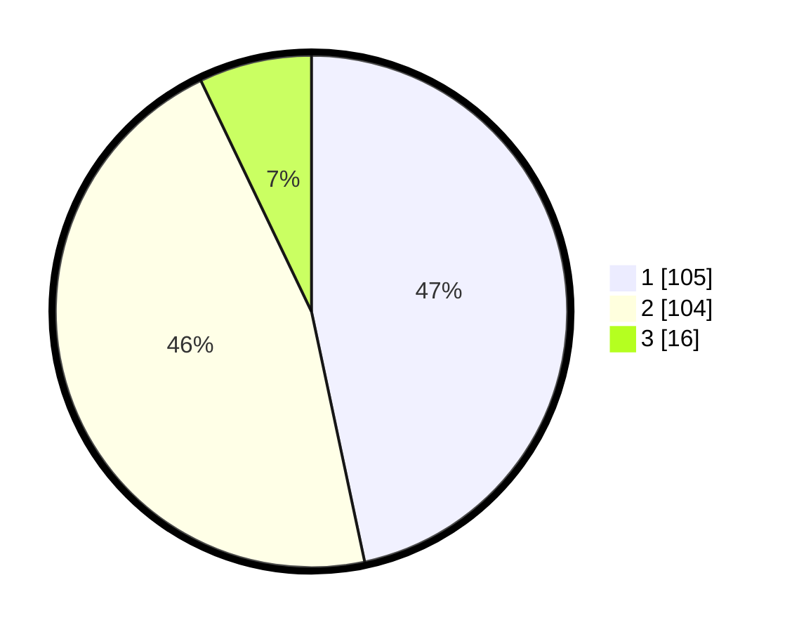

# Hasil

## Grafik

## Tabel

| No. | Nama Paslon    | Suara | Suara (raw) | Persentase |
|:--- |:-------------- | -----:| -----------:| ----------:|
| 1   | ANIES MUHAIMIN | 105   | [105][p-1]  | 46,67      |
| 2   | PRABOWO GIBRAN | 104   | [104][p-2]  | 46,22      |
| 3   | GANJAR MAHFUD  | 16    | [16][p-3]   | 7,11       |

[p-1]: https://github.com/gigit-pemilu/pemilu-2024-35-jawa-timur/blob/main/pilpres/hitung-suara/sub/35-jawa-timur/sub/15-sidoarjo/sub/06-tanggulangin/sub/2012-putat/sub/001-tps/sub/paslon-1.txt
[p-2]: https://github.com/gigit-pemilu/pemilu-2024-35-jawa-timur/blob/main/pilpres/hitung-suara/sub/35-jawa-timur/sub/15-sidoarjo/sub/06-tanggulangin/sub/2012-putat/sub/001-tps/sub/paslon-2.txt
[p-3]: https://github.com/gigit-pemilu/pemilu-2024-35-jawa-timur/blob/main/pilpres/hitung-suara/sub/35-jawa-timur/sub/15-sidoarjo/sub/06-tanggulangin/sub/2012-putat/sub/001-tps/sub/paslon-3.txt

## Foto C Plano

https://sirekap-obj-formc.kpu.go.id/6752/pemilu/ppwp/35/15/06/20/12/3515062012001-20240217-061649--6ead5c5c-ae25-442c-863b-bef13c43927c.jpg

https://sirekap-obj-formc.kpu.go.id/6752/pemilu/ppwp/35/15/06/20/12/3515062012001-20240214-141821--de140867-492b-42d2-a1f2-019fa28c6c64.jpg

https://sirekap-obj-formc.kpu.go.id/6752/pemilu/ppwp/35/15/06/20/12/3515062012001-20240217-061911--0ffb0170-8208-41c2-95a8-05812da4df61.jpg

## Metadata

| Key        | Value               |
| ---------- | ------------------- |
| Time Stamp | 2024-02-21 17:00:00 |

