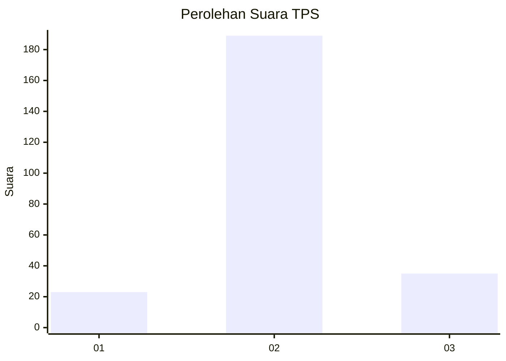

# Hasil

## Grafik

## Tabel

| No. | Nama Paslon    | Suara | Suara (raw) | Persentase |
|:--- |:-------------- | -----:| -----------:| ----------:|
| 1   | ANIES MUHAIMIN | 23    | [23][p-1]   | 9,31       |
| 2   | PRABOWO GIBRAN | 189   | [189][p-2]  | 76,52      |
| 3   | GANJAR MAHFUD  | 35    | [35][p-3]   | 14,17      |

[p-1]: https://github.com/gigit-pemilu/pemilu-2024-35-jawa-timur/blob/main/pilpres/hitung-suara/sub/35-jawa-timur/sub/15-sidoarjo/sub/06-tanggulangin/sub/2013-ngaban/sub/007-tps/sub/paslon-1.txt
[p-2]: https://github.com/gigit-pemilu/pemilu-2024-35-jawa-timur/blob/main/pilpres/hitung-suara/sub/35-jawa-timur/sub/15-sidoarjo/sub/06-tanggulangin/sub/2013-ngaban/sub/007-tps/sub/paslon-2.txt
[p-3]: https://github.com/gigit-pemilu/pemilu-2024-35-jawa-timur/blob/main/pilpres/hitung-suara/sub/35-jawa-timur/sub/15-sidoarjo/sub/06-tanggulangin/sub/2013-ngaban/sub/007-tps/sub/paslon-3.txt

## Foto C Plano

https://sirekap-obj-formc.kpu.go.id/aa1e/pemilu/ppwp/35/15/06/20/13/3515062013007-20240215-190635--c0365561-9c39-4ce8-83bd-32c746325732.jpg

https://sirekap-obj-formc.kpu.go.id/aa1e/pemilu/ppwp/35/15/06/20/13/3515062013007-20240214-214824--9866c0e3-a746-4509-94d6-4642f713a381.jpg

https://sirekap-obj-formc.kpu.go.id/aa1e/pemilu/ppwp/35/15/06/20/13/3515062013007-20240214-214910--6dfb28d6-a449-4ecd-8001-140e8927b143.jpg

## Metadata

| Key        | Value               |
| ---------- | ------------------- |
| Time Stamp | 2024-02-15 19:30:26 |

