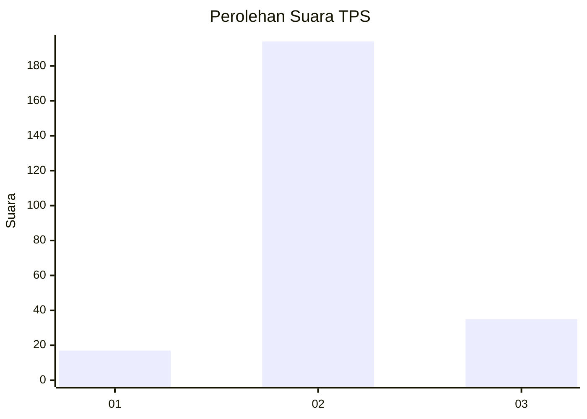

# Hasil

## Grafik

## Tabel

| No. | Nama Paslon    | Suara | Suara (raw) | Persentase |
|:--- |:-------------- | -----:| -----------:| ----------:|
| 1   | ANIES MUHAIMIN | 17    | [17][p-1]   | 6,91       |
| 2   | PRABOWO GIBRAN | 194   | [194][p-2]  | 78,86      |
| 3   | GANJAR MAHFUD  | 35    | [35][p-3]   | 14,23      |

[p-1]: https://github.com/gigit-pemilu/pemilu-2024/blob/main/pilpres/hitung-suara/sub/35-jawa-timur/sub/15-sidoarjo/sub/06-tanggulangin/sub/2014-kludan/sub/001-tps/sub/paslon-1.txt
[p-2]: https://github.com/gigit-pemilu/pemilu-2024/blob/main/pilpres/hitung-suara/sub/35-jawa-timur/sub/15-sidoarjo/sub/06-tanggulangin/sub/2014-kludan/sub/001-tps/sub/paslon-2.txt
[p-3]: https://github.com/gigit-pemilu/pemilu-2024/blob/main/pilpres/hitung-suara/sub/35-jawa-timur/sub/15-sidoarjo/sub/06-tanggulangin/sub/2014-kludan/sub/001-tps/sub/paslon-3.txt

## Foto C Plano

https://sirekap-obj-formc.kpu.go.id/09a9/pemilu/ppwp/35/15/06/20/14/3515062014001-20240215-051600--752b86ae-fd75-49fc-ac36-b8501522a415.jpg

https://sirekap-obj-formc.kpu.go.id/09a9/pemilu/ppwp/35/15/06/20/14/3515062014001-20240215-051808--02ceb9d7-7a22-4a10-95b6-e0727e6cea49.jpg

https://sirekap-obj-formc.kpu.go.id/09a9/pemilu/ppwp/35/15/06/20/14/3515062014001-20240215-051941--9b6936bc-c5a2-44e7-8ca8-6eccb0ae291d.jpg

## Metadata

| Key        | Value               |
| ---------- | ------------------- |
| Time Stamp | 2024-02-24 22:31:28 |

