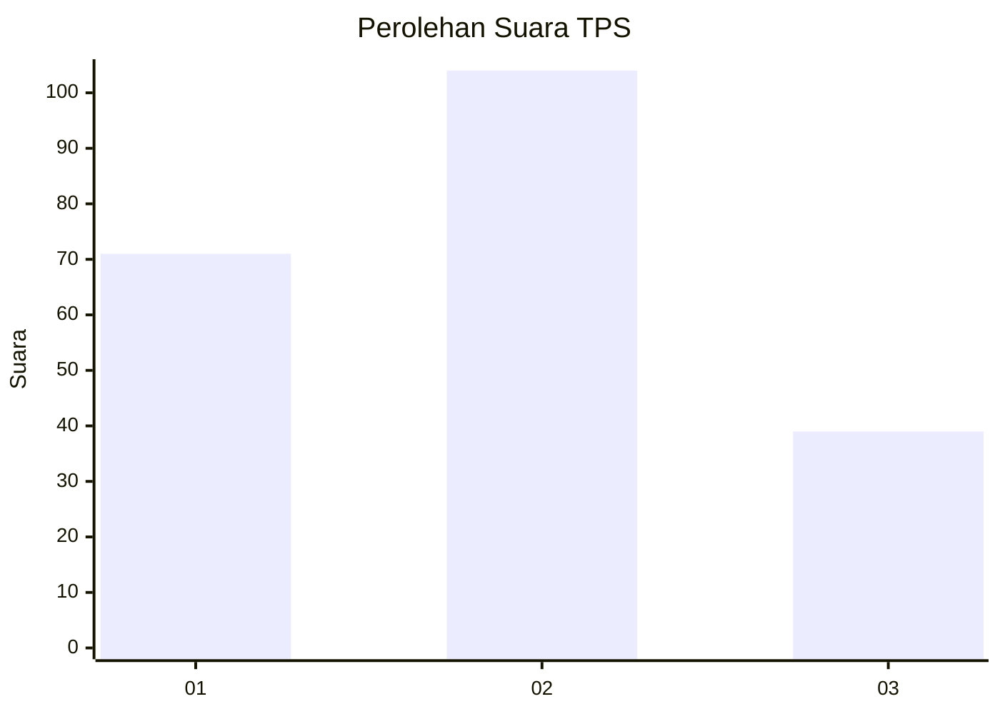
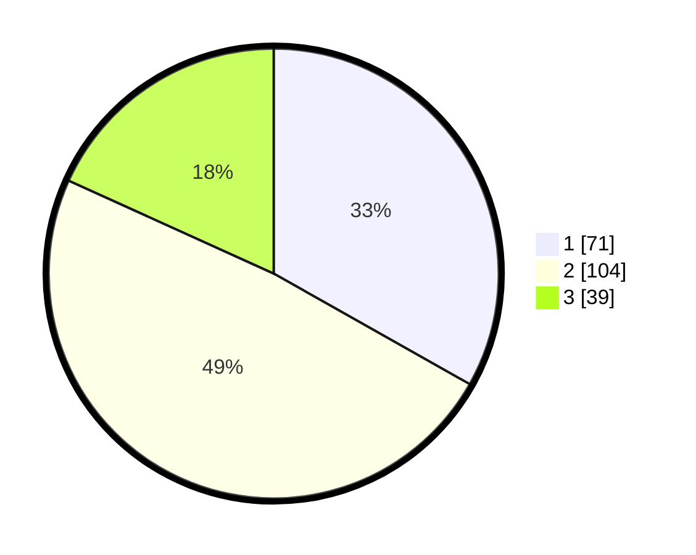

# Hasil

## Grafik

## Tabel

| No. | Nama Paslon    | Suara | Suara (raw) | Persentase |
|:--- |:-------------- | -----:| -----------:| ----------:|
| 1   | ANIES MUHAIMIN | 71    | [71][p-1]   | 33,18      |
| 2   | PRABOWO GIBRAN | 104   | [104][p-2]  | 48,60      |
| 3   | GANJAR MAHFUD  | 39    | [39][p-3]   | 18,22      |

[p-1]: https://github.com/gigit-pemilu/pemilu-2024-35-jawa-timur/blob/main/pilpres/hitung-suara/sub/35-jawa-timur/sub/15-sidoarjo/sub/06-tanggulangin/sub/2014-kludan/sub/014-tps/sub/paslon-1.txt
[p-2]: https://github.com/gigit-pemilu/pemilu-2024-35-jawa-timur/blob/main/pilpres/hitung-suara/sub/35-jawa-timur/sub/15-sidoarjo/sub/06-tanggulangin/sub/2014-kludan/sub/014-tps/sub/paslon-2.txt
[p-3]: https://github.com/gigit-pemilu/pemilu-2024-35-jawa-timur/blob/main/pilpres/hitung-suara/sub/35-jawa-timur/sub/15-sidoarjo/sub/06-tanggulangin/sub/2014-kludan/sub/014-tps/sub/paslon-3.txt

## Foto C Plano

https://sirekap-obj-formc.kpu.go.id/3c19/pemilu/ppwp/35/15/06/20/14/3515062014014-20240214-231127--62029a01-effb-414b-8366-464eb1f65f5a.jpg

https://sirekap-obj-formc.kpu.go.id/3c19/pemilu/ppwp/35/15/06/20/14/3515062014014-20240214-231353--a1dcbce2-847e-43d0-a53a-51c9386a3e68.jpg

https://sirekap-obj-formc.kpu.go.id/3c19/pemilu/ppwp/35/15/06/20/14/3515062014014-20240214-232037--a8985c4b-a5ca-4be9-b8ed-5dfd300c0d56.jpg

## Metadata

| Key        | Value               |
| ---------- | ------------------- |
| Time Stamp | 2024-02-15 18:00:26 |

