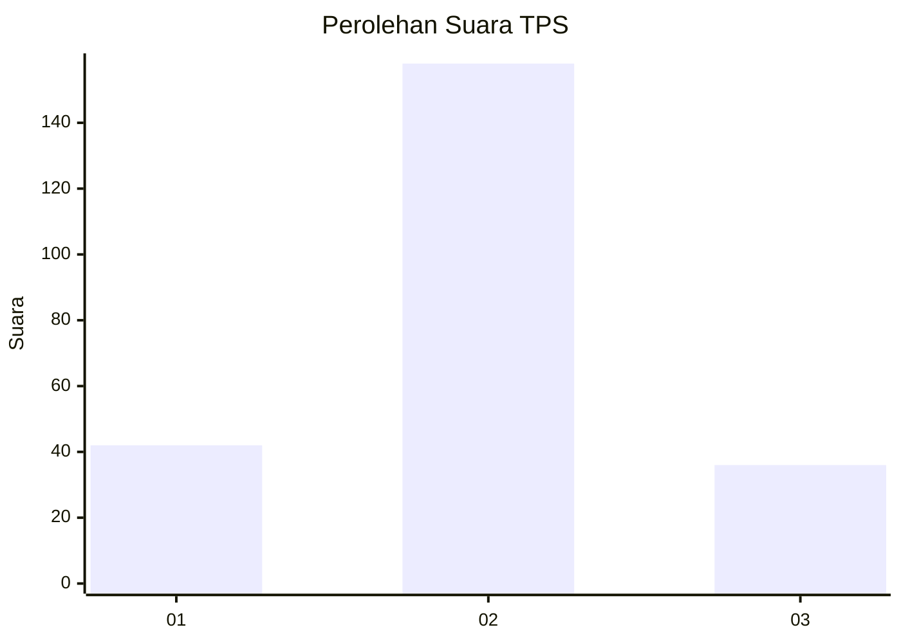
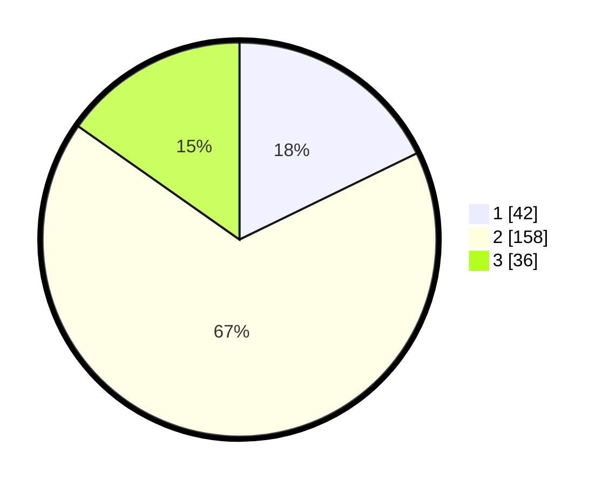

# Hasil

## Grafik

## Tabel

| No. | Nama Paslon    | Suara | Suara (raw) | Persentase |
|:--- |:-------------- | -----:| -----------:| ----------:|
| 1   | ANIES MUHAIMIN | 42    | [42][p-1]   | 17,80      |
| 2   | PRABOWO GIBRAN | 158   | [158][p-2]  | 66,95      |
| 3   | GANJAR MAHFUD  | 36    | [36][p-3]   | 15,25      |

[p-1]: https://github.com/gigit-pemilu/pemilu-2024/blob/main/pilpres/hitung-suara/sub/35-jawa-timur/sub/15-sidoarjo/sub/06-tanggulangin/sub/2017-ketegan/sub/004-tps/sub/paslon-1.txt
[p-2]: https://github.com/gigit-pemilu/pemilu-2024/blob/main/pilpres/hitung-suara/sub/35-jawa-timur/sub/15-sidoarjo/sub/06-tanggulangin/sub/2017-ketegan/sub/004-tps/sub/paslon-2.txt
[p-3]: https://github.com/gigit-pemilu/pemilu-2024/blob/main/pilpres/hitung-suara/sub/35-jawa-timur/sub/15-sidoarjo/sub/06-tanggulangin/sub/2017-ketegan/sub/004-tps/sub/paslon-3.txt

## Foto C Plano

https://sirekap-obj-formc.kpu.go.id/b06e/pemilu/ppwp/35/15/06/20/17/3515062017004-20240214-222348--720739ed-b9d9-4ade-a2cb-2c88aebe4b58.jpg

https://sirekap-obj-formc.kpu.go.id/b06e/pemilu/ppwp/35/15/06/20/17/3515062017004-20240214-222712--2e8de0b3-859d-4310-a39b-d434ad2b56cf.jpg

https://sirekap-obj-formc.kpu.go.id/b06e/pemilu/ppwp/35/15/06/20/17/3515062017004-20240214-222831--4008801e-0968-43a9-a63d-2846ec4f3e52.jpg

## Metadata

| Key        | Value               |
| ---------- | ------------------- |
| Time Stamp | 2024-02-25 16:00:00 |

