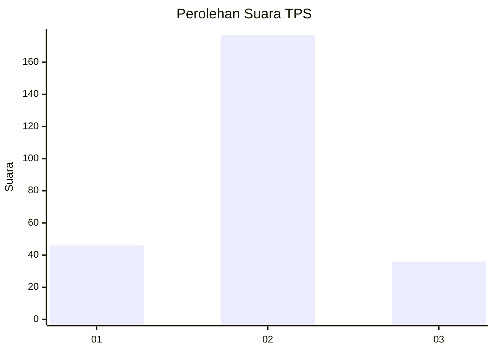
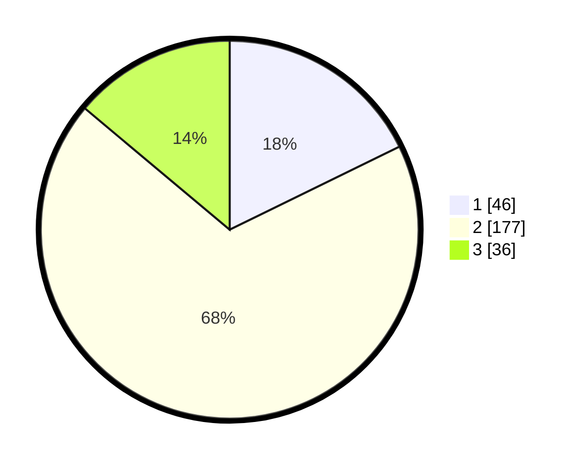

# Hasil

## Grafik

## Tabel

| No. | Nama Paslon    | Suara | Suara (raw) | Persentase |
|:--- |:-------------- | -----:| -----------:| ----------:|
| 1   | ANIES MUHAIMIN | 46    | [46][p-1]   | 17,76      |
| 2   | PRABOWO GIBRAN | 177   | [177][p-2]  | 68,34      |
| 3   | GANJAR MAHFUD  | 36    | [36][p-3]   | 13,90      |

[p-1]: https://github.com/gigit-pemilu/pemilu-2024/blob/main/pilpres/hitung-suara/sub/35-jawa-timur/sub/15-sidoarjo/sub/06-tanggulangin/sub/2018-ganggangpanjang/sub/001-tps/sub/paslon-1.txt
[p-2]: https://github.com/gigit-pemilu/pemilu-2024/blob/main/pilpres/hitung-suara/sub/35-jawa-timur/sub/15-sidoarjo/sub/06-tanggulangin/sub/2018-ganggangpanjang/sub/001-tps/sub/paslon-2.txt
[p-3]: https://github.com/gigit-pemilu/pemilu-2024/blob/main/pilpres/hitung-suara/sub/35-jawa-timur/sub/15-sidoarjo/sub/06-tanggulangin/sub/2018-ganggangpanjang/sub/001-tps/sub/paslon-3.txt

## Foto C Plano

https://sirekap-obj-formc.kpu.go.id/eea4/pemilu/ppwp/35/15/06/20/18/3515062018001-20240216-235715--ebedfdd4-f6df-461f-b757-18b46a7c9f0e.jpg

https://sirekap-obj-formc.kpu.go.id/eea4/pemilu/ppwp/35/15/06/20/18/3515062018001-20240216-230520--bb5032cd-49f0-4da1-9f15-0cdfea18fe00.jpg

https://sirekap-obj-formc.kpu.go.id/eea4/pemilu/ppwp/35/15/06/20/18/3515062018001-20240216-232737--3ba86eb8-f63a-41c7-8cf2-dd9b813a673d.jpg

## Metadata

| Key        | Value               |
| ---------- | ------------------- |
| Time Stamp | 2024-02-21 21:00:04 |

## DATA PEMILIH TETAP

Jumlah pemilih dalam DPT: **264**.
 * L: **110**.
 * P: **154**.

## DATA PENGGUNA HAK PILIH

Jumlah pengguna hak pilih dalam DPT: **247**.
 * L: **100**.
 * P: **147**.

Jumlah pengguna hak pilih dalam DPTb: **0**.
 * L: **0**.
 * P: **0**.

Jumlah pengguna hak pilih dalam DPK: **17**.
 * L: **10**.
 * P: **7**.

Jumlah pengguna hak pilih: **264**.
 * L: **110**.
 * P: **154**.

## JUMLAH SUARA SAH DAN TIDAK SAH

JUMLAH SELURUH SUARA SAH: **259**.

JUMLAH SUARA TIDAK SAH: **5**.

JUMLAH SELURUH SUARA SAH DAN SUARA TIDAK SAH: **264**.

