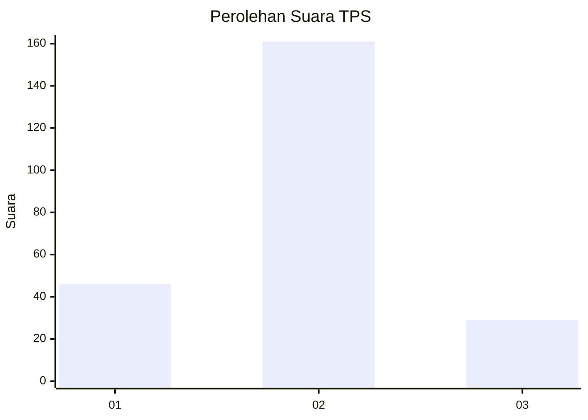
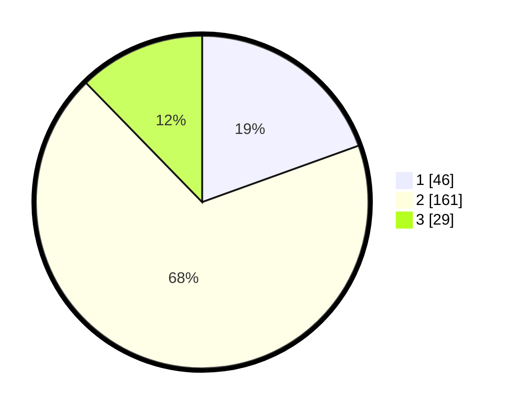

# Hasil

## Grafik

## Tabel

| No. | Nama Paslon    | Suara | Suara (raw) | Persentase |
|:--- |:-------------- | -----:| -----------:| ----------:|
| 1   | ANIES MUHAIMIN | 46    | [46][p-1]   | 19,49      |
| 2   | PRABOWO GIBRAN | 161   | [161][p-2]  | 68,22      |
| 3   | GANJAR MAHFUD  | 29    | [29][p-3]   | 12,29      |

[p-1]: https://github.com/gigit-pemilu/pemilu-2024/blob/main/pilpres/hitung-suara/sub/35-jawa-timur/sub/15-sidoarjo/sub/06-tanggulangin/sub/2018-ganggangpanjang/sub/003-tps/sub/paslon-1.txt
[p-2]: https://github.com/gigit-pemilu/pemilu-2024/blob/main/pilpres/hitung-suara/sub/35-jawa-timur/sub/15-sidoarjo/sub/06-tanggulangin/sub/2018-ganggangpanjang/sub/003-tps/sub/paslon-2.txt
[p-3]: https://github.com/gigit-pemilu/pemilu-2024/blob/main/pilpres/hitung-suara/sub/35-jawa-timur/sub/15-sidoarjo/sub/06-tanggulangin/sub/2018-ganggangpanjang/sub/003-tps/sub/paslon-3.txt

## Foto C Plano

https://sirekap-obj-formc.kpu.go.id/c4bf/pemilu/ppwp/35/15/06/20/18/3515062018003-20240215-024600--0e28a946-2e6f-4971-9e2e-0cc5c90f1910.jpg

https://sirekap-obj-formc.kpu.go.id/c4bf/pemilu/ppwp/35/15/06/20/18/3515062018003-20240215-024642--33bfd1e0-7dc6-46b2-98f6-06a157093959.jpg

https://sirekap-obj-formc.kpu.go.id/c4bf/pemilu/ppwp/35/15/06/20/18/3515062018003-20240215-024753--b70e6a4e-3fa0-4b80-8594-b7844824d2b8.jpg

## Metadata

| Key        | Value               |
| ---------- | ------------------- |
| Time Stamp | 2024-02-25 22:00:00 |

