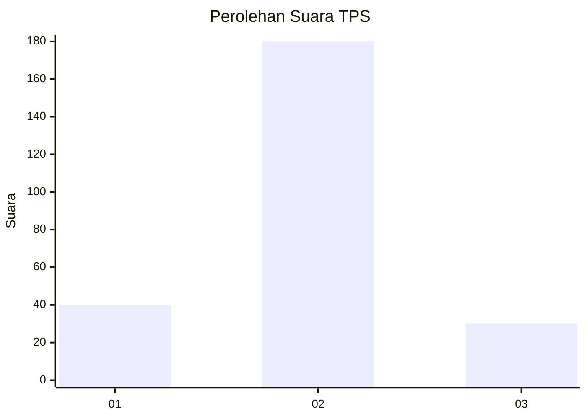
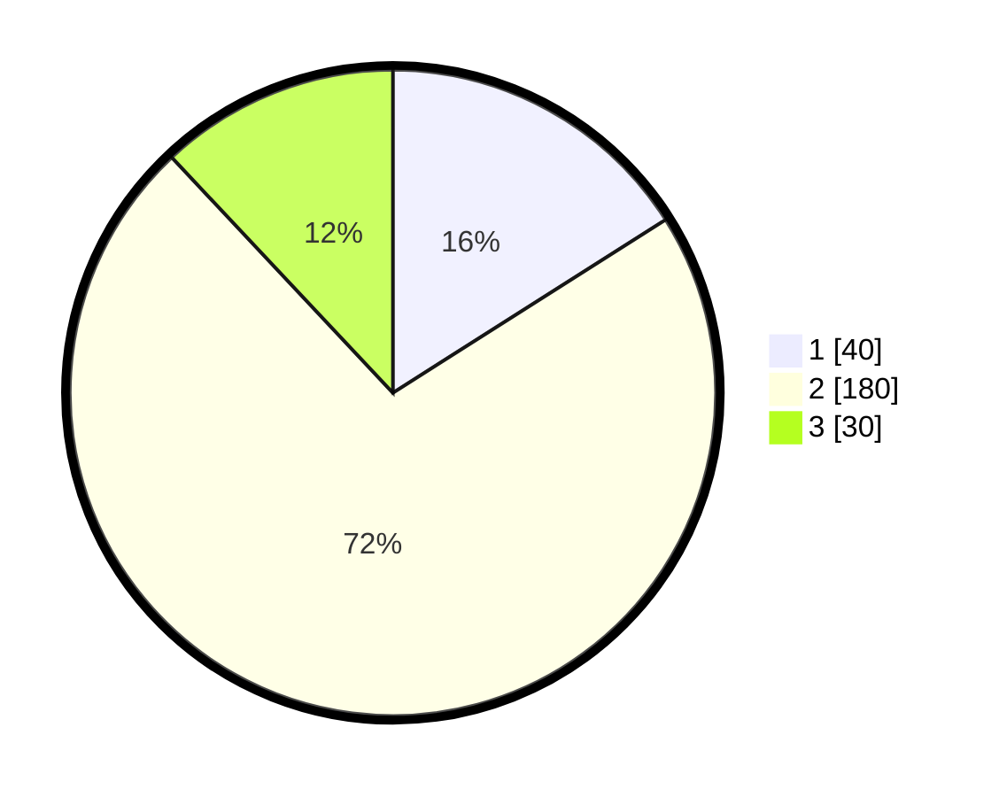

# Hasil

## Grafik

## Tabel

| No. | Nama Paslon    | Suara | Suara (raw) | Persentase |
|:--- |:-------------- | -----:| -----------:| ----------:|
| 1   | ANIES MUHAIMIN | 40    | [40][p-1]   | 16,00      |
| 2   | PRABOWO GIBRAN | 180   | [180][p-2]  | 72,00      |
| 3   | GANJAR MAHFUD  | 30    | [30][p-3]   | 12,00      |

[p-1]: https://github.com/gigit-pemilu/pemilu-2024-35-jawa-timur/blob/main/pilpres/hitung-suara/sub/35-jawa-timur/sub/15-sidoarjo/sub/06-tanggulangin/sub/2018-ganggangpanjang/sub/011-tps/sub/paslon-1.txt
[p-2]: https://github.com/gigit-pemilu/pemilu-2024-35-jawa-timur/blob/main/pilpres/hitung-suara/sub/35-jawa-timur/sub/15-sidoarjo/sub/06-tanggulangin/sub/2018-ganggangpanjang/sub/011-tps/sub/paslon-2.txt
[p-3]: https://github.com/gigit-pemilu/pemilu-2024-35-jawa-timur/blob/main/pilpres/hitung-suara/sub/35-jawa-timur/sub/15-sidoarjo/sub/06-tanggulangin/sub/2018-ganggangpanjang/sub/011-tps/sub/paslon-3.txt

## Foto C Plano

https://sirekap-obj-formc.kpu.go.id/7861/pemilu/ppwp/35/15/06/20/18/3515062018011-20240214-223439--31a405fd-44fc-4133-9f15-885a7e2a9628.jpg

https://sirekap-obj-formc.kpu.go.id/7861/pemilu/ppwp/35/15/06/20/18/3515062018011-20240214-223539--64f4bb9e-f3ce-498d-8a7b-6e51e59f4945.jpg

https://sirekap-obj-formc.kpu.go.id/7861/pemilu/ppwp/35/15/06/20/18/3515062018011-20240214-223642--90a8e01f-650a-4270-9442-32d49d9caee3.jpg

## Metadata

| Key        | Value               |
| ---------- | ------------------- |
| Time Stamp | 2024-02-24 22:31:28 |

