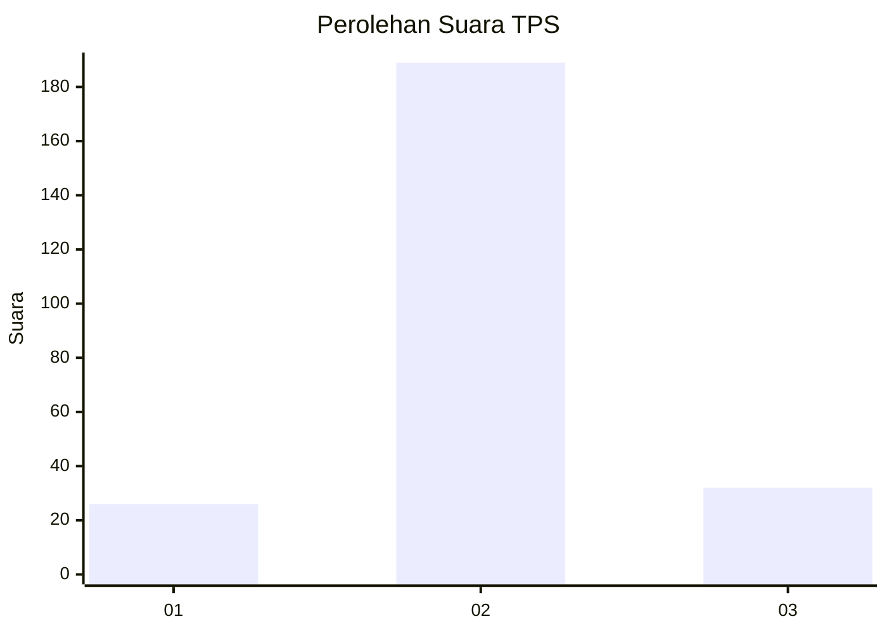
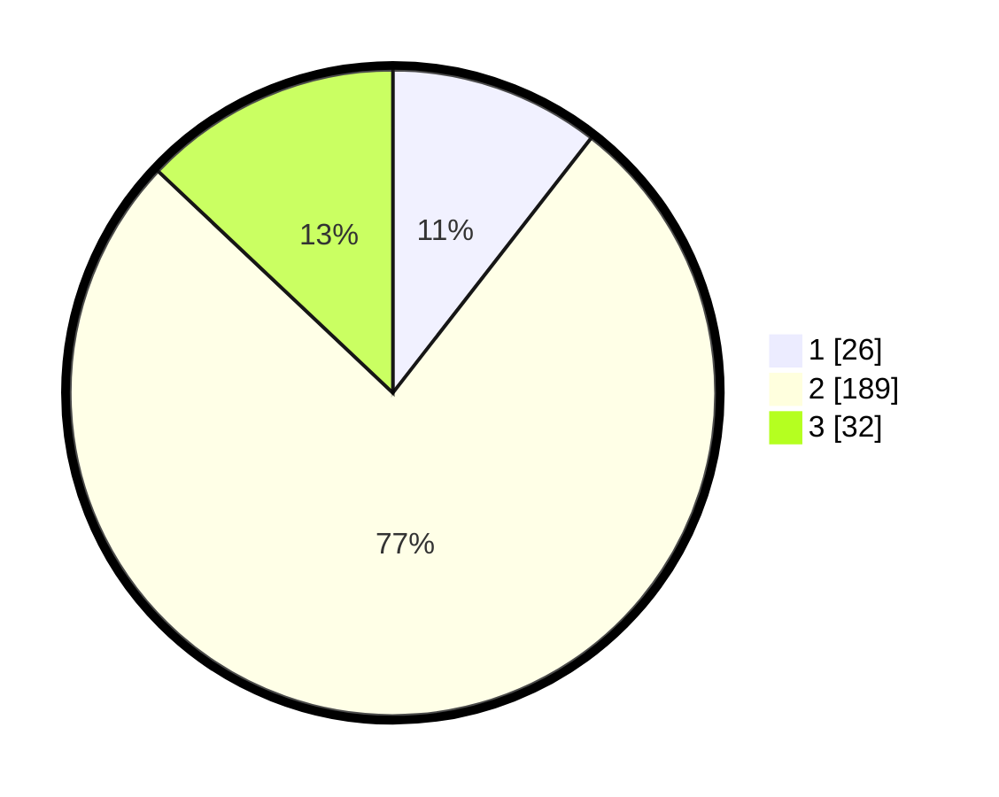

# Hasil

## Grafik

## Tabel

| No. | Nama Paslon    | Suara | Suara (raw) | Persentase |
|:--- |:-------------- | -----:| -----------:| ----------:|
| 1   | ANIES MUHAIMIN | 26    | [26][p-1]   | 10,53      |
| 2   | PRABOWO GIBRAN | 189   | [189][p-2]  | 76,52      |
| 3   | GANJAR MAHFUD  | 32    | [32][p-3]   | 12,96      |

[p-1]: https://github.com/gigit-pemilu/pemilu-2024/blob/main/pilpres/hitung-suara/sub/35-jawa-timur/sub/15-sidoarjo/sub/06-tanggulangin/sub/2019-randegan/sub/002-tps/sub/paslon-1.txt
[p-2]: https://github.com/gigit-pemilu/pemilu-2024/blob/main/pilpres/hitung-suara/sub/35-jawa-timur/sub/15-sidoarjo/sub/06-tanggulangin/sub/2019-randegan/sub/002-tps/sub/paslon-2.txt
[p-3]: https://github.com/gigit-pemilu/pemilu-2024/blob/main/pilpres/hitung-suara/sub/35-jawa-timur/sub/15-sidoarjo/sub/06-tanggulangin/sub/2019-randegan/sub/002-tps/sub/paslon-3.txt

## Foto C Plano

https://sirekap-obj-formc.kpu.go.id/ed4d/pemilu/ppwp/35/15/06/20/19/3515062019002-20240214-222750--055c773d-5c46-4fbb-a2d6-55e91811b7ce.jpg

https://sirekap-obj-formc.kpu.go.id/ed4d/pemilu/ppwp/35/15/06/20/19/3515062019002-20240215-004031--5b60e978-c588-4569-8140-1e688f19a528.jpg

https://sirekap-obj-formc.kpu.go.id/ed4d/pemilu/ppwp/35/15/06/20/19/3515062019002-20240215-004150--74d3c663-439a-46aa-9e84-4d3042873852.jpg

## Metadata

| Key        | Value               |
| ---------- | ------------------- |
| Time Stamp | 2024-02-24 22:31:28 |

