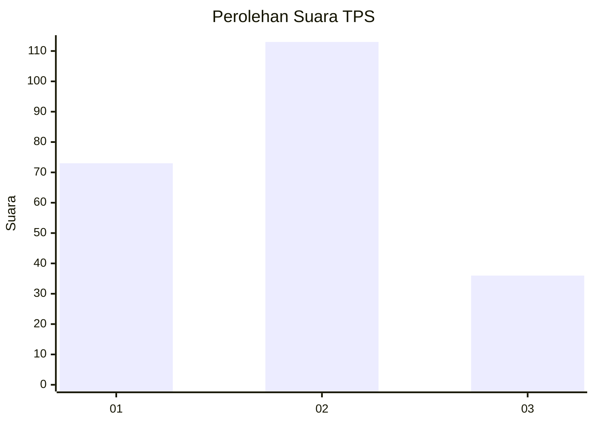
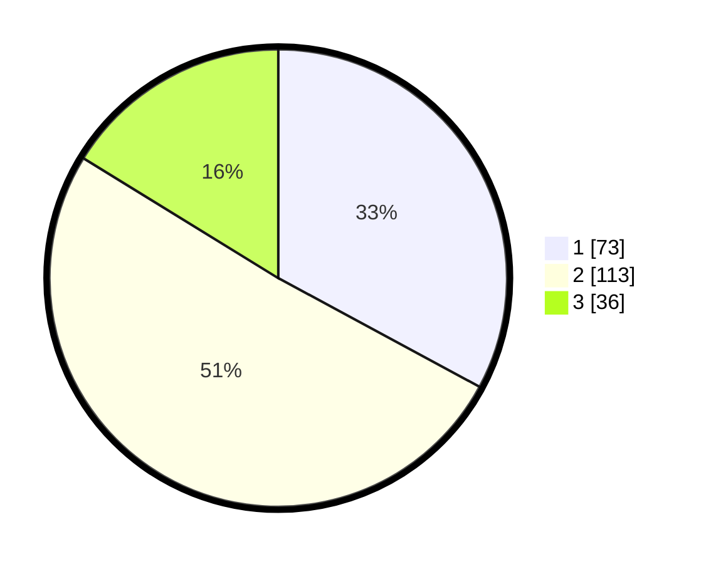

# Hasil

## Grafik

## Tabel

| No. | Nama Paslon    | Suara | Suara (raw) | Persentase |
|:--- |:-------------- | -----:| -----------:| ----------:|
| 1   | ANIES MUHAIMIN | 73    | [73][p-1]   | 32,88      |
| 2   | PRABOWO GIBRAN | 113   | [113][p-2]  | 50,90      |
| 3   | GANJAR MAHFUD  | 36    | [36][p-3]   | 16,22      |

[p-1]: https://github.com/gigit-pemilu/pemilu-2024/blob/main/pilpres/hitung-suara/sub/35-jawa-timur/sub/15-sidoarjo/sub/07-candi/sub/2002-sumorame/sub/006-tps/sub/paslon-1.txt
[p-2]: https://github.com/gigit-pemilu/pemilu-2024/blob/main/pilpres/hitung-suara/sub/35-jawa-timur/sub/15-sidoarjo/sub/07-candi/sub/2002-sumorame/sub/006-tps/sub/paslon-2.txt
[p-3]: https://github.com/gigit-pemilu/pemilu-2024/blob/main/pilpres/hitung-suara/sub/35-jawa-timur/sub/15-sidoarjo/sub/07-candi/sub/2002-sumorame/sub/006-tps/sub/paslon-3.txt

## Foto C Plano

https://sirekap-obj-formc.kpu.go.id/57e8/pemilu/ppwp/35/15/07/20/02/3515072002006-20240217-141601--2fa73f4e-515c-4ede-8242-e5454f4362a2.jpg

https://sirekap-obj-formc.kpu.go.id/57e8/pemilu/ppwp/35/15/07/20/02/3515072002006-20240217-141619--ac4c1a5b-a68d-4934-90f9-098098596363.jpg

https://sirekap-obj-formc.kpu.go.id/57e8/pemilu/ppwp/35/15/07/20/02/3515072002006-20240217-141707--3b788615-5e85-41ab-a703-4a68c5746502.jpg

## Metadata

| Key        | Value               |
| ---------- | ------------------- |
| Time Stamp | 2024-02-25 15:00:00 |

