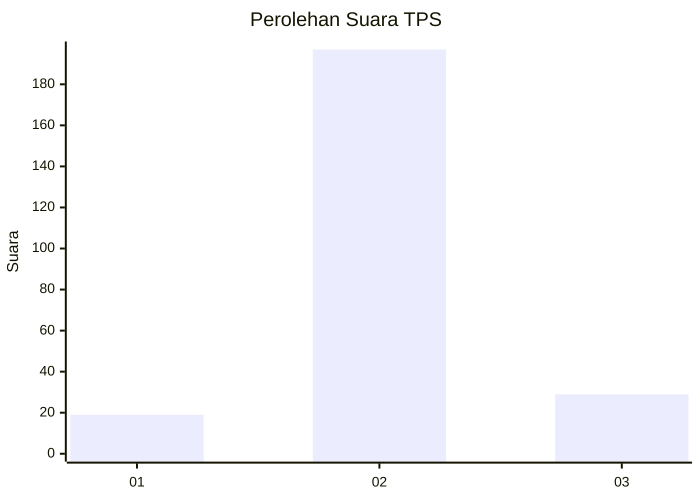
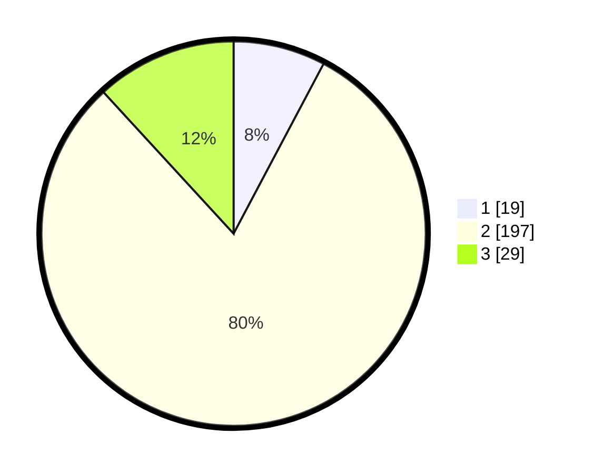

# Hasil

## Grafik

## Tabel

| No. | Nama Paslon    | Suara | Suara (raw) | Persentase |
|:--- |:-------------- | -----:| -----------:| ----------:|
| 1   | ANIES MUHAIMIN | 19    | [19][p-1]   | 7,76       |
| 2   | PRABOWO GIBRAN | 197   | [197][p-2]  | 80,41      |
| 3   | GANJAR MAHFUD  | 29    | [29][p-3]   | 11,84      |

[p-1]: https://github.com/gigit-pemilu/pemilu-2024-35-jawa-timur/blob/main/pilpres/hitung-suara/sub/35-jawa-timur/sub/15-sidoarjo/sub/07-candi/sub/2003-ngampelsari/sub/002-tps/sub/paslon-1.txt
[p-2]: https://github.com/gigit-pemilu/pemilu-2024-35-jawa-timur/blob/main/pilpres/hitung-suara/sub/35-jawa-timur/sub/15-sidoarjo/sub/07-candi/sub/2003-ngampelsari/sub/002-tps/sub/paslon-2.txt
[p-3]: https://github.com/gigit-pemilu/pemilu-2024-35-jawa-timur/blob/main/pilpres/hitung-suara/sub/35-jawa-timur/sub/15-sidoarjo/sub/07-candi/sub/2003-ngampelsari/sub/002-tps/sub/paslon-3.txt

## Foto C Plano

https://sirekap-obj-formc.kpu.go.id/d273/pemilu/ppwp/35/15/07/20/03/3515072003002-20240219-005104--c70165af-6aab-4079-a602-28c983aa54a7.jpg

https://sirekap-obj-formc.kpu.go.id/d273/pemilu/ppwp/35/15/07/20/03/3515072003002-20240219-005120--bc355f90-9ba0-41fb-be67-7ba1d392634a.jpg

https://sirekap-obj-formc.kpu.go.id/d273/pemilu/ppwp/35/15/07/20/03/3515072003002-20240219-005130--c330033c-f5d1-4219-b180-091b82d353d0.jpg

## Metadata

| Key        | Value               |
| ---------- | ------------------- |
| Time Stamp | 2024-02-24 22:31:28 |

