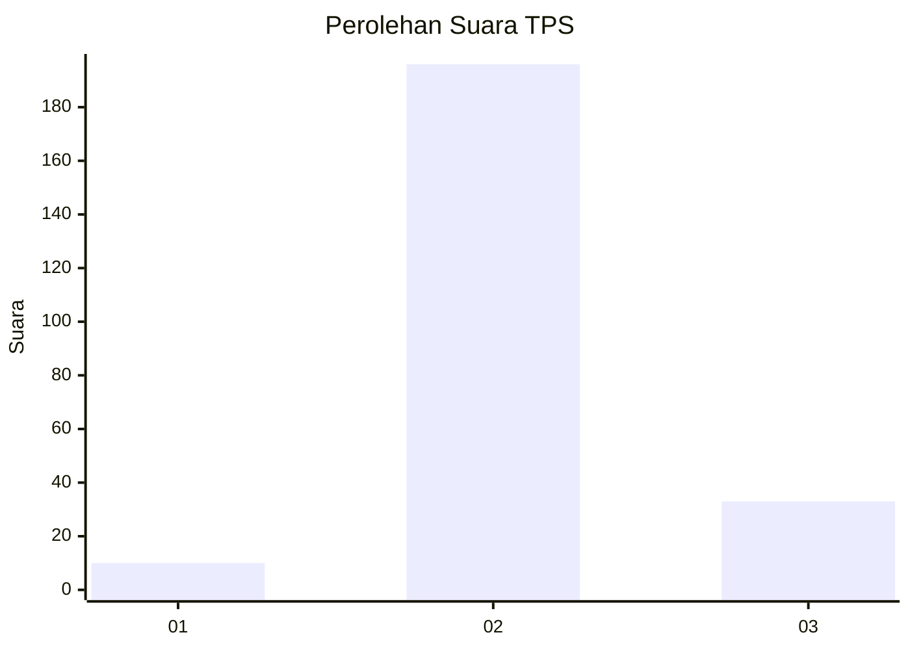
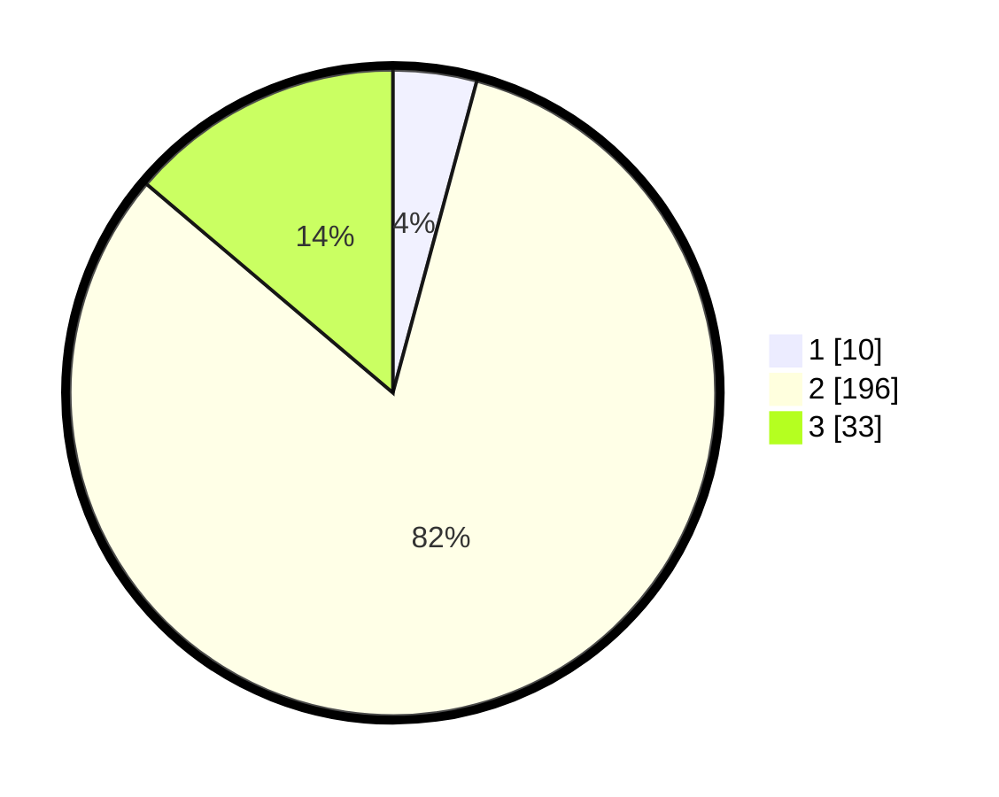

# Hasil

## Grafik

## Tabel

| No. | Nama Paslon    | Suara | Suara (raw) | Persentase |
|:--- |:-------------- | -----:| -----------:| ----------:|
| 1   | ANIES MUHAIMIN | 10    | [10][p-1]   | 4,18       |
| 2   | PRABOWO GIBRAN | 196   | [196][p-2]  | 82,01      |
| 3   | GANJAR MAHFUD  | 33    | [33][p-3]   | 13,81      |

[p-1]: https://github.com/gigit-pemilu/pemilu-2024/blob/main/pilpres/hitung-suara/sub/35-jawa-timur/sub/15-sidoarjo/sub/07-candi/sub/2004-balonggabus/sub/005-tps/sub/paslon-1.txt
[p-2]: https://github.com/gigit-pemilu/pemilu-2024/blob/main/pilpres/hitung-suara/sub/35-jawa-timur/sub/15-sidoarjo/sub/07-candi/sub/2004-balonggabus/sub/005-tps/sub/paslon-2.txt
[p-3]: https://github.com/gigit-pemilu/pemilu-2024/blob/main/pilpres/hitung-suara/sub/35-jawa-timur/sub/15-sidoarjo/sub/07-candi/sub/2004-balonggabus/sub/005-tps/sub/paslon-3.txt

## Foto C Plano

https://sirekap-obj-formc.kpu.go.id/8a08/pemilu/ppwp/35/15/07/20/04/3515072004005-20240217-181436--e901a6e8-76a9-4f52-bed6-2de622bf8f8e.jpg

https://sirekap-obj-formc.kpu.go.id/8a08/pemilu/ppwp/35/15/07/20/04/3515072004005-20240217-170622--0370e743-0cf6-4b00-ac4d-fffd6ec4b888.jpg

https://sirekap-obj-formc.kpu.go.id/8a08/pemilu/ppwp/35/15/07/20/04/3515072004005-20240218-082123--93a22c66-eb60-48f6-b029-9c2491796bf2.jpg

## Metadata

| Key        | Value               |
| ---------- | ------------------- |
| Time Stamp | 2024-02-21 20:00:00 |

