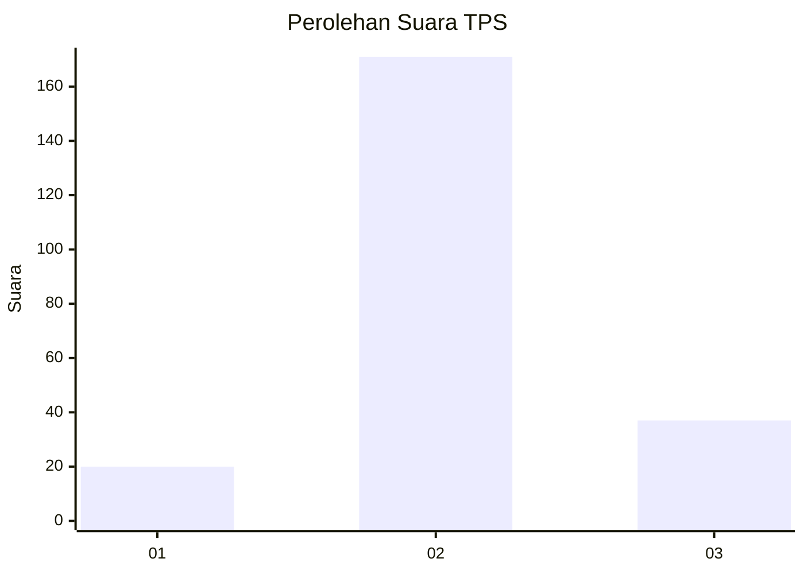
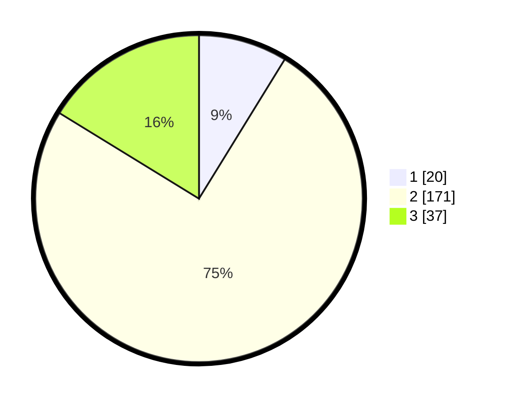

# Hasil

## Grafik

## Tabel

| No. | Nama Paslon    | Suara | Suara (raw) | Persentase |
|:--- |:-------------- | -----:| -----------:| ----------:|
| 1   | ANIES MUHAIMIN | 20    | [20][p-1]   | 8,77       |
| 2   | PRABOWO GIBRAN | 171   | [171][p-2]  | 75,00      |
| 3   | GANJAR MAHFUD  | 37    | [37][p-3]   | 16,23      |

[p-1]: https://github.com/gigit-pemilu/pemilu-2024/blob/main/pilpres/hitung-suara/sub/35-jawa-timur/sub/15-sidoarjo/sub/07-candi/sub/2007-kedungpeluk/sub/002-tps/sub/paslon-1.txt
[p-2]: https://github.com/gigit-pemilu/pemilu-2024/blob/main/pilpres/hitung-suara/sub/35-jawa-timur/sub/15-sidoarjo/sub/07-candi/sub/2007-kedungpeluk/sub/002-tps/sub/paslon-2.txt
[p-3]: https://github.com/gigit-pemilu/pemilu-2024/blob/main/pilpres/hitung-suara/sub/35-jawa-timur/sub/15-sidoarjo/sub/07-candi/sub/2007-kedungpeluk/sub/002-tps/sub/paslon-3.txt

## Foto C Plano

https://sirekap-obj-formc.kpu.go.id/546c/pemilu/ppwp/35/15/07/20/07/3515072007002-20240217-145822--3387cd8f-87e5-4901-aebe-d74714351225.jpg

https://sirekap-obj-formc.kpu.go.id/546c/pemilu/ppwp/35/15/07/20/07/3515072007002-20240217-150042--717fe553-86c2-4f4e-baca-b560b42066d8.jpg

https://sirekap-obj-formc.kpu.go.id/546c/pemilu/ppwp/35/15/07/20/07/3515072007002-20240217-150142--c4efd430-0773-4415-a54e-92ee3c89c780.jpg

## Metadata

| Key        | Value               |
| ---------- | ------------------- |
| Time Stamp | 2024-03-02 15:00:00 |

