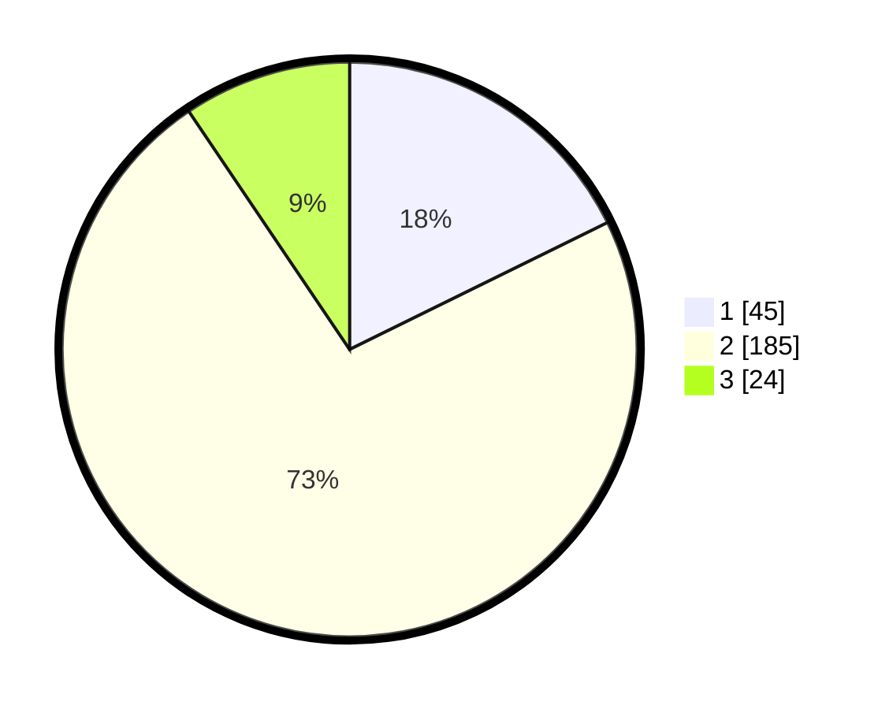

# Hasil

## Grafik

## Tabel

| No. | Nama Paslon    | Suara | Suara (raw) | Persentase |
|:--- |:-------------- | -----:| -----------:| ----------:|
| 1   | ANIES MUHAIMIN | 45    | [45][p-1]   | 17,72      |
| 2   | PRABOWO GIBRAN | 185   | [185][p-2]  | 72,83      |
| 3   | GANJAR MAHFUD  | 24    | [24][p-3]   | 9,45       |

[p-1]: https://github.com/gigit-pemilu/pemilu-2024-35-jawa-timur/blob/main/pilpres/hitung-suara/sub/35-jawa-timur/sub/15-sidoarjo/sub/07-candi/sub/2007-kedungpeluk/sub/006-tps/sub/paslon-1.txt
[p-2]: https://github.com/gigit-pemilu/pemilu-2024-35-jawa-timur/blob/main/pilpres/hitung-suara/sub/35-jawa-timur/sub/15-sidoarjo/sub/07-candi/sub/2007-kedungpeluk/sub/006-tps/sub/paslon-2.txt
[p-3]: https://github.com/gigit-pemilu/pemilu-2024-35-jawa-timur/blob/main/pilpres/hitung-suara/sub/35-jawa-timur/sub/15-sidoarjo/sub/07-candi/sub/2007-kedungpeluk/sub/006-tps/sub/paslon-3.txt

## Foto C Plano

https://sirekap-obj-formc.kpu.go.id/50ad/pemilu/ppwp/35/15/07/20/07/3515072007006-20240217-150643--fcbc53ff-672a-4743-bc59-44326533a2ea.jpg

https://sirekap-obj-formc.kpu.go.id/50ad/pemilu/ppwp/35/15/07/20/07/3515072007006-20240217-150840--b59c0995-ba56-4130-97df-27608f39939d.jpg

https://sirekap-obj-formc.kpu.go.id/50ad/pemilu/ppwp/35/15/07/20/07/3515072007006-20240217-151006--27ddb07a-0546-4496-94b8-4e9d2808f9ea.jpg

## Metadata

| Key        | Value               |
| ---------- | ------------------- |
| Time Stamp | 2024-02-17 16:00:02 |

