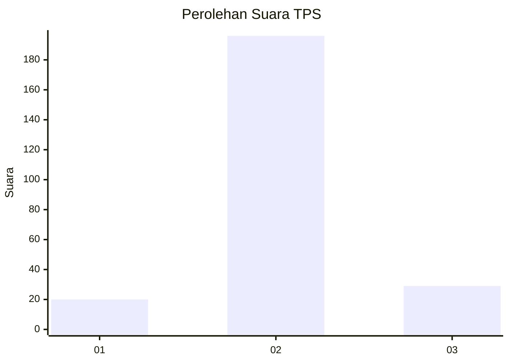
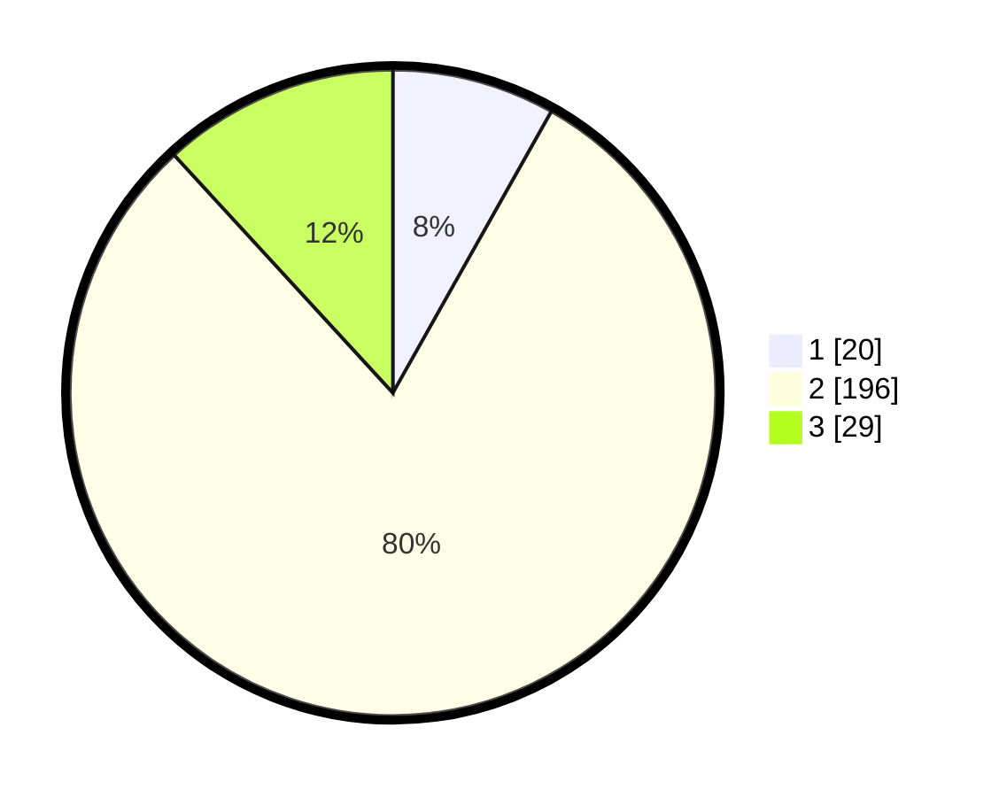

# Hasil

## Grafik

## Tabel

| No. | Nama Paslon    | Suara | Suara (raw) | Persentase |
|:--- |:-------------- | -----:| -----------:| ----------:|
| 1   | ANIES MUHAIMIN | 20    | [20][p-1]   | 8,16       |
| 2   | PRABOWO GIBRAN | 196   | [196][p-2]  | 80,00      |
| 3   | GANJAR MAHFUD  | 29    | [29][p-3]   | 11,84      |

[p-1]: https://github.com/gigit-pemilu/pemilu-2024-35-jawa-timur/blob/main/pilpres/hitung-suara/sub/35-jawa-timur/sub/15-sidoarjo/sub/07-candi/sub/2009-klurak/sub/004-tps/sub/paslon-1.txt
[p-2]: https://github.com/gigit-pemilu/pemilu-2024-35-jawa-timur/blob/main/pilpres/hitung-suara/sub/35-jawa-timur/sub/15-sidoarjo/sub/07-candi/sub/2009-klurak/sub/004-tps/sub/paslon-2.txt
[p-3]: https://github.com/gigit-pemilu/pemilu-2024-35-jawa-timur/blob/main/pilpres/hitung-suara/sub/35-jawa-timur/sub/15-sidoarjo/sub/07-candi/sub/2009-klurak/sub/004-tps/sub/paslon-3.txt

## Foto C Plano

https://sirekap-obj-formc.kpu.go.id/624f/pemilu/ppwp/35/15/07/20/09/3515072009004-20240217-115910--37a06177-da20-46a5-bc66-897d0aa7162e.jpg

https://sirekap-obj-formc.kpu.go.id/624f/pemilu/ppwp/35/15/07/20/09/3515072009004-20240214-203901--8c7eb272-8d6e-4a53-bc5a-035746aaf1b0.jpg

https://sirekap-obj-formc.kpu.go.id/624f/pemilu/ppwp/35/15/07/20/09/3515072009004-20240214-203941--176ffdf7-8955-4356-a4a0-02bf23b2d622.jpg

## Metadata

| Key        | Value               |
| ---------- | ------------------- |
| Time Stamp | 2024-02-17 12:00:00 |

