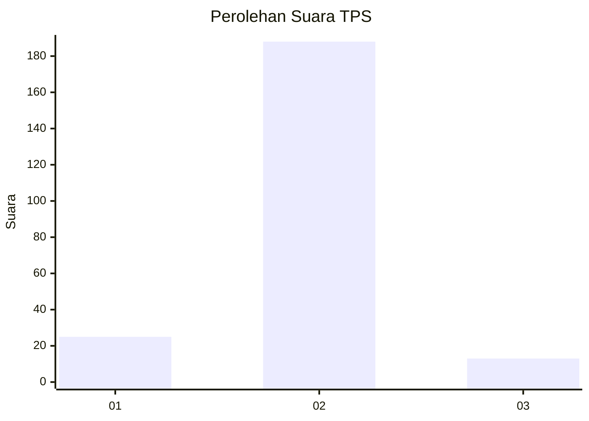
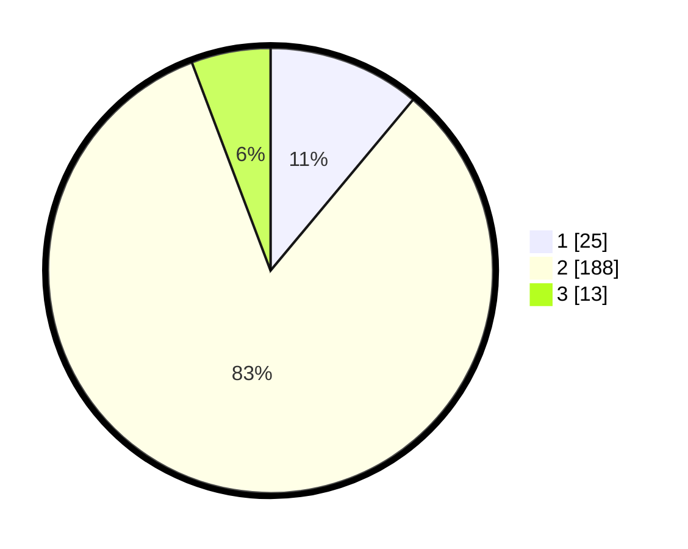

# Hasil

## Grafik

## Tabel

| No. | Nama Paslon    | Suara | Suara (raw) | Persentase |
|:--- |:-------------- | -----:| -----------:| ----------:|
| 1   | ANIES MUHAIMIN | 25    | [25][p-1]   | 11,06      |
| 2   | PRABOWO GIBRAN | 188   | [188][p-2]  | 83,19      |
| 3   | GANJAR MAHFUD  | 13    | [13][p-3]   | 5,75       |

[p-1]: https://github.com/gigit-pemilu/pemilu-2024/blob/main/pilpres/hitung-suara/sub/35-jawa-timur/sub/15-sidoarjo/sub/07-candi/sub/2009-klurak/sub/006-tps/sub/paslon-1.txt
[p-2]: https://github.com/gigit-pemilu/pemilu-2024/blob/main/pilpres/hitung-suara/sub/35-jawa-timur/sub/15-sidoarjo/sub/07-candi/sub/2009-klurak/sub/006-tps/sub/paslon-2.txt
[p-3]: https://github.com/gigit-pemilu/pemilu-2024/blob/main/pilpres/hitung-suara/sub/35-jawa-timur/sub/15-sidoarjo/sub/07-candi/sub/2009-klurak/sub/006-tps/sub/paslon-3.txt

## Foto C Plano

https://sirekap-obj-formc.kpu.go.id/52b3/pemilu/ppwp/35/15/07/20/09/3515072009006-20240217-112030--c68ead1e-2cd7-403f-ad8a-63ea69b54569.jpg

https://sirekap-obj-formc.kpu.go.id/52b3/pemilu/ppwp/35/15/07/20/09/3515072009006-20240217-112211--bda5f949-b3fc-4c7b-8afb-6f3e71e3e6eb.jpg

https://sirekap-obj-formc.kpu.go.id/52b3/pemilu/ppwp/35/15/07/20/09/3515072009006-20240217-112320--0d6ba4d9-78d1-4b5a-a45e-df6c403a3845.jpg

## Metadata

| Key        | Value               |
| ---------- | ------------------- |
| Time Stamp | 2024-02-25 16:00:00 |

