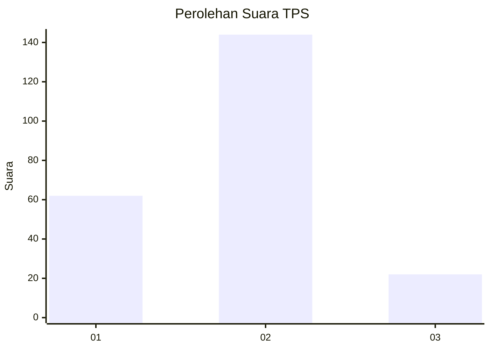
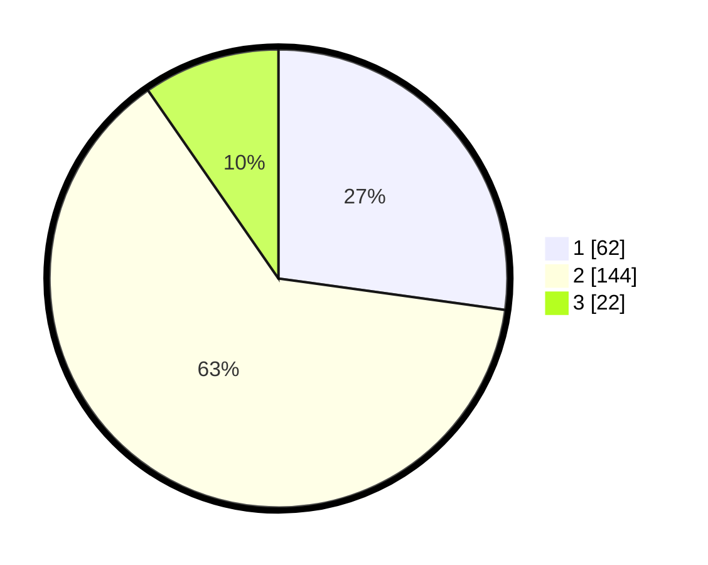

# Hasil

## Grafik

## Tabel

| No. | Nama Paslon    | Suara | Suara (raw) | Persentase |
|:--- |:-------------- | -----:| -----------:| ----------:|
| 1   | ANIES MUHAIMIN | 62    | [62][p-1]   | 27,19      |
| 2   | PRABOWO GIBRAN | 144   | [144][p-2]  | 63,16      |
| 3   | GANJAR MAHFUD  | 22    | [22][p-3]   | 9,65       |

[p-1]: https://github.com/gigit-pemilu/pemilu-2024/blob/main/pilpres/hitung-suara/sub/35-jawa-timur/sub/15-sidoarjo/sub/07-candi/sub/2013-sugihwaras/sub/005-tps/sub/paslon-1.txt
[p-2]: https://github.com/gigit-pemilu/pemilu-2024/blob/main/pilpres/hitung-suara/sub/35-jawa-timur/sub/15-sidoarjo/sub/07-candi/sub/2013-sugihwaras/sub/005-tps/sub/paslon-2.txt
[p-3]: https://github.com/gigit-pemilu/pemilu-2024/blob/main/pilpres/hitung-suara/sub/35-jawa-timur/sub/15-sidoarjo/sub/07-candi/sub/2013-sugihwaras/sub/005-tps/sub/paslon-3.txt

## Foto C Plano

https://sirekap-obj-formc.kpu.go.id/537a/pemilu/ppwp/35/15/07/20/13/3515072013005-20240215-140721--8beb3db8-7b93-4874-8941-68854ef35afd.jpg

https://sirekap-obj-formc.kpu.go.id/537a/pemilu/ppwp/35/15/07/20/13/3515072013005-20240217-133210--b2cbef72-7a18-49b5-9ee7-39cfa266faf1.jpg

https://sirekap-obj-formc.kpu.go.id/537a/pemilu/ppwp/35/15/07/20/13/3515072013005-20240217-135701--f9dbb4dc-24df-4111-9e92-99f6a958440a.jpg

## Metadata

| Key        | Value               |
| ---------- | ------------------- |
| Time Stamp | 2024-02-17 14:45:18 |

