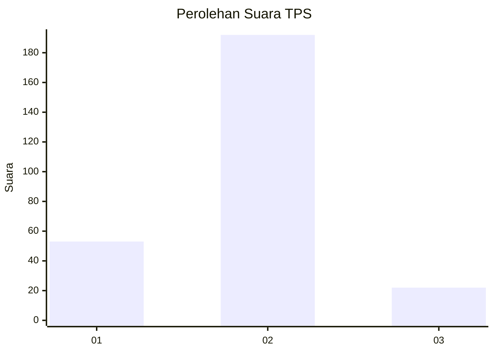
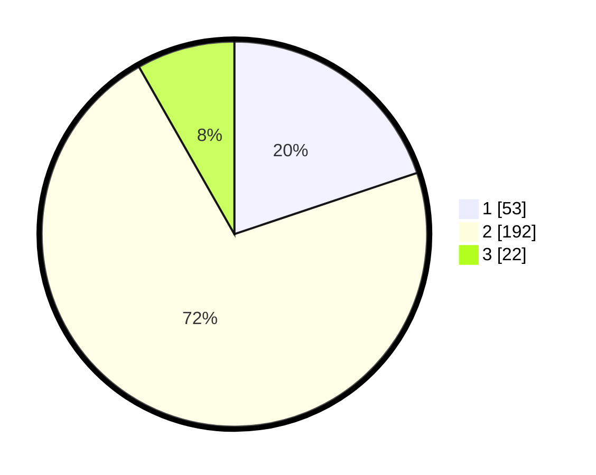

# Hasil

## Grafik

## Tabel

| No. | Nama Paslon    | Suara | Suara (raw) | Persentase |
|:--- |:-------------- | -----:| -----------:| ----------:|
| 1   | ANIES MUHAIMIN | 53    | [53][p-1]   | 19,85      |
| 2   | PRABOWO GIBRAN | 192   | [192][p-2]  | 71,91      |
| 3   | GANJAR MAHFUD  | 22    | [22][p-3]   | 8,24       |

[p-1]: https://github.com/gigit-pemilu/pemilu-2024-35-jawa-timur/blob/main/pilpres/hitung-suara/sub/35-jawa-timur/sub/15-sidoarjo/sub/07-candi/sub/2014-kedungkendo/sub/014-tps/sub/paslon-1.txt
[p-2]: https://github.com/gigit-pemilu/pemilu-2024-35-jawa-timur/blob/main/pilpres/hitung-suara/sub/35-jawa-timur/sub/15-sidoarjo/sub/07-candi/sub/2014-kedungkendo/sub/014-tps/sub/paslon-2.txt
[p-3]: https://github.com/gigit-pemilu/pemilu-2024-35-jawa-timur/blob/main/pilpres/hitung-suara/sub/35-jawa-timur/sub/15-sidoarjo/sub/07-candi/sub/2014-kedungkendo/sub/014-tps/sub/paslon-3.txt

## Foto C Plano

https://sirekap-obj-formc.kpu.go.id/b9a8/pemilu/ppwp/35/15/07/20/14/3515072014014-20240216-220132--8874d1e4-1084-4d10-b96c-13f407ad681b.jpg

https://sirekap-obj-formc.kpu.go.id/b9a8/pemilu/ppwp/35/15/07/20/14/3515072014014-20240219-144641--36323fc2-4d17-411a-90f2-e05f77b058b5.jpg

https://sirekap-obj-formc.kpu.go.id/b9a8/pemilu/ppwp/35/15/07/20/14/3515072014014-20240216-222923--b25e1b32-a090-4c3d-9624-1a8cd6318b59.jpg

## Metadata

| Key        | Value               |
| ---------- | ------------------- |
| Time Stamp | 2024-02-24 22:31:28 |

