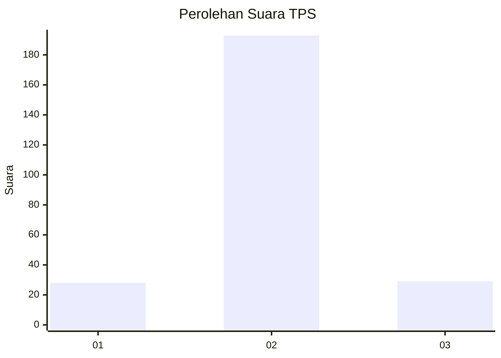
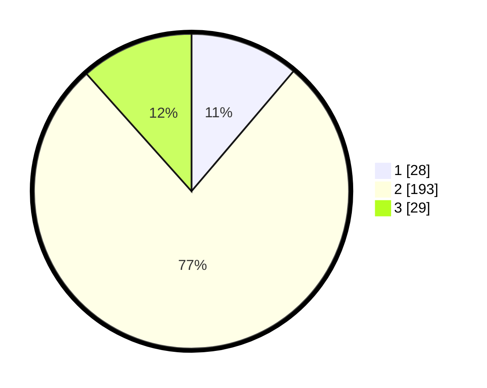

# Hasil

## Grafik

## Tabel

| No. | Nama Paslon    | Suara | Suara (raw) | Persentase |
|:--- |:-------------- | -----:| -----------:| ----------:|
| 1   | ANIES MUHAIMIN | 28    | [28][p-1]   | 11,20      |
| 2   | PRABOWO GIBRAN | 193   | [193][p-2]  | 77,20      |
| 3   | GANJAR MAHFUD  | 29    | [29][p-3]   | 11,60      |

[p-1]: https://github.com/gigit-pemilu/pemilu-2024-35-jawa-timur/blob/main/pilpres/hitung-suara/sub/35-jawa-timur/sub/15-sidoarjo/sub/07-candi/sub/2015-durungbanjar/sub/001-tps/sub/paslon-1.txt
[p-2]: https://github.com/gigit-pemilu/pemilu-2024-35-jawa-timur/blob/main/pilpres/hitung-suara/sub/35-jawa-timur/sub/15-sidoarjo/sub/07-candi/sub/2015-durungbanjar/sub/001-tps/sub/paslon-2.txt
[p-3]: https://github.com/gigit-pemilu/pemilu-2024-35-jawa-timur/blob/main/pilpres/hitung-suara/sub/35-jawa-timur/sub/15-sidoarjo/sub/07-candi/sub/2015-durungbanjar/sub/001-tps/sub/paslon-3.txt

## Foto C Plano

https://sirekap-obj-formc.kpu.go.id/544f/pemilu/ppwp/35/15/07/20/15/3515072015001-20240214-221421--f2e99e5a-5f3a-460e-8b55-b1aa8d74f8b0.jpg

https://sirekap-obj-formc.kpu.go.id/544f/pemilu/ppwp/35/15/07/20/15/3515072015001-20240214-221615--0aeffe46-f77d-4d9b-89be-1f23b77526de.jpg

https://sirekap-obj-formc.kpu.go.id/544f/pemilu/ppwp/35/15/07/20/15/3515072015001-20240214-221742--e54bbd97-1dd3-4c2d-b544-65d1ac64d6fe.jpg

## Metadata

| Key        | Value               |
| ---------- | ------------------- |
| Time Stamp | 2024-02-15 19:00:26 |

