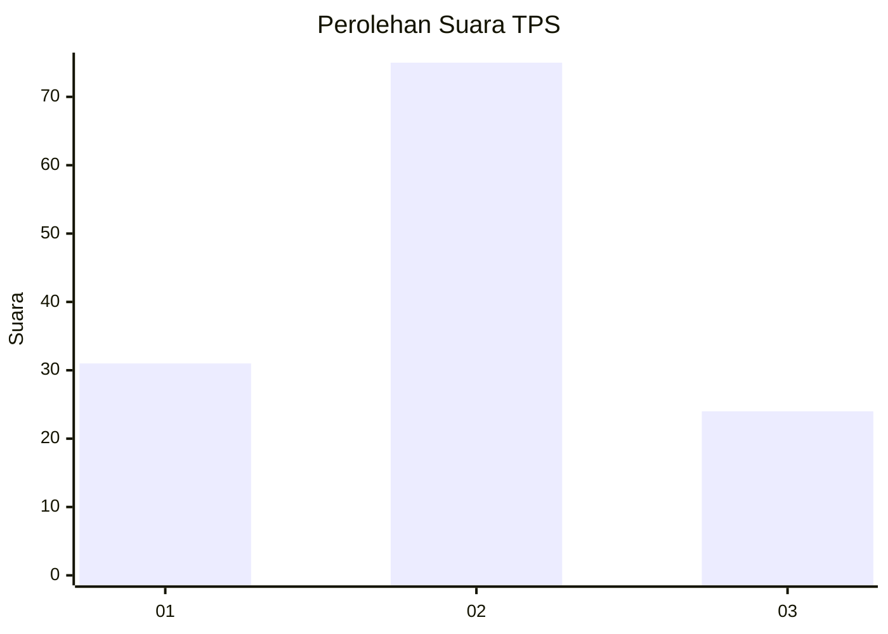
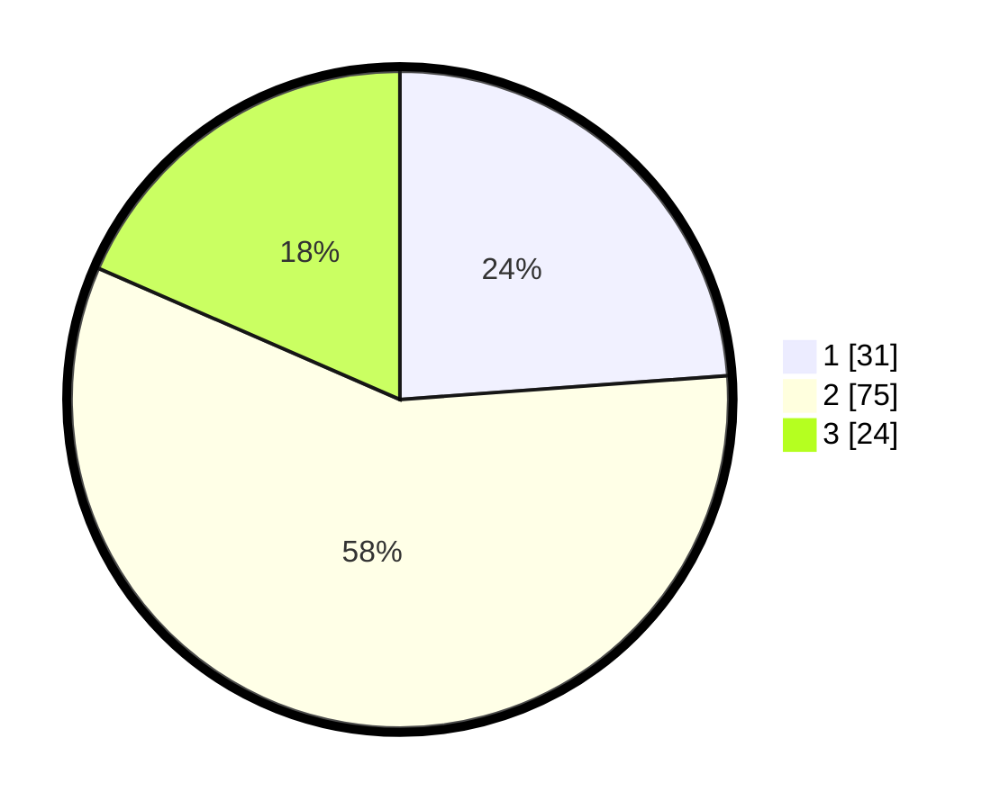

# Hasil

## Grafik

## Tabel

| No. | Nama Paslon    | Suara | Suara (raw) | Persentase |
|:--- |:-------------- | -----:| -----------:| ----------:|
| 1   | ANIES MUHAIMIN | 31    | [31][p-1]   | 23,85      |
| 2   | PRABOWO GIBRAN | 75    | [75][p-2]   | 57,69      |
| 3   | GANJAR MAHFUD  | 24    | [24][p-3]   | 18,46      |

[p-1]: https://github.com/gigit-pemilu/pemilu-2024/blob/main/pilpres/hitung-suara/sub/35-jawa-timur/sub/15-sidoarjo/sub/07-candi/sub/2022-bligo/sub/007-tps/sub/paslon-1.txt
[p-2]: https://github.com/gigit-pemilu/pemilu-2024/blob/main/pilpres/hitung-suara/sub/35-jawa-timur/sub/15-sidoarjo/sub/07-candi/sub/2022-bligo/sub/007-tps/sub/paslon-2.txt
[p-3]: https://github.com/gigit-pemilu/pemilu-2024/blob/main/pilpres/hitung-suara/sub/35-jawa-timur/sub/15-sidoarjo/sub/07-candi/sub/2022-bligo/sub/007-tps/sub/paslon-3.txt

## Foto C Plano

https://sirekap-obj-formc.kpu.go.id/59e1/pemilu/ppwp/35/15/07/20/22/3515072022007-20240220-143827--e0071280-60e9-414e-bddc-aead0b0ad6b1.jpg

https://sirekap-obj-formc.kpu.go.id/59e1/pemilu/ppwp/35/15/07/20/22/3515072022007-20240220-144040--cb0f0374-f41f-4107-b431-80fb5a3b9267.jpg

https://sirekap-obj-formc.kpu.go.id/59e1/pemilu/ppwp/35/15/07/20/22/3515072022007-20240220-144303--d620629b-16d0-4057-873c-f696923b98ec.jpg

## Metadata

| Key        | Value               |
| ---------- | ------------------- |
| Time Stamp | 2024-02-20 15:00:00 |

## DATA PEMILIH TETAP

Jumlah pemilih dalam DPT: **55**.
 * L: **555**.
 * P: **557**.

## DATA PENGGUNA HAK PILIH

Jumlah pengguna hak pilih dalam DPT: **557**.
 * L: **700**.
 * P: **0**.

Jumlah pengguna hak pilih dalam DPTb: **0**.
 * L: **0**.
 * P: **0**.

Jumlah pengguna hak pilih dalam DPK: **4**.
 * L: **2**.
 * P: **3**.

Jumlah pengguna hak pilih: **238**.
 * L: **722**.
 * P: **727**.

## JUMLAH SUARA SAH DAN TIDAK SAH

JUMLAH SELURUH SUARA SAH: **20**.

JUMLAH SUARA TIDAK SAH: **4**.

JUMLAH SELURUH SUARA SAH DAN SUARA TIDAK SAH: **277**.

