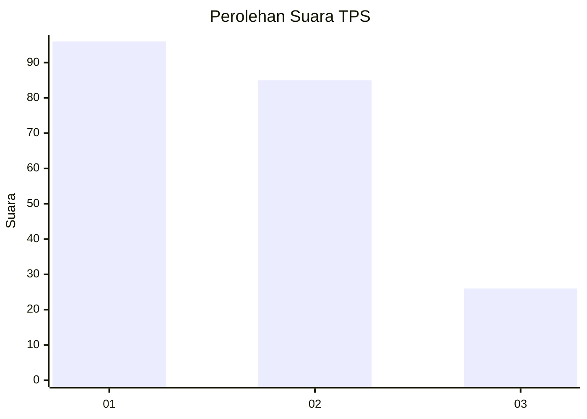
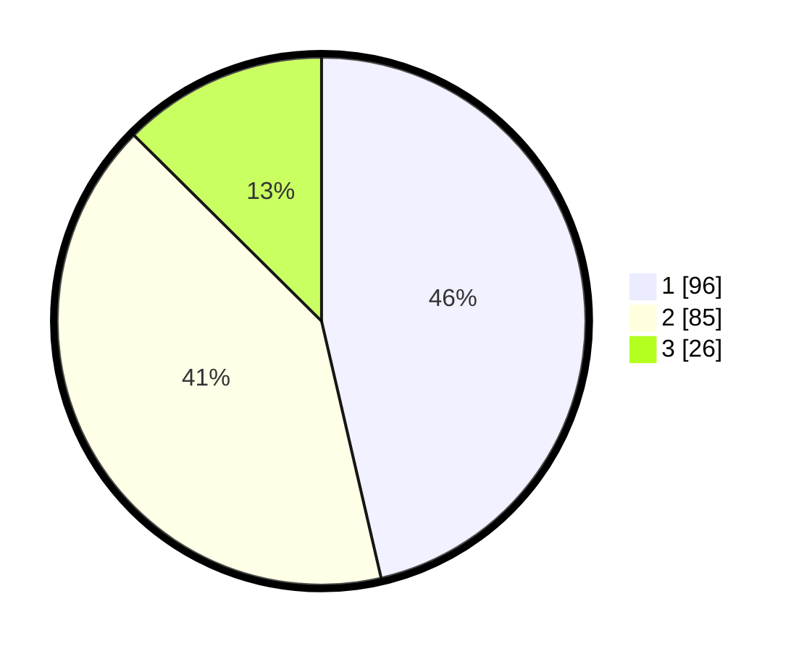

# Hasil

## Grafik

## Tabel

| No. | Nama Paslon    | Suara | Suara (raw) | Persentase |
|:--- |:-------------- | -----:| -----------:| ----------:|
| 1   | ANIES MUHAIMIN | 96    | [96][p-1]   | 46,38      |
| 2   | PRABOWO GIBRAN | 85    | [85][p-2]   | 41,06      |
| 3   | GANJAR MAHFUD  | 26    | [26][p-3]   | 12,56      |

[p-1]: https://github.com/gigit-pemilu/pemilu-2024-35-jawa-timur/blob/main/pilpres/hitung-suara/sub/35-jawa-timur/sub/15-sidoarjo/sub/07-candi/sub/2022-bligo/sub/017-tps/sub/paslon-1.txt
[p-2]: https://github.com/gigit-pemilu/pemilu-2024-35-jawa-timur/blob/main/pilpres/hitung-suara/sub/35-jawa-timur/sub/15-sidoarjo/sub/07-candi/sub/2022-bligo/sub/017-tps/sub/paslon-2.txt
[p-3]: https://github.com/gigit-pemilu/pemilu-2024-35-jawa-timur/blob/main/pilpres/hitung-suara/sub/35-jawa-timur/sub/15-sidoarjo/sub/07-candi/sub/2022-bligo/sub/017-tps/sub/paslon-3.txt

## Foto C Plano

https://sirekap-obj-formc.kpu.go.id/bf38/pemilu/ppwp/35/15/07/20/22/3515072022017-20240215-210853--6dd64def-7789-439c-b8b3-5d15f759e8f9.jpg

https://sirekap-obj-formc.kpu.go.id/bf38/pemilu/ppwp/35/15/07/20/22/3515072022017-20240216-094356--c6bd546b-52f1-4247-a6a8-daba6c3fb443.jpg

https://sirekap-obj-formc.kpu.go.id/bf38/pemilu/ppwp/35/15/07/20/22/3515072022017-20240216-094956--b2a8e4f5-2c0b-4818-961a-ffb2379b30bc.jpg

## Metadata

| Key        | Value               |
| ---------- | ------------------- |
| Time Stamp | 2024-02-16 10:00:28 |

