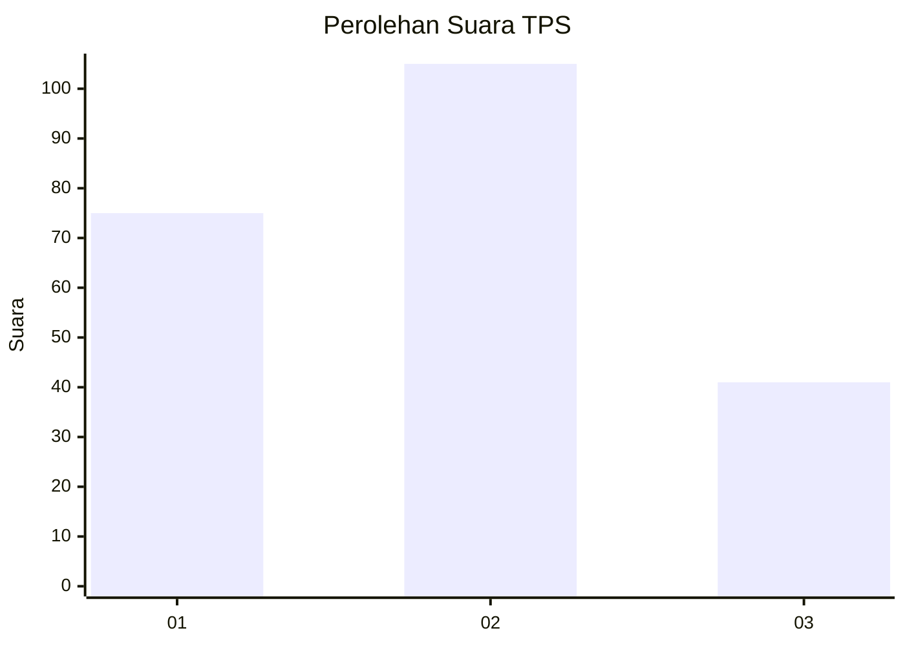
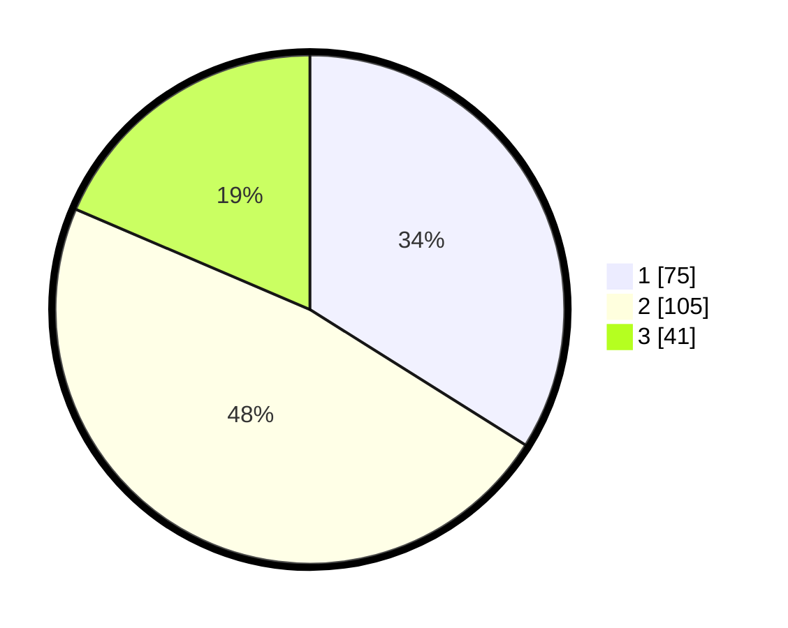

# Hasil

## Grafik

## Tabel

| No. | Nama Paslon    | Suara | Suara (raw) | Persentase |
|:--- |:-------------- | -----:| -----------:| ----------:|
| 1   | ANIES MUHAIMIN | 75    | [75][p-1]   | 33,94      |
| 2   | PRABOWO GIBRAN | 105   | [105][p-2]  | 47,51      |
| 3   | GANJAR MAHFUD  | 41    | [41][p-3]   | 18,55      |

[p-1]: https://github.com/gigit-pemilu/pemilu-2024-35-jawa-timur/blob/main/pilpres/hitung-suara/sub/35-jawa-timur/sub/15-sidoarjo/sub/07-candi/sub/2023-wedoroklurak/sub/009-tps/sub/paslon-1.txt
[p-2]: https://github.com/gigit-pemilu/pemilu-2024-35-jawa-timur/blob/main/pilpres/hitung-suara/sub/35-jawa-timur/sub/15-sidoarjo/sub/07-candi/sub/2023-wedoroklurak/sub/009-tps/sub/paslon-2.txt
[p-3]: https://github.com/gigit-pemilu/pemilu-2024-35-jawa-timur/blob/main/pilpres/hitung-suara/sub/35-jawa-timur/sub/15-sidoarjo/sub/07-candi/sub/2023-wedoroklurak/sub/009-tps/sub/paslon-3.txt

## Foto C Plano

https://sirekap-obj-formc.kpu.go.id/85eb/pemilu/ppwp/35/15/07/20/23/3515072023009-20240218-130002--fb508579-f450-4876-ad95-bf1af33e5f31.jpg

https://sirekap-obj-formc.kpu.go.id/85eb/pemilu/ppwp/35/15/07/20/23/3515072023009-20240217-101448--9787e49f-f904-48a1-8555-9ac30386d534.jpg

https://sirekap-obj-formc.kpu.go.id/85eb/pemilu/ppwp/35/15/07/20/23/3515072023009-20240217-101630--0b362dec-34c5-4107-a073-ad3dc1ebebb7.jpg

## Metadata

| Key        | Value               |
| ---------- | ------------------- |
| Time Stamp | 2024-02-19 06:16:00 |

