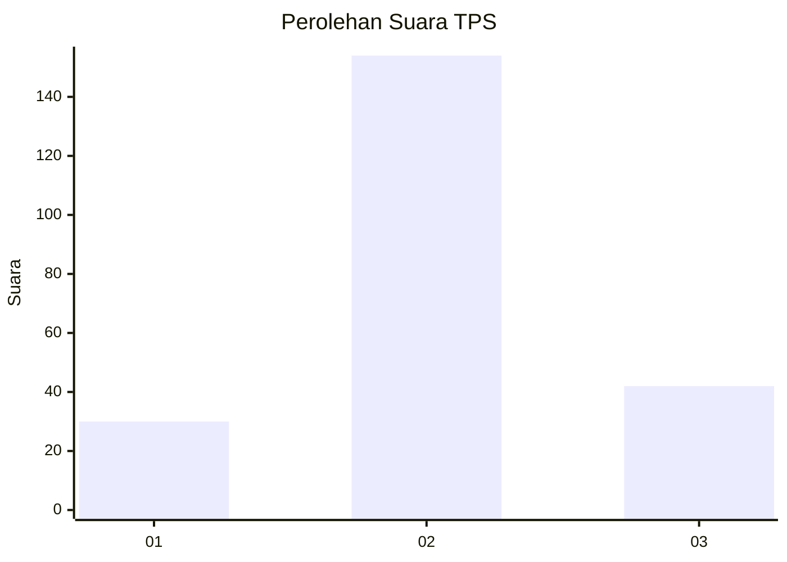
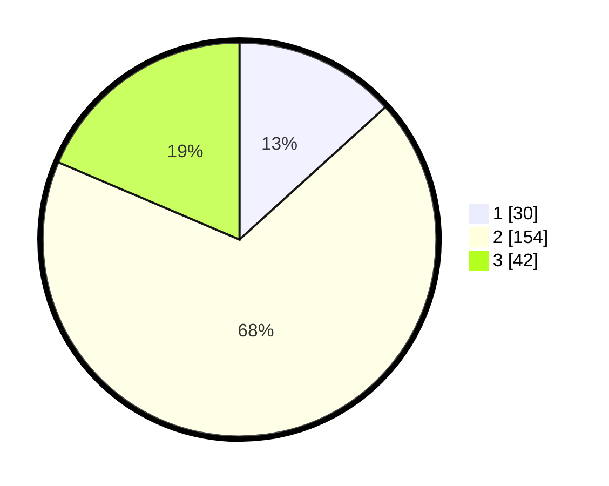

# Hasil

## Grafik

## Tabel

| No. | Nama Paslon    | Suara | Suara (raw) | Persentase |
|:--- |:-------------- | -----:| -----------:| ----------:|
| 1   | ANIES MUHAIMIN | 30    | [30][p-1]   | 13,27      |
| 2   | PRABOWO GIBRAN | 154   | [154][p-2]  | 68,14      |
| 3   | GANJAR MAHFUD  | 42    | [42][p-3]   | 18,58      |

[p-1]: https://github.com/gigit-pemilu/pemilu-2024-35-jawa-timur/blob/main/pilpres/hitung-suara/sub/35-jawa-timur/sub/15-sidoarjo/sub/08-sidoarjo/sub/1004-sidokare/sub/002-tps/sub/paslon-1.txt
[p-2]: https://github.com/gigit-pemilu/pemilu-2024-35-jawa-timur/blob/main/pilpres/hitung-suara/sub/35-jawa-timur/sub/15-sidoarjo/sub/08-sidoarjo/sub/1004-sidokare/sub/002-tps/sub/paslon-2.txt
[p-3]: https://github.com/gigit-pemilu/pemilu-2024-35-jawa-timur/blob/main/pilpres/hitung-suara/sub/35-jawa-timur/sub/15-sidoarjo/sub/08-sidoarjo/sub/1004-sidokare/sub/002-tps/sub/paslon-3.txt

## Foto C Plano

https://sirekap-obj-formc.kpu.go.id/95ca/pemilu/ppwp/35/15/08/10/04/3515081004002-20240217-092200--0e6041c3-4924-42bc-85f7-0179d3f4dbe1.jpg

https://sirekap-obj-formc.kpu.go.id/95ca/pemilu/ppwp/35/15/08/10/04/3515081004002-20240217-091807--7ba43ac9-3b46-4772-a1fc-b40bdb38ac2f.jpg

https://sirekap-obj-formc.kpu.go.id/95ca/pemilu/ppwp/35/15/08/10/04/3515081004002-20240217-091930--0d6d001d-2054-4dc2-a534-9b35db50b419.jpg

## Metadata

| Key        | Value               |
| ---------- | ------------------- |
| Time Stamp | 2024-03-01 22:00:00 |

