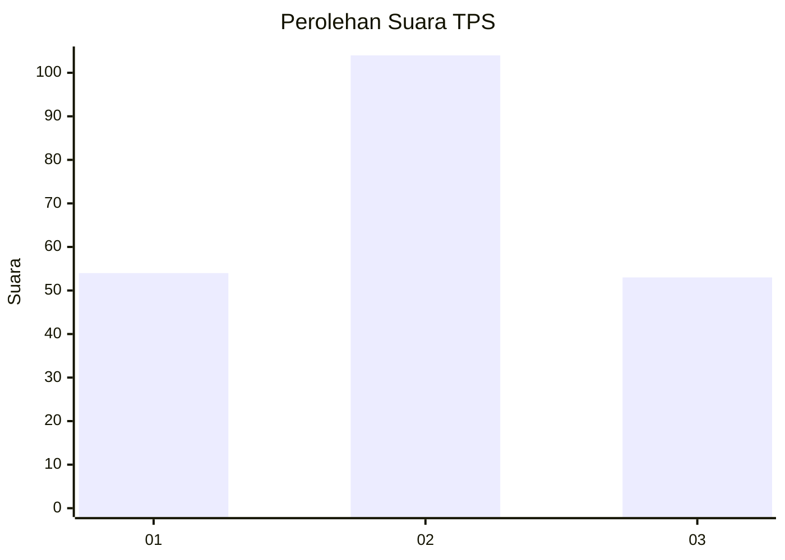
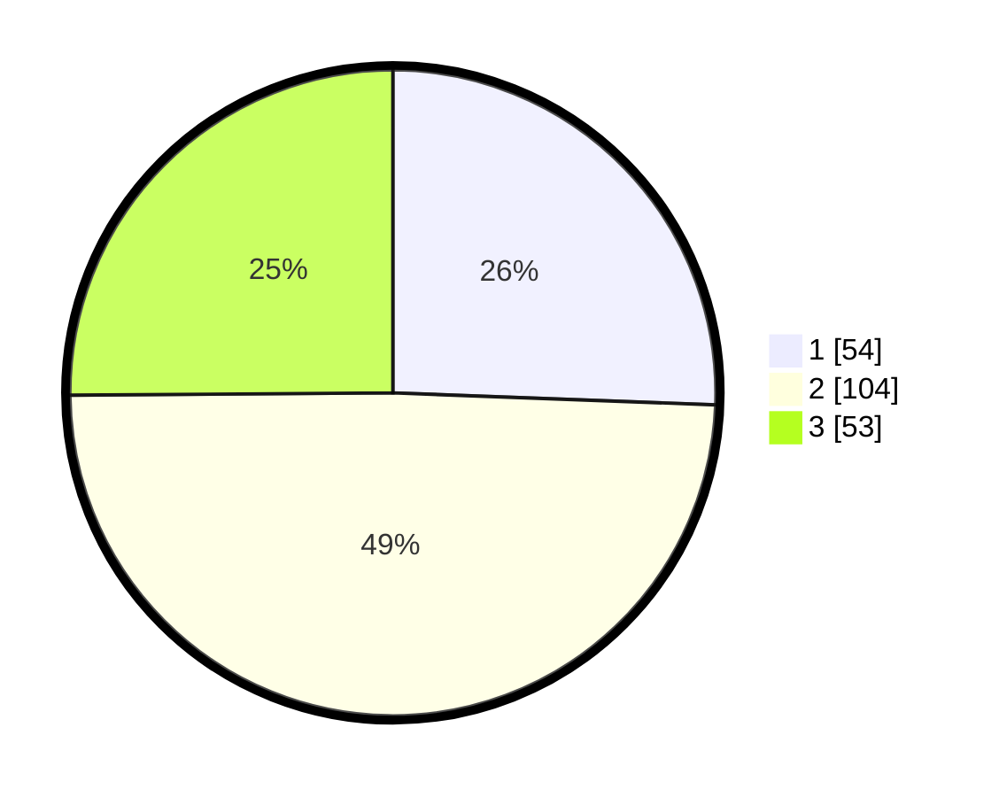

# Hasil

## Grafik

## Tabel

| No. | Nama Paslon    | Suara | Suara (raw) | Persentase |
|:--- |:-------------- | -----:| -----------:| ----------:|
| 1   | ANIES MUHAIMIN | 54    | [54][p-1]   | 25,59      |
| 2   | PRABOWO GIBRAN | 104   | [104][p-2]  | 49,29      |
| 3   | GANJAR MAHFUD  | 53    | [53][p-3]   | 25,12      |

[p-1]: https://github.com/gigit-pemilu/pemilu-2024-35-jawa-timur/blob/main/pilpres/hitung-suara/sub/35-jawa-timur/sub/15-sidoarjo/sub/08-sidoarjo/sub/1004-sidokare/sub/003-tps/sub/paslon-1.txt
[p-2]: https://github.com/gigit-pemilu/pemilu-2024-35-jawa-timur/blob/main/pilpres/hitung-suara/sub/35-jawa-timur/sub/15-sidoarjo/sub/08-sidoarjo/sub/1004-sidokare/sub/003-tps/sub/paslon-2.txt
[p-3]: https://github.com/gigit-pemilu/pemilu-2024-35-jawa-timur/blob/main/pilpres/hitung-suara/sub/35-jawa-timur/sub/15-sidoarjo/sub/08-sidoarjo/sub/1004-sidokare/sub/003-tps/sub/paslon-3.txt

## Foto C Plano

https://sirekap-obj-formc.kpu.go.id/36a7/pemilu/ppwp/35/15/08/10/04/3515081004003-20240217-154412--541854a4-a9b5-4075-86da-89a4167d6980.jpg

https://sirekap-obj-formc.kpu.go.id/36a7/pemilu/ppwp/35/15/08/10/04/3515081004003-20240217-154530--a3d1c1d9-4c6a-4e0d-aa0f-65b004121347.jpg

https://sirekap-obj-formc.kpu.go.id/36a7/pemilu/ppwp/35/15/08/10/04/3515081004003-20240217-154730--1c323121-10de-47ce-8fb6-dc918c47b639.jpg

## Metadata

| Key        | Value               |
| ---------- | ------------------- |
| Time Stamp | 2024-02-25 15:00:00 |

