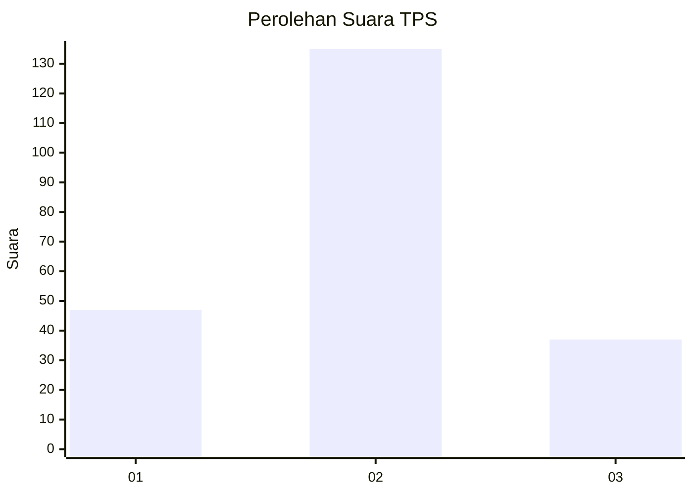

# Hasil

## Grafik

## Tabel

| No. | Nama Paslon    | Suara | Suara (raw) | Persentase |
|:--- |:-------------- | -----:| -----------:| ----------:|
| 1   | ANIES MUHAIMIN | 47    | [47][p-1]   | 21,46      |
| 2   | PRABOWO GIBRAN | 135   | [135][p-2]  | 61,64      |
| 3   | GANJAR MAHFUD  | 37    | [37][p-3]   | 16,89      |

[p-1]: https://github.com/gigit-pemilu/pemilu-2024/blob/main/pilpres/hitung-suara/sub/35-jawa-timur/sub/15-sidoarjo/sub/08-sidoarjo/sub/1004-sidokare/sub/004-tps/sub/paslon-1.txt
[p-2]: https://github.com/gigit-pemilu/pemilu-2024/blob/main/pilpres/hitung-suara/sub/35-jawa-timur/sub/15-sidoarjo/sub/08-sidoarjo/sub/1004-sidokare/sub/004-tps/sub/paslon-2.txt
[p-3]: https://github.com/gigit-pemilu/pemilu-2024/blob/main/pilpres/hitung-suara/sub/35-jawa-timur/sub/15-sidoarjo/sub/08-sidoarjo/sub/1004-sidokare/sub/004-tps/sub/paslon-3.txt

## Foto C Plano

https://sirekap-obj-formc.kpu.go.id/b320/pemilu/ppwp/35/15/08/10/04/3515081004004-20240217-180949--66c6ee36-3a85-480b-a3a7-f802a3d9f119.jpg

https://sirekap-obj-formc.kpu.go.id/b320/pemilu/ppwp/35/15/08/10/04/3515081004004-20240217-181009--2672c6b2-39e6-4b06-a493-45f53bb43a15.jpg

https://sirekap-obj-formc.kpu.go.id/b320/pemilu/ppwp/35/15/08/10/04/3515081004004-20240217-181058--c3c1f35b-ace1-4a30-a680-56e433f9d9ee.jpg

## Metadata

| Key        | Value               |
| ---------- | ------------------- |
| Time Stamp | 2024-02-24 22:31:28 |

