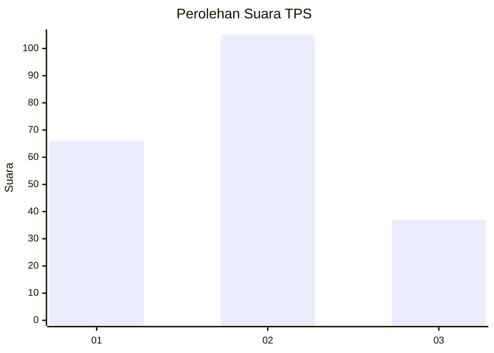
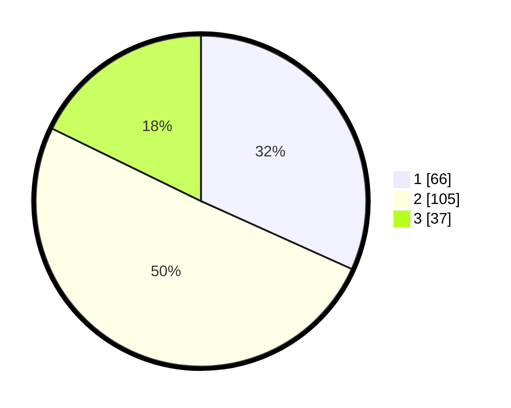

# Hasil

## Grafik

## Tabel

| No. | Nama Paslon    | Suara | Suara (raw) | Persentase |
|:--- |:-------------- | -----:| -----------:| ----------:|
| 1   | ANIES MUHAIMIN | 66    | [66][p-1]   | 31,73      |
| 2   | PRABOWO GIBRAN | 105   | [105][p-2]  | 50,48      |
| 3   | GANJAR MAHFUD  | 37    | [37][p-3]   | 17,79      |

[p-1]: https://github.com/gigit-pemilu/pemilu-2024/blob/main/pilpres/hitung-suara/sub/35-jawa-timur/sub/15-sidoarjo/sub/08-sidoarjo/sub/1004-sidokare/sub/026-tps/sub/paslon-1.txt
[p-2]: https://github.com/gigit-pemilu/pemilu-2024/blob/main/pilpres/hitung-suara/sub/35-jawa-timur/sub/15-sidoarjo/sub/08-sidoarjo/sub/1004-sidokare/sub/026-tps/sub/paslon-2.txt
[p-3]: https://github.com/gigit-pemilu/pemilu-2024/blob/main/pilpres/hitung-suara/sub/35-jawa-timur/sub/15-sidoarjo/sub/08-sidoarjo/sub/1004-sidokare/sub/026-tps/sub/paslon-3.txt

## Foto C Plano

https://sirekap-obj-formc.kpu.go.id/48e2/pemilu/ppwp/35/15/08/10/04/3515081004026-20240217-121426--324a0ea5-282c-4359-b184-60d50c37c829.jpg

https://sirekap-obj-formc.kpu.go.id/48e2/pemilu/ppwp/35/15/08/10/04/3515081004026-20240216-114815--2533babf-a3ea-4e57-b6b3-a28a3b1994bb.jpg

https://sirekap-obj-formc.kpu.go.id/48e2/pemilu/ppwp/35/15/08/10/04/3515081004026-20240216-114911--b95bd308-01e3-4116-9543-8bd121882897.jpg

## Metadata

| Key        | Value               |
| ---------- | ------------------- |
| Time Stamp | 2024-02-25 11:00:00 |

