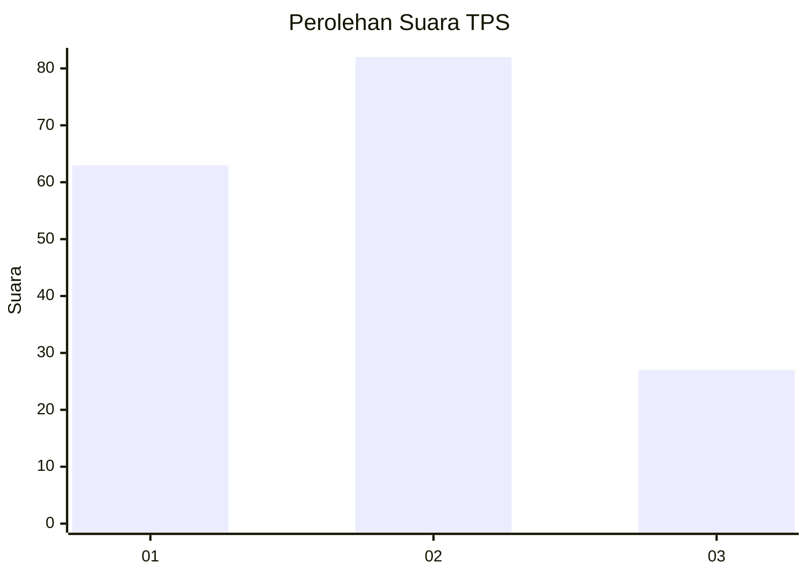
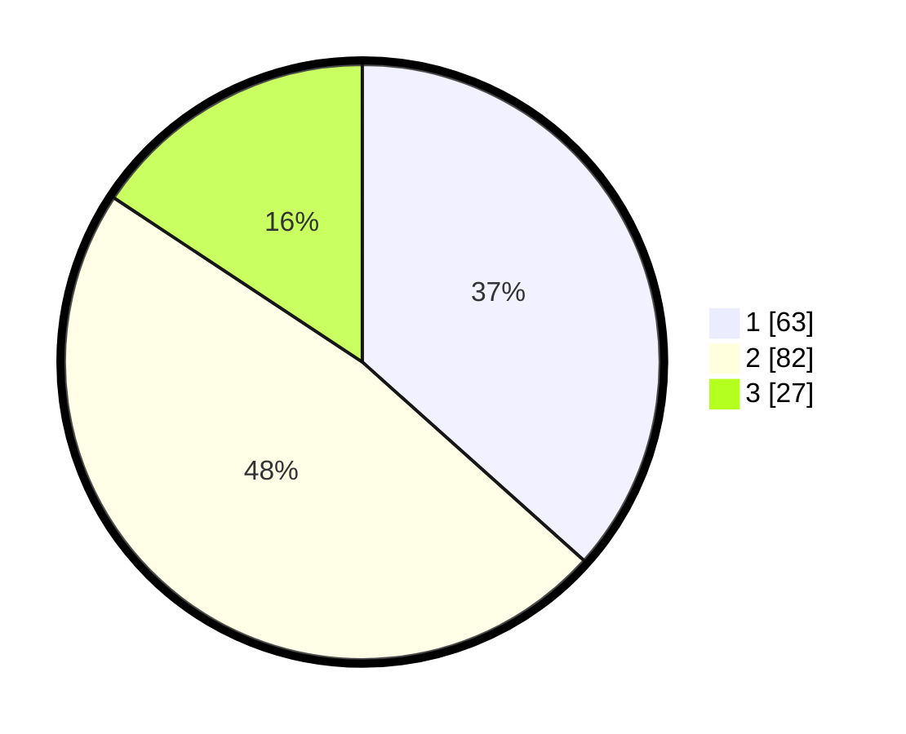

# Hasil

## Grafik

## Tabel

| No. | Nama Paslon    | Suara | Suara (raw) | Persentase |
|:--- |:-------------- | -----:| -----------:| ----------:|
| 1   | ANIES MUHAIMIN | 63    | [63][p-1]   | 36,63      |
| 2   | PRABOWO GIBRAN | 82    | [82][p-2]   | 47,67      |
| 3   | GANJAR MAHFUD  | 27    | [27][p-3]   | 15,70      |

[p-1]: https://github.com/gigit-pemilu/pemilu-2024/blob/main/pilpres/hitung-suara/sub/35-jawa-timur/sub/15-sidoarjo/sub/08-sidoarjo/sub/1004-sidokare/sub/039-tps/sub/paslon-1.txt
[p-2]: https://github.com/gigit-pemilu/pemilu-2024/blob/main/pilpres/hitung-suara/sub/35-jawa-timur/sub/15-sidoarjo/sub/08-sidoarjo/sub/1004-sidokare/sub/039-tps/sub/paslon-2.txt
[p-3]: https://github.com/gigit-pemilu/pemilu-2024/blob/main/pilpres/hitung-suara/sub/35-jawa-timur/sub/15-sidoarjo/sub/08-sidoarjo/sub/1004-sidokare/sub/039-tps/sub/paslon-3.txt

## Foto C Plano

https://sirekap-obj-formc.kpu.go.id/13c1/pemilu/ppwp/35/15/08/10/04/3515081004039-20240217-073453--f94af484-23a6-4080-9608-a1eaa498ca6a.jpg

https://sirekap-obj-formc.kpu.go.id/13c1/pemilu/ppwp/35/15/08/10/04/3515081004039-20240217-073722--e20ee41f-7201-438f-ad2b-197f35065536.jpg

https://sirekap-obj-formc.kpu.go.id/13c1/pemilu/ppwp/35/15/08/10/04/3515081004039-20240217-073634--d39ebf5e-2a85-44f5-b703-4d4f2db5836a.jpg

## Metadata

| Key        | Value               |
| ---------- | ------------------- |
| Time Stamp | 2024-02-25 13:00:00 |

