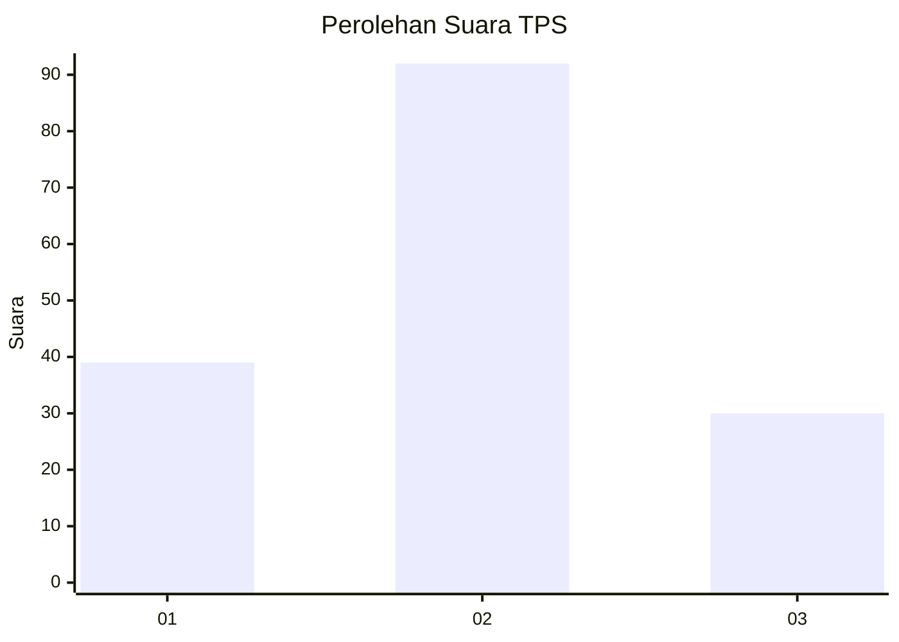
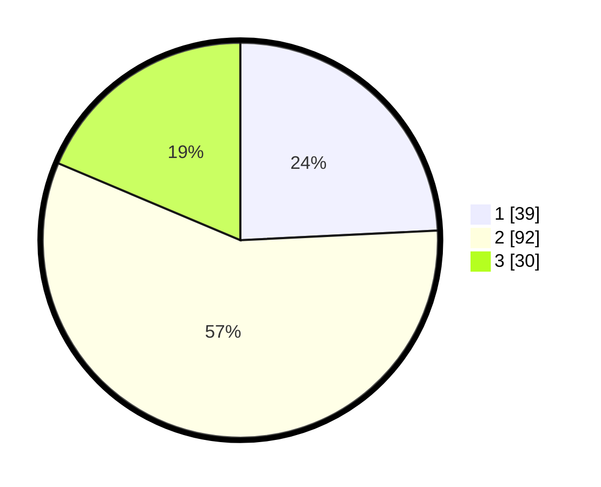

# Hasil

## Grafik

## Tabel

| No. | Nama Paslon    | Suara | Suara (raw) | Persentase |
|:--- |:-------------- | -----:| -----------:| ----------:|
| 1   | ANIES MUHAIMIN | 39    | [39][p-1]   | 24,22      |
| 2   | PRABOWO GIBRAN | 92    | [92][p-2]   | 57,14      |
| 3   | GANJAR MAHFUD  | 30    | [30][p-3]   | 18,63      |

[p-1]: https://github.com/gigit-pemilu/pemilu-2024-35-jawa-timur/blob/main/pilpres/hitung-suara/sub/35-jawa-timur/sub/15-sidoarjo/sub/08-sidoarjo/sub/1004-sidokare/sub/043-tps/sub/paslon-1.txt
[p-2]: https://github.com/gigit-pemilu/pemilu-2024-35-jawa-timur/blob/main/pilpres/hitung-suara/sub/35-jawa-timur/sub/15-sidoarjo/sub/08-sidoarjo/sub/1004-sidokare/sub/043-tps/sub/paslon-2.txt
[p-3]: https://github.com/gigit-pemilu/pemilu-2024-35-jawa-timur/blob/main/pilpres/hitung-suara/sub/35-jawa-timur/sub/15-sidoarjo/sub/08-sidoarjo/sub/1004-sidokare/sub/043-tps/sub/paslon-3.txt

## Foto C Plano

https://sirekap-obj-formc.kpu.go.id/ba8c/pemilu/ppwp/35/15/08/10/04/3515081004043-20240217-093631--632af9d9-fbfd-4db0-9d4d-eddfd9c0cb9f.jpg

https://sirekap-obj-formc.kpu.go.id/ba8c/pemilu/ppwp/35/15/08/10/04/3515081004043-20240217-093533--3569a080-5125-43be-95f7-01c5cbb5b91e.jpg

https://sirekap-obj-formc.kpu.go.id/ba8c/pemilu/ppwp/35/15/08/10/04/3515081004043-20240217-093655--a836e3de-0fb5-4879-9fe1-9f8e34ebb015.jpg

## Metadata

| Key        | Value               |
| ---------- | ------------------- |
| Time Stamp | 2024-02-24 22:31:28 |

