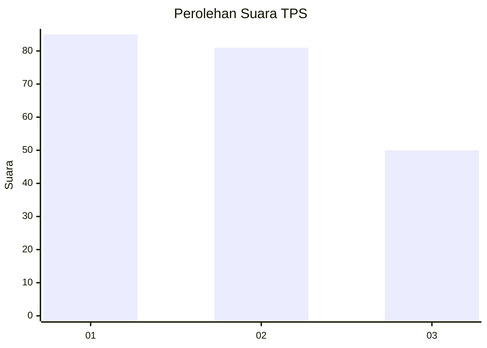
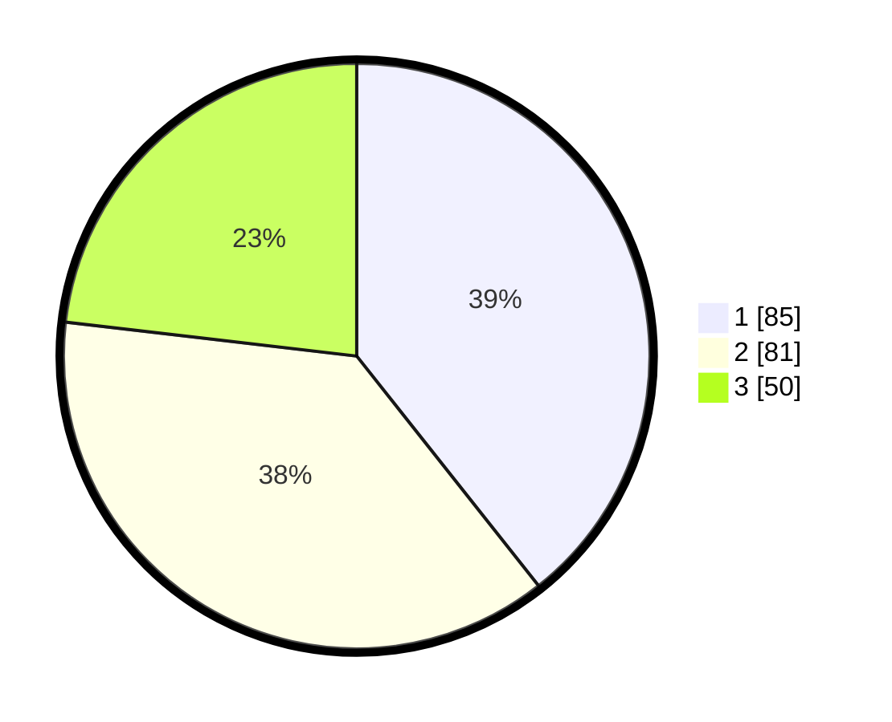

# Hasil

## Grafik

## Tabel

| No. | Nama Paslon    | Suara | Suara (raw) | Persentase |
|:--- |:-------------- | -----:| -----------:| ----------:|
| 1   | ANIES MUHAIMIN | 85    | [85][p-1]   | 39,35      |
| 2   | PRABOWO GIBRAN | 81    | [81][p-2]   | 37,50      |
| 3   | GANJAR MAHFUD  | 50    | [50][p-3]   | 23,15      |

[p-1]: https://github.com/gigit-pemilu/pemilu-2024/blob/main/pilpres/hitung-suara/sub/35-jawa-timur/sub/15-sidoarjo/sub/08-sidoarjo/sub/1006-sekardangan/sub/017-tps/sub/paslon-1.txt
[p-2]: https://github.com/gigit-pemilu/pemilu-2024/blob/main/pilpres/hitung-suara/sub/35-jawa-timur/sub/15-sidoarjo/sub/08-sidoarjo/sub/1006-sekardangan/sub/017-tps/sub/paslon-2.txt
[p-3]: https://github.com/gigit-pemilu/pemilu-2024/blob/main/pilpres/hitung-suara/sub/35-jawa-timur/sub/15-sidoarjo/sub/08-sidoarjo/sub/1006-sekardangan/sub/017-tps/sub/paslon-3.txt

## Foto C Plano

https://sirekap-obj-formc.kpu.go.id/abb5/pemilu/ppwp/35/15/08/10/06/3515081006017-20240216-143557--8229f630-a52b-42cf-849c-129ea805db2b.jpg

https://sirekap-obj-formc.kpu.go.id/abb5/pemilu/ppwp/35/15/08/10/06/3515081006017-20240216-143828--720b7ded-9889-4720-9937-7273427ee6ad.jpg

https://sirekap-obj-formc.kpu.go.id/abb5/pemilu/ppwp/35/15/08/10/06/3515081006017-20240216-144056--e90f7f7f-7d16-4920-82be-6aca9c1648ed.jpg

## Metadata

| Key        | Value               |
| ---------- | ------------------- |
| Time Stamp | 2024-02-25 17:00:00 |

