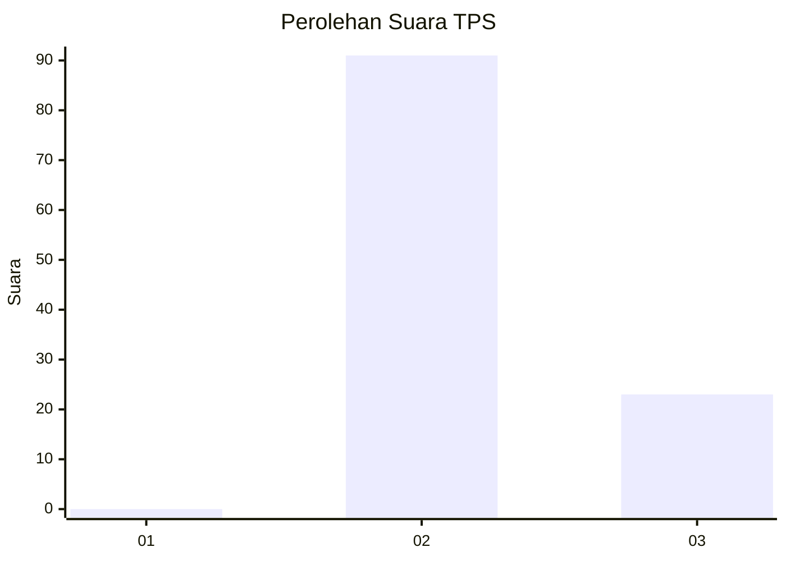
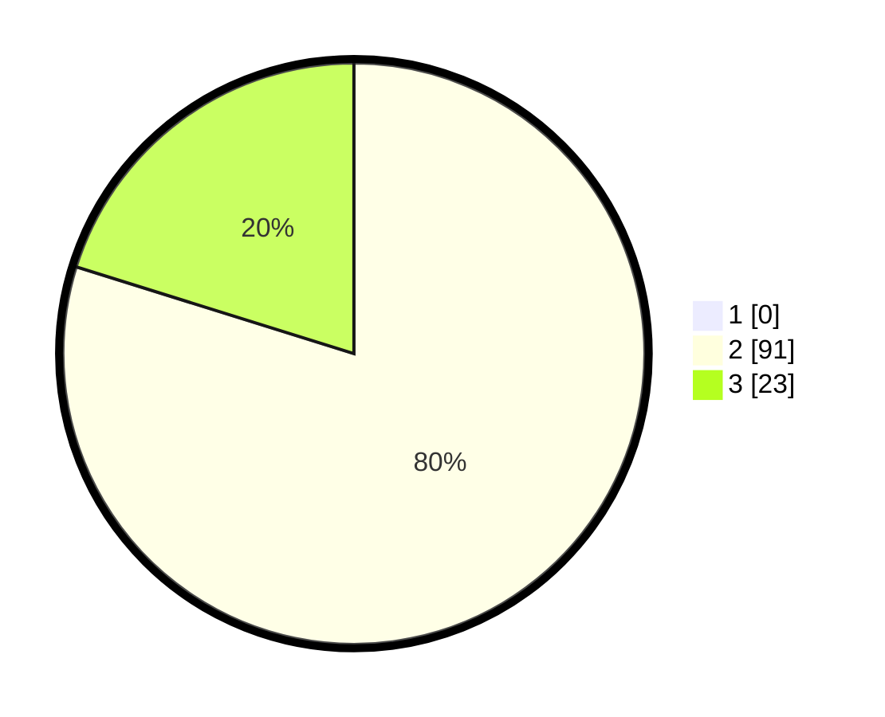

# Hasil

## Grafik

## Tabel

| No. | Nama Paslon    | Suara | Suara (raw) | Persentase |
|:--- |:-------------- | -----:| -----------:| ----------:|
| 1   | ANIES MUHAIMIN | 0     | [0][p-1]    | 0,00       |
| 2   | PRABOWO GIBRAN | 91    | [91][p-2]   | 79,82      |
| 3   | GANJAR MAHFUD  | 23    | [23][p-3]   | 20,18      |

[p-1]: https://github.com/gigit-pemilu/pemilu-2024-35-jawa-timur/blob/main/pilpres/hitung-suara/sub/35-jawa-timur/sub/15-sidoarjo/sub/08-sidoarjo/sub/1007-gebang/sub/019-tps/sub/paslon-1.txt
[p-2]: https://github.com/gigit-pemilu/pemilu-2024-35-jawa-timur/blob/main/pilpres/hitung-suara/sub/35-jawa-timur/sub/15-sidoarjo/sub/08-sidoarjo/sub/1007-gebang/sub/019-tps/sub/paslon-2.txt
[p-3]: https://github.com/gigit-pemilu/pemilu-2024-35-jawa-timur/blob/main/pilpres/hitung-suara/sub/35-jawa-timur/sub/15-sidoarjo/sub/08-sidoarjo/sub/1007-gebang/sub/019-tps/sub/paslon-3.txt

## Foto C Plano

https://sirekap-obj-formc.kpu.go.id/a6d4/pemilu/ppwp/35/15/08/10/07/3515081007019-20240214-234448--3cc9dfe1-3937-4ba4-8580-affa28a457a2.jpg

https://sirekap-obj-formc.kpu.go.id/a6d4/pemilu/ppwp/35/15/08/10/07/3515081007019-20240214-234618--5478980d-7e78-48a1-9377-582939ce1836.jpg

https://sirekap-obj-formc.kpu.go.id/a6d4/pemilu/ppwp/35/15/08/10/07/3515081007019-20240214-234728--3c70d6d7-0925-4c0f-8047-98ebc769b8a6.jpg

## Metadata

| Key        | Value               |
| ---------- | ------------------- |
| Time Stamp | 2024-02-15 15:00:29 |

