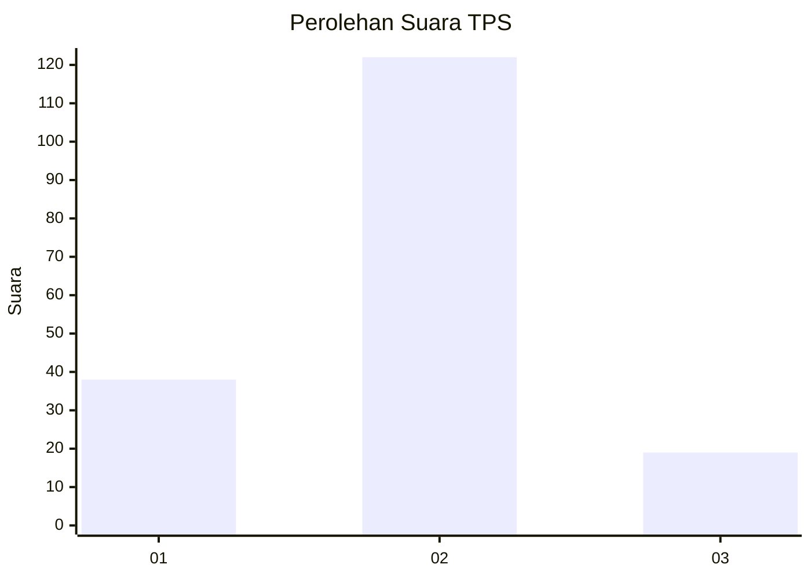
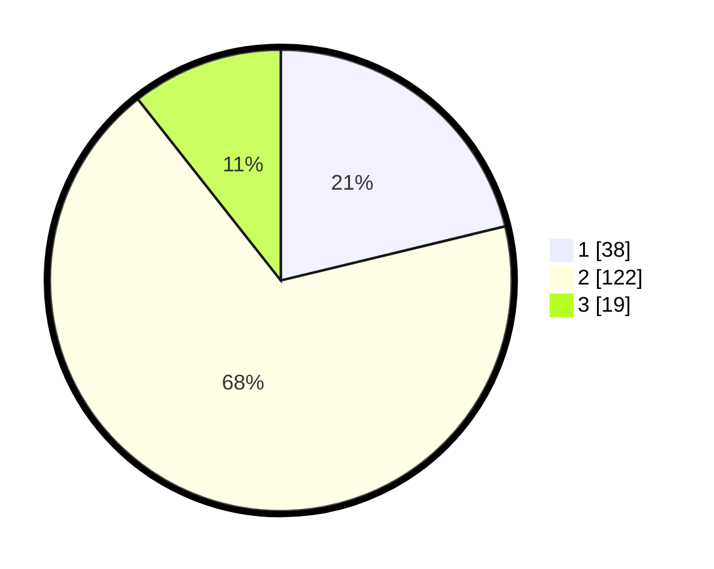

# Hasil

## Grafik

## Tabel

| No. | Nama Paslon    | Suara | Suara (raw) | Persentase |
|:--- |:-------------- | -----:| -----------:| ----------:|
| 1   | ANIES MUHAIMIN | 38    | [38][p-1]   | 21,23      |
| 2   | PRABOWO GIBRAN | 122   | [122][p-2]  | 68,16      |
| 3   | GANJAR MAHFUD  | 19    | [19][p-3]   | 10,61      |

[p-1]: https://github.com/gigit-pemilu/pemilu-2024/blob/main/pilpres/hitung-suara/sub/35-jawa-timur/sub/15-sidoarjo/sub/08-sidoarjo/sub/1009-bulusidokare/sub/009-tps/sub/paslon-1.txt
[p-2]: https://github.com/gigit-pemilu/pemilu-2024/blob/main/pilpres/hitung-suara/sub/35-jawa-timur/sub/15-sidoarjo/sub/08-sidoarjo/sub/1009-bulusidokare/sub/009-tps/sub/paslon-2.txt
[p-3]: https://github.com/gigit-pemilu/pemilu-2024/blob/main/pilpres/hitung-suara/sub/35-jawa-timur/sub/15-sidoarjo/sub/08-sidoarjo/sub/1009-bulusidokare/sub/009-tps/sub/paslon-3.txt

## Foto C Plano

https://sirekap-obj-formc.kpu.go.id/0d43/pemilu/ppwp/35/15/08/10/09/3515081009009-20240214-141607--021f4da1-b02c-48b1-a603-9652a93ef311.jpg

https://sirekap-obj-formc.kpu.go.id/0d43/pemilu/ppwp/35/15/08/10/09/3515081009009-20240214-141715--fbf945bd-c21d-42ef-8ff4-a02d73a5d3bc.jpg

https://sirekap-obj-formc.kpu.go.id/0d43/pemilu/ppwp/35/15/08/10/09/3515081009009-20240214-141846--d43bec34-c428-46be-b434-3110f09af4c1.jpg

## Metadata

| Key        | Value               |
| ---------- | ------------------- |
| Time Stamp | 2024-02-15 20:00:44 |

