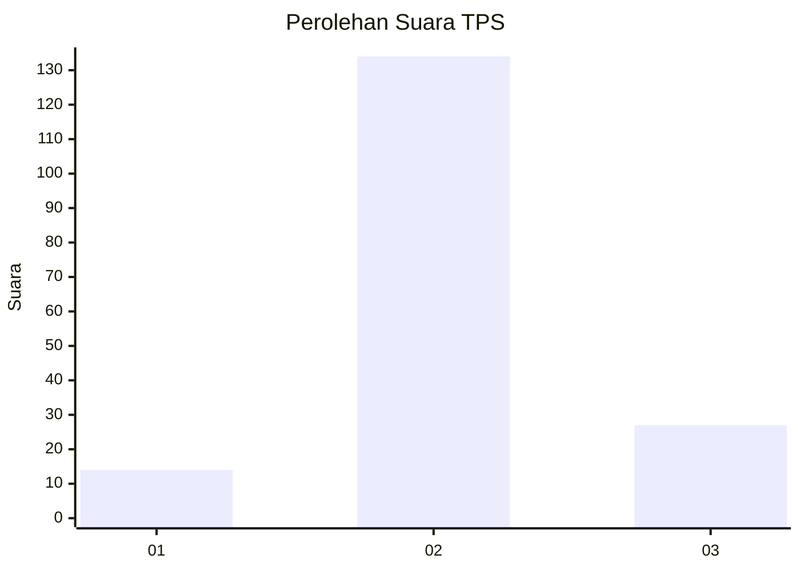

# Hasil

## Grafik

## Tabel

| No. | Nama Paslon    | Suara | Suara (raw) | Persentase |
|:--- |:-------------- | -----:| -----------:| ----------:|
| 1   | ANIES MUHAIMIN | 14    | [14][p-1]   | 8,00       |
| 2   | PRABOWO GIBRAN | 134   | [134][p-2]  | 76,57      |
| 3   | GANJAR MAHFUD  | 27    | [27][p-3]   | 15,43      |

[p-1]: https://github.com/gigit-pemilu/pemilu-2024/blob/main/pilpres/hitung-suara/sub/35-jawa-timur/sub/15-sidoarjo/sub/08-sidoarjo/sub/1012-lemahputro/sub/017-tps/sub/paslon-1.txt
[p-2]: https://github.com/gigit-pemilu/pemilu-2024/blob/main/pilpres/hitung-suara/sub/35-jawa-timur/sub/15-sidoarjo/sub/08-sidoarjo/sub/1012-lemahputro/sub/017-tps/sub/paslon-2.txt
[p-3]: https://github.com/gigit-pemilu/pemilu-2024/blob/main/pilpres/hitung-suara/sub/35-jawa-timur/sub/15-sidoarjo/sub/08-sidoarjo/sub/1012-lemahputro/sub/017-tps/sub/paslon-3.txt

## Foto C Plano

https://sirekap-obj-formc.kpu.go.id/74c5/pemilu/ppwp/35/15/08/10/12/3515081012017-20240214-213719--c91e7943-090b-417e-8146-ef1c0fcc92d1.jpg

https://sirekap-obj-formc.kpu.go.id/74c5/pemilu/ppwp/35/15/08/10/12/3515081012017-20240214-213822--18553a8e-89f8-40b7-beac-c6f56b767044.jpg

https://sirekap-obj-formc.kpu.go.id/74c5/pemilu/ppwp/35/15/08/10/12/3515081012017-20240214-213928--8fd1f119-cb97-4d21-8da6-ee7ac371e69c.jpg

## Metadata

| Key        | Value               |
| ---------- | ------------------- |
| Time Stamp | 2024-02-25 11:00:00 |

