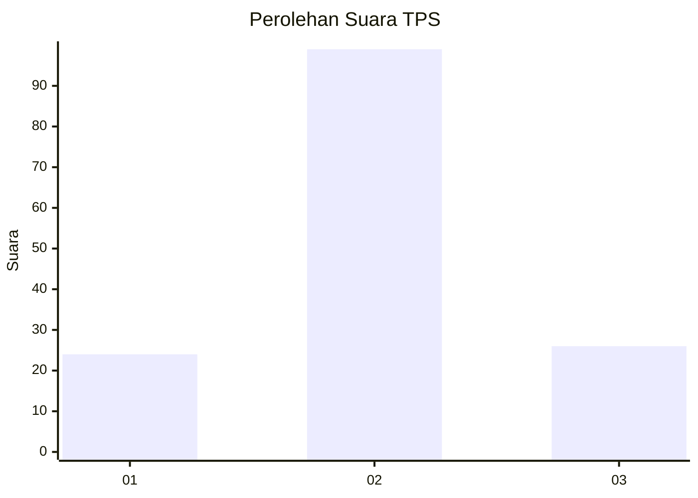
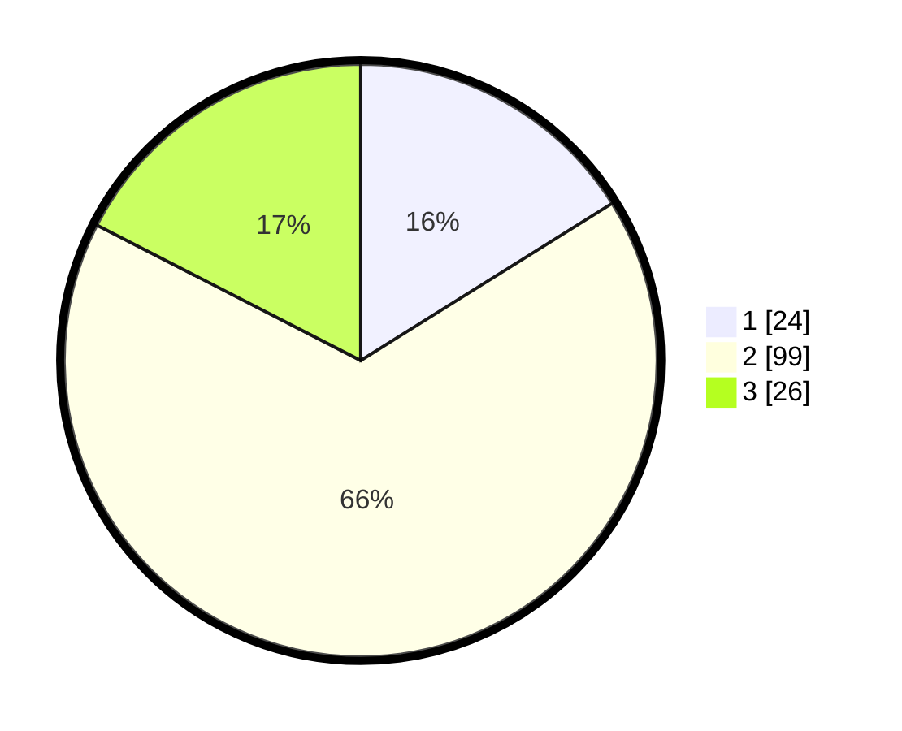

# Hasil

## Grafik

## Tabel

| No. | Nama Paslon    | Suara | Suara (raw) | Persentase |
|:--- |:-------------- | -----:| -----------:| ----------:|
| 1   | ANIES MUHAIMIN | 24    | [24][p-1]   | 16,11      |
| 2   | PRABOWO GIBRAN | 99    | [99][p-2]   | 66,44      |
| 3   | GANJAR MAHFUD  | 26    | [26][p-3]   | 17,45      |

[p-1]: https://github.com/gigit-pemilu/pemilu-2024-35-jawa-timur/blob/main/pilpres/hitung-suara/sub/35-jawa-timur/sub/15-sidoarjo/sub/08-sidoarjo/sub/1018-magersari/sub/006-tps/sub/paslon-1.txt
[p-2]: https://github.com/gigit-pemilu/pemilu-2024-35-jawa-timur/blob/main/pilpres/hitung-suara/sub/35-jawa-timur/sub/15-sidoarjo/sub/08-sidoarjo/sub/1018-magersari/sub/006-tps/sub/paslon-2.txt
[p-3]: https://github.com/gigit-pemilu/pemilu-2024-35-jawa-timur/blob/main/pilpres/hitung-suara/sub/35-jawa-timur/sub/15-sidoarjo/sub/08-sidoarjo/sub/1018-magersari/sub/006-tps/sub/paslon-3.txt

## Foto C Plano

https://sirekap-obj-formc.kpu.go.id/683e/pemilu/ppwp/35/15/08/10/18/3515081018006-20240221-200309--bc4852c0-2856-4fef-8200-f5f363515045.jpg

https://sirekap-obj-formc.kpu.go.id/683e/pemilu/ppwp/35/15/08/10/18/3515081018006-20240221-200322--7e44c7ff-6bb9-4d1c-b0af-4f4cf03d1774.jpg

https://sirekap-obj-formc.kpu.go.id/683e/pemilu/ppwp/35/15/08/10/18/3515081018006-20240221-200328--81048b1e-7819-441e-bcf8-33c72a46e137.jpg

## Metadata

| Key        | Value               |
| ---------- | ------------------- |
| Time Stamp | 2024-02-25 21:00:00 |

