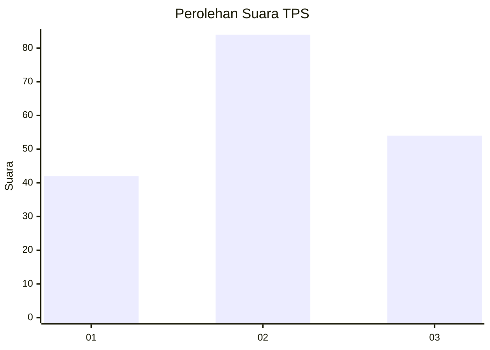
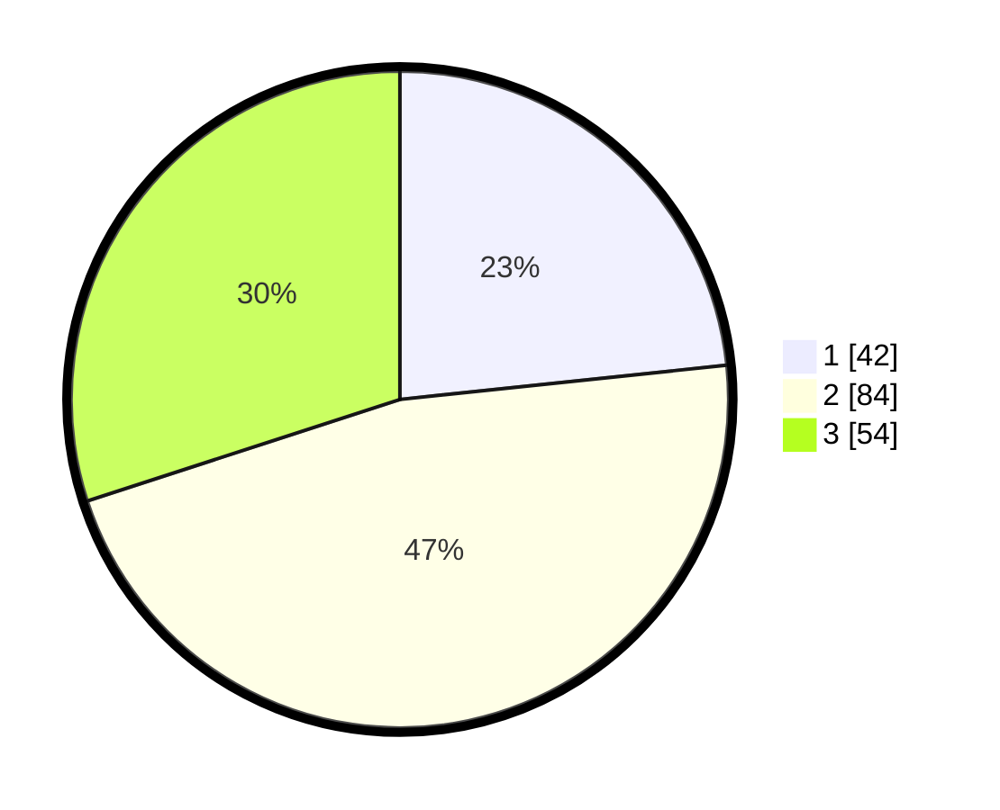

# Hasil

## Grafik

## Tabel

| No. | Nama Paslon    | Suara | Suara (raw) | Persentase |
|:--- |:-------------- | -----:| -----------:| ----------:|
| 1   | ANIES MUHAIMIN | 42    | [42][p-1]   | 23,33      |
| 2   | PRABOWO GIBRAN | 84    | [84][p-2]   | 46,67      |
| 3   | GANJAR MAHFUD  | 54    | [54][p-3]   | 30,00      |

[p-1]: https://github.com/gigit-pemilu/pemilu-2024-35-jawa-timur/blob/main/pilpres/hitung-suara/sub/35-jawa-timur/sub/15-sidoarjo/sub/08-sidoarjo/sub/2003-banjarbendo/sub/016-tps/sub/paslon-1.txt
[p-2]: https://github.com/gigit-pemilu/pemilu-2024-35-jawa-timur/blob/main/pilpres/hitung-suara/sub/35-jawa-timur/sub/15-sidoarjo/sub/08-sidoarjo/sub/2003-banjarbendo/sub/016-tps/sub/paslon-2.txt
[p-3]: https://github.com/gigit-pemilu/pemilu-2024-35-jawa-timur/blob/main/pilpres/hitung-suara/sub/35-jawa-timur/sub/15-sidoarjo/sub/08-sidoarjo/sub/2003-banjarbendo/sub/016-tps/sub/paslon-3.txt

## Foto C Plano

https://sirekap-obj-formc.kpu.go.id/0ba5/pemilu/ppwp/35/15/08/20/03/3515082003016-20240215-001538--58b7275a-49c2-48cd-8956-ee718a29c98c.jpg

https://sirekap-obj-formc.kpu.go.id/0ba5/pemilu/ppwp/35/15/08/20/03/3515082003016-20240215-001659--5101ad3c-0f5a-4b08-8d7d-c49952d7202f.jpg

https://sirekap-obj-formc.kpu.go.id/0ba5/pemilu/ppwp/35/15/08/20/03/3515082003016-20240215-001830--b9d886e4-6d68-43dd-a9d7-b3bfbef09962.jpg

## Metadata

| Key        | Value               |
| ---------- | ------------------- |
| Time Stamp | 2024-02-15 20:30:46 |

