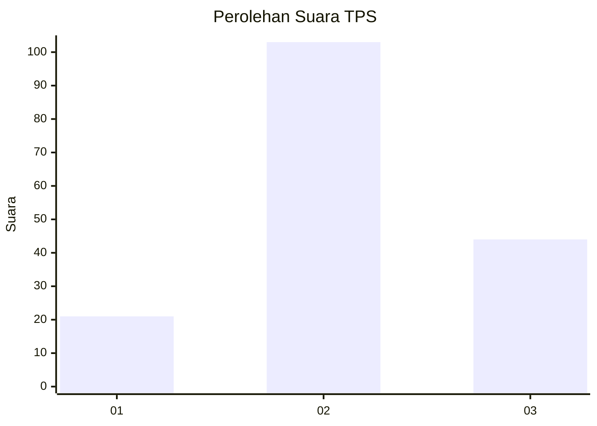
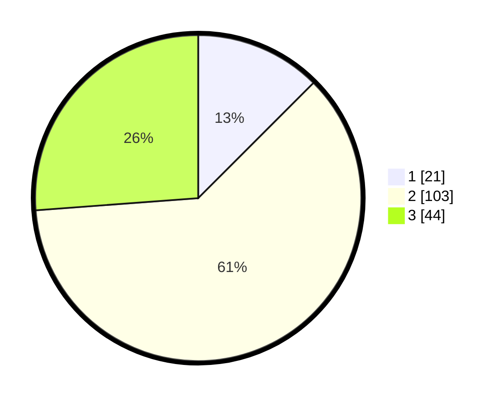

# Hasil

## Grafik

## Tabel

| No. | Nama Paslon    | Suara | Suara (raw) | Persentase |
|:--- |:-------------- | -----:| -----------:| ----------:|
| 1   | ANIES MUHAIMIN | 21    | [21][p-1]   | 12,50      |
| 2   | PRABOWO GIBRAN | 103   | [103][p-2]  | 61,31      |
| 3   | GANJAR MAHFUD  | 44    | [44][p-3]   | 26,19      |

[p-1]: https://github.com/gigit-pemilu/pemilu-2024/blob/main/pilpres/hitung-suara/sub/35-jawa-timur/sub/15-sidoarjo/sub/08-sidoarjo/sub/2003-banjarbendo/sub/023-tps/sub/paslon-1.txt
[p-2]: https://github.com/gigit-pemilu/pemilu-2024/blob/main/pilpres/hitung-suara/sub/35-jawa-timur/sub/15-sidoarjo/sub/08-sidoarjo/sub/2003-banjarbendo/sub/023-tps/sub/paslon-2.txt
[p-3]: https://github.com/gigit-pemilu/pemilu-2024/blob/main/pilpres/hitung-suara/sub/35-jawa-timur/sub/15-sidoarjo/sub/08-sidoarjo/sub/2003-banjarbendo/sub/023-tps/sub/paslon-3.txt

## Foto C Plano

https://sirekap-obj-formc.kpu.go.id/7450/pemilu/ppwp/35/15/08/20/03/3515082003023-20240214-222446--6df6511e-553c-49f8-ad6c-4a8b4940aacf.jpg

https://sirekap-obj-formc.kpu.go.id/7450/pemilu/ppwp/35/15/08/20/03/3515082003023-20240214-222512--8bc74871-113c-491b-8569-f2329352322f.jpg

https://sirekap-obj-formc.kpu.go.id/7450/pemilu/ppwp/35/15/08/20/03/3515082003023-20240214-222531--a4625fcb-df6a-4888-95eb-e5dbec2311b8.jpg

## Metadata

| Key        | Value               |
| ---------- | ------------------- |
| Time Stamp | 2024-02-15 20:30:46 |

